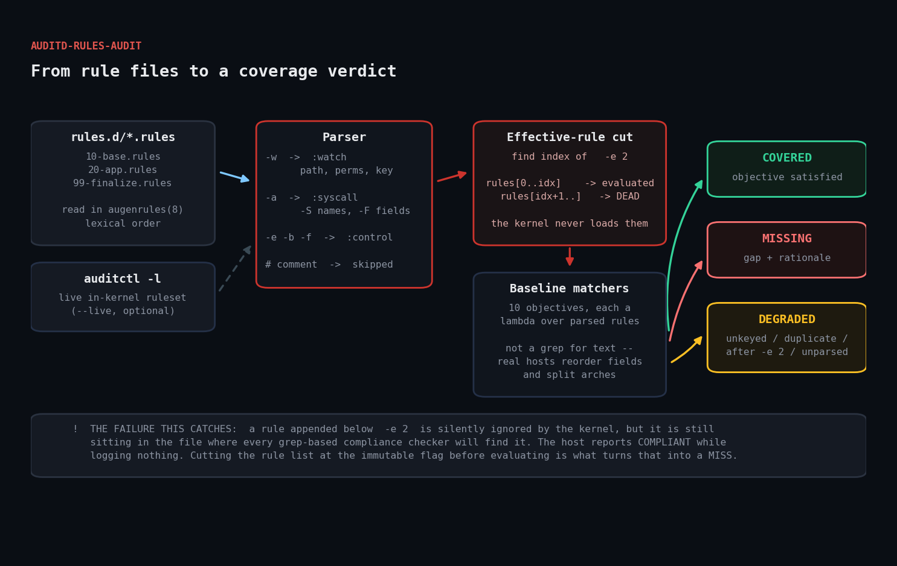

# auditd-rules-audit

Ruby tool that parses your Linux `auditd` rule files, works out which rules the
kernel will *actually* load, and reports the gaps against a baseline of control
objectives.



## The problem

`auditd` ships with essentially no rules. A freshly built host is *running*
auditd and logging almost nothing — which looks identical to compliance from any
dashboard that only checks `systemctl is-active auditd`.

Then rules drift. Someone adds a watch for a new app, someone else pastes in a
block from a 2016 hardening guide, config management half-applies a template, and
`-e 2` ends up in the middle of the file instead of at the end.

That last one is the interesting failure. Once `auditctl` applies `-e 2` the
ruleset is immutable until reboot, so **every rule `augenrules` concatenates
after it is dead text**. It is still sitting in the file, so a grep-based
compliance checker finds it and passes the host. The kernel never loaded it.

This tool cuts the parsed rule list at the immutable flag *before* evaluating
coverage, so rules in that dead zone correctly count as missing.

## Prerequisites

| | |
|---|---|
| Ruby | >= 2.7 (stdlib only — no gems) |
| OS | Any Linux with `auditd` installed |
| Privileges | None to read `/etc/audit/rules.d`; root for `--live` |

## Usage

```bash
# audit the rule files on this host
ruby auditd_rules_audit.rb

# audit a directory of rules (works anywhere, no root needed)
ruby auditd_rules_audit.rb --rules-dir ./fixtures/rules.d

# also read the live in-kernel ruleset
sudo ruby auditd_rules_audit.rb --live

# machine-readable output for a monitoring pipeline
ruby auditd_rules_audit.rb --format json
```

### Exit codes

| Code | Meaning |
|---|---|
| `0` | All baseline objectives covered, no degradations |
| `1` | One or more objectives missing or degraded |
| `2` | Could not read any rule source |

## How it works

### 1. Parsing

auditd rules come in three shapes that match completely different things, so the
parser tags each line by kind:

| Syntax | Kind | Carries |
|---|---|---|
| `-w <path> -p <perms> -k <key>` | `:watch` | a filesystem path |
| `-a <list>,<action> -F ... -S ...` | `:syscall` | syscall names and `-F` field filters |
| `-D`, `-e`, `-b`, `-f`, `-r` | `:control` | not a matcher at all |

Files are read in `augenrules(8)` order — lexical sort of `rules.d/*.rules` —
because order determines what the immutable cut catches.

One parsing detail worth copying: strip the newline **before** removing the
comment.

```ruby
raw = line.chomp.sub(/#.*/, '').strip
```

`line.sub(/#.*\z/, '')` looks equivalent and is not. `.` does not cross a
newline, but `\z` demands the true end of the string, so on a line that still
ends in `"\n"` the pattern never matches and every comment survives into the
report as unrecognised auditd syntax.

### 2. The effective-rule cut

```ruby
def effective_rules(rules)
  imm = rules.index { |r| r.kind == :control && r.raw =~ /\A-e\s+2\b/ }
  imm ? rules[0..imm] : rules
end
```

Objectives are evaluated against `effective_rules`, not the raw file contents.
This is the whole point of the tool.

### 3. Objectives as predicates, not strings

Each of the ten baseline objectives is a lambda over parsed rules:

```ruby
Objective.new(
  id: 'AUD-003', title: 'Kernel module load/unload is audited',
  severity: :high,
  matcher: ->(rules) {
    syscall_rule?(rules, 'init_module', 'finit_module', 'delete_module') ||
      watches_any?(rules, '/sbin/insmod', '/sbin/modprobe', '/usr/sbin/modprobe')
  }
)
```

Hardening guides publish rules as copy-paste text, but real hosts reorder `-F`
fields, split 32- and 64-bit arches onto separate lines, use their own `-k` keys
and watch a symlinked path. String matching produces false MISSING findings on
hosts that are genuinely fine; a predicate over parsed structure does not.

### The baseline

| ID | Objective | Severity |
|---|---|---|
| AUD-001 | Identity files (`passwd`/`shadow`/`group`/`sudoers`) watched | high |
| AUD-002 | Login records (`wtmp`/`btmp`/`utmp`) watched | high |
| AUD-003 | Kernel module load/unload audited | high |
| AUD-004 | Time-change syscalls audited | medium |
| AUD-005 | DAC changes (`chmod`/`chown`/`*xattr`) audited | medium |
| AUD-006 | Unauthorised file access (`EACCES`/`EPERM`) audited | medium |
| AUD-007 | Privileged (setuid) command execution audited | medium |
| AUD-008 | `/etc/audit/` itself watched | high |
| AUD-009 | Ruleset made immutable (`-e 2`) | high |
| AUD-010 | Buffer size raised above the 8192 default | low |

### 4. Degradations

Findings that are not "objective missing" but still weaken the ruleset:

- `DEG-UNKEYED` — rules with no `-k`. They fire, but `ausearch`/`aureport`
  queries are key-driven, so nobody will ever find their events.
- `DEG-AFTER-IMMUTABLE` — rules below `-e 2`.
- `DEG-DUPLICATE` — identical rules defined twice; double the event volume, no
  extra coverage.
- `DEG-UNPARSED` — lines the parser did not recognise, surfaced rather than
  silently dropped.

## Example output

```
========================================================================
auditd rule coverage audit
========================================================================
  parsed: 12 rules  (7 watch, 1 syscall, 4 control, 0 unparsed)
  coverage: 3/10 baseline objectives

OBJECTIVES
------------------------------------------------------------------------
[MISS] AUD-001  HIGH      Identity files are watched for modification
         Changes to /etc/passwd, /etc/shadow, /etc/group or /etc/sudoers
         are the classic persistence and privilege-escalation moves.
         Without a watch there is no record of who edited them.
[MISS] AUD-002  HIGH      Login and session records are watched
         wtmp/btmp/lastlog are where successful and failed logins land.
         Attackers truncate them; a watch makes that visible.
[ OK ] AUD-008  HIGH      The audit configuration itself is watched
[ OK ] AUD-009  HIGH      Ruleset is made immutable (-e 2)
[ OK ] AUD-004  MEDIUM    Time-change syscalls are audited

DEGRADATIONS
------------------------------------------------------------------------
[WARN] DEG-UNKEYED            1 rule(s) have no -k key; ausearch/aureport cannot select their events
         - fixtures/rules.d/20-app.rules:2
[WARN] DEG-AFTER-IMMUTABLE    1 rule(s) appear after '-e 2' and will be ignored by the kernel
         - fixtures/rules.d/20-app.rules:8
[WARN] DEG-DUPLICATE          1 rule(s) are defined more than once; duplicates double event volume for no extra coverage
         - -k -p -w /etc/passwd identity wa

RESULT: FAIL
```

Note AUD-002 is **MISSING** even though the fixture contains
`-w /var/log/wtmp -p wa -k logins` — that watch sits below `-e 2`.

## Troubleshooting

**`rules dir not found: /etc/audit/rules.d`**
The audit package is not installed, or your distro uses the legacy single-file
layout. Point at it directly: `--rules-dir /etc/audit` (it globs `*.rules`).

**`auditctl not found in PATH`**
`--live` needs the `audit`/`auditd` package. Without it the file-based audit
still works; drop the flag.

**`auditctl -l` output differs from the files**
Expected. `auditctl -l` prints the normalised in-kernel form and expands `-w`
watches into `-a always,exit` syscall rules. That is why live rules are tagged
with a distinct source rather than merged blindly. A genuine mismatch between
files and kernel usually means someone ran `auditctl` by hand, or `augenrules
--load` was never run after an edit.

**Everything reports MISSING on a host you know is hardened**
Check for an early `-e 2`. Run with `--format json` and look at the
`DEG-AFTER-IMMUTABLE` entry — that is the cause far more often than a genuinely
empty ruleset.

**A rule you can see in the file is reported unparsed**
Line continuations are not supported; auditd does not support them either. Put
each rule on one line.

## Extending

- **Add objectives.** Append an `Objective` to `BASELINE` with a matcher lambda.
  The helpers `watches_any?`, `watches_prefix?` and `syscall_rule?` cover most
  cases.
- **Fleet reporting.** `--format json` per host into a collector; the
  `coverage` object is designed to graph directly.
- **Nagios/Icinga.** Exit codes already map: 0 OK, 1 WARNING, 2 CRITICAL.
- **Generate the missing rules.** Each objective knows what it wants; emitting
  a suggested rule line per MISS is a natural next step.
- **Pair it with `ausearch`.** Coverage tells you the rules exist. Sampling
  `ausearch -k <key>` tells you they are actually producing events, which
  catches a full audit buffer (see AUD-010).

## References

- [auditctl(8)](https://man7.org/linux/man-pages/man8/auditctl.8.html) — rule syntax and the `-e` flag
- [auditd.conf(5)](https://man7.org/linux/man-pages/man5/auditd.conf.5.html)
- [augenrules(8)](https://man7.org/linux/man-pages/man8/augenrules.8.html) — how `rules.d` files are concatenated
- [Linux Audit project](https://github.com/linux-audit/audit-userspace)
- [CIS Benchmarks](https://www.cisecurity.org/cis-benchmarks) — source of the baseline objectives
- [Ruby OptionParser](https://docs.ruby-lang.org/en/3.3/OptionParser.html)

## License

MIT — see [LICENSE](../LICENSE).
