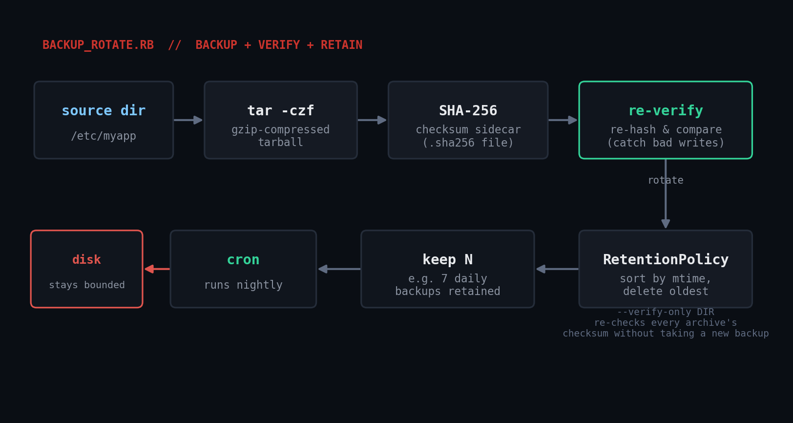

# backup_rotate.rb

Back up a directory to a timestamped, gzip-compressed tarball, verify
it with a SHA-256 checksum immediately, and enforce a retention policy
so old backups don't quietly fill the disk. For config directories,
small data dumps, or app data folders that don't already have a
dedicated backup tool.



## Prerequisites

- **Ruby 2.7+** (tested on Ruby 3.0.2). Only stdlib: `optparse`,
  `fileutils`, `digest`, `json`, `open3`.
- **`tar` and `gzip`** on `PATH` - present by default on Linux/macOS.
  On Windows, run under WSL or Git Bash (which ships a real `tar`).
- Write access to the destination directory (created automatically if
  missing).

## Usage

```bash
ruby backup_rotate.rb /etc/myapp /var/backups/myapp
ruby backup_rotate.rb /etc/myapp /var/backups/myapp --keep 14
ruby backup_rotate.rb /etc/myapp /var/backups/myapp --keep 14 --json
ruby backup_rotate.rb --verify-only /var/backups/myapp
```

**Exit codes:** `0` success (checksum verified), `1` checksum
verification failed (don't trust this backup), `2` usage/input error
(e.g. missing source directory).

## How it works

1. **`BackupCreator#create`** shells out to `tar -czf` via
   `Open3.capture3` (captures stderr and exit status cleanly), archiving
   from the *parent* directory so the tarball contains a clean relative
   path (`myapp/...`) instead of an absolute path baked in.
2. It computes a SHA-256 with `Digest::SHA256.file`, writes a
   `sha256sum`-compatible `.sha256` sidecar, then **immediately
   re-hashes the file on disk and compares** - catching a truncated
   write (full disk, interrupted process) the moment the backup runs,
   not months later during a failed restore.
3. **`RetentionPolicy#enforce`** globs every `*.tar.gz` in the
   destination, sorts by mtime, and deletes archives (plus sidecars)
   beyond the newest `--keep`. It reads the directory fresh each run
   rather than tracking state, so it's safe to re-run after a failure.
4. **`--verify-only DIR`** re-hashes every existing archive and reports
   OK/FAILED per file, with no side effects - useful as an independent
   health check separate from the nightly backup job.

## Example output

```
$ ruby backup_rotate.rb src/myapp dest --keep 7
backup_rotate: created dest/myapp-20260727-145737.tar.gz (197 bytes)
  sha256: f9e301d2d9f79af52469291046baed9a333856fe511576c11543614c83e41ad6
  checksum verified OK
  no backups rotated out (1/7 kept)

$ ruby backup_rotate.rb --verify-only dest
OK      dest/myapp-20260727-145737.tar.gz
OK      dest/myapp-20260727-145738.tar.gz
```

## Troubleshooting

- **"tar failed: ..."** - check the captured stderr; usually an
  unreadable source directory or a full/read-only destination
  filesystem.
- **"checksum mismatch immediately after writing"** - the disk filled
  up mid-write, or something else touched the archive between write
  and verify. Check `df -h` on the destination first.
- **Rotation deletes fail with a permission error** on some
  sandboxed/FUSE-backed mounts (certain CI runners, some cloud dev
  environments disallow deletion even by the owning user). This was
  observed and confirmed to be a filesystem-mount restriction, not a
  script bug, by re-running the exact same rotation logic against a
  normal local filesystem (see Testing notes below) where it correctly
  deleted the oldest archives.
- **Windows without WSL/Git Bash** - the script shells out to
  `tar`/`gzip` directly, which a stock `cmd.exe`/PowerShell doesn't
  have. Run under WSL, install Git for Windows, or swap `run_tar` for a
  pure-Ruby `zlib`-based tar writer.

## Extending it

- **Remote off-site copy**: after a successful verify, `rsync`/`scp` the
  archive and its `.sha256` sidecar to a remote host or object storage.
- **Encryption at rest**: pipe `tar` output through `openssl enc` or
  `age` before writing, for backups containing secrets or PII.
- **Per-directory retention policies**: different `--keep` windows for
  different backup name prefixes sharing one destination.
- **Restore verification drills**: add a `--test-restore TMPDIR` mode
  that extracts the newest archive and diffs a few expected files - the
  only way to be sure a backup restores cleanly is to actually restore
  it periodically.

## Testing notes

Verified end-to-end in a sandbox: created backups across multiple runs
with `--keep 3`, confirmed rotation deleted the correct oldest archives
on a normal filesystem, confirmed `--verify-only` correctly flags a
manually corrupted archive as `FAILED` (exit 1), and confirmed the
correct exit codes for a missing source directory (`2`) versus a
checksum failure (`1`).

## References

- [Ruby stdlib: Digest::SHA256](https://docs.ruby-lang.org/en/3.0/Digest/SHA256.html)
- [Ruby stdlib: Open3](https://docs.ruby-lang.org/en/3.0/Open3.html)
- [Ruby stdlib: FileUtils](https://docs.ruby-lang.org/en/3.0/FileUtils.html)
