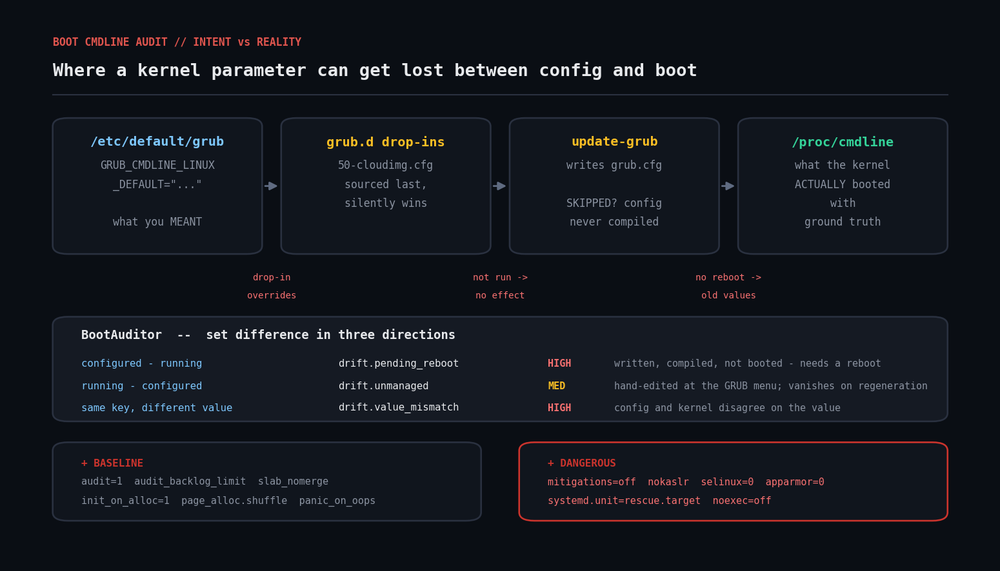

# boot-cmdline-audit

Reconcile the **running** kernel command line against the **configured** one, and grade both against a hardening baseline. Ruby, read-only, no gems.



## The problem

Kernel boot parameters are where a lot of security and reliability settings actually live — `audit=1`, `slab_nomerge`, `init_on_alloc=1`, `panic_on_oops=1`. They're set in `/etc/default/grub` (or a drop-in under `/etc/default/grub.d/`), compiled into the bootloader config by `update-grub` / `grub2-mkconfig`, and **only take effect after a reboot**.

That creates a gap nothing else catches:

* Config management writes the parameter into `/etc/default/grub` and reports "converged". The kernel running right now still doesn't have it.
* Someone edits the GRUB menu entry at boot for a one-off recovery, and the box keeps running that way for eight months.
* A cloud-image drop-in in `grub.d/` is sourced *after* the main file and silently wins.
* A vendor kernel update rewrites `grub.cfg` and drops a parameter.

`/proc/cmdline` is ground truth for what the kernel booted with. `/etc/default/grub` is intent. This script diffs the two — so you can tell **"wrong config"** apart from **"right config, needs a reboot"**, which are completely different tickets.

## Prerequisites

| | |
|---|---|
| Ruby | 2.7+ (tested on 3.0.2) |
| Gems | none — `optparse`, `json`, `time` are stdlib |
| OS | any Linux with `/proc/cmdline`; GRUB2 for the config side |
| Privileges | `/proc/cmdline` is world-readable; `/etc/default/grub` usually is too |

Non-GRUB bootloaders (systemd-boot, U-Boot extlinux) still get the baseline and dangerous-parameter checks — the drift checks just report nothing, because there's no configured line to compare against.

## Usage

```bash
# Audit the running host
ruby boot_cmdline_audit.rb

# Audit captured files from another host
ruby boot_cmdline_audit.rb --cmdline ./captured/proc_cmdline \
                           --grub-default ./captured/default_grub \
                           --grub-dropin ./captured/grub.d

# Machine-readable
ruby boot_cmdline_audit.rb --format json

# Your own baseline instead of the built-in one
ruby boot_cmdline_audit.rb --baseline ./my-baseline.json

# CI gate
ruby boot_cmdline_audit.rb --fail-on high
```

A custom baseline is a JSON array of objects:

```json
[
  { "param": "audit", "value": "1", "severity": "high",
    "why": "auditd cannot capture events that happen before it starts." },
  { "param": "slab_nomerge", "value": null, "severity": "medium",
    "why": "merging slab caches makes heap-overflow exploitation easier." }
]
```

`"value": null` means "the parameter must be present; any value is fine."

## How it works

### Tokenising a kernel command line properly

Values can be double-quoted and can contain spaces:

```
BOOT_IMAGE=/vmlinuz root=UUID=3f1a systemd.setenv="FOO=a b" quiet
```

A naive `String#split` mangles that. `CmdlineParser.tokenize` scans character by character and tracks quote state, then splits each token on the **first** `=` only — so `root=UUID=3f1a` yields `root` → `UUID=3f1a`, not `root` → `UUID`.

It also returns the list of duplicate keys. A parameter legitimately *can* appear twice (the last occurrence usually wins), but when it does, the effective value is non-obvious — worth a low-severity note.

### Reading the configured line, including drop-ins

`/etc/default/grub` is shell syntax. `GrubDefaults` only cares about two assignments:

* `GRUB_CMDLINE_LINUX` — applied to every menu entry
* `GRUB_CMDLINE_LINUX_DEFAULT` — applied to normal (non-recovery) entries

Then it sources every `/etc/default/grub.d/*.cfg` **in sorted order**, letting later files overwrite earlier ones — because that's what the shell does when `grub-mkconfig` sources them. Cloud images ship `50-cloudimg-settings.cfg`, which routinely overrides whatever you wrote in the main file. If you only read `/etc/default/grub`, you get the wrong answer.

The effective configured line is `GRUB_CMDLINE_LINUX` + `GRUB_CMDLINE_LINUX_DEFAULT`.

### Three set differences, three different meanings

| direction | check | severity | means |
|---|---|---|---|
| configured − running | `drift.pending_reboot` | high | written and compiled, but not booted — **needs a reboot** |
| running − configured | `drift.unmanaged` | medium | hand-edited at the GRUB menu; **vanishes on the next `update-grub`** |
| same key, different value | `drift.value_mismatch` | high | config and kernel disagree outright |

Host-specific and bootloader-injected parameters are excluded from all three via a `VOLATILE` list: `root`, `rootfstype`, `BOOT_IMAGE`, `initrd`, `crashkernel`, `console`, `resume`, LUKS/LVM/md UUIDs — and `ro` / `rw`, because GRUB appends the root mount mode to every generated entry. Without that last exclusion **every single host** reports a false `drift.unmanaged` for `ro`. (That one was found by running the script against a real `/proc/cmdline` rather than only against fixtures — which is exactly why you test against the real thing.)

### Baseline and dangerous parameters

Two more passes over the running line:

* **Baseline** — parameters that should be there: `audit=1`, `audit_backlog_limit`, `slab_nomerge`, `init_on_alloc=1`, `page_alloc.shuffle=1`, `panic_on_oops=1`. Override with `--baseline`.
* **Dangerous** — parameters that are actively bad in production: `mitigations=off`, `nokaslr`, `selinux=0`, `enforcing=0`, `apparmor=0`, `noexec=off`, `init_on_free=0`, `debug`, and `systemd.unit=rescue.target` (a host still running in rescue mode is almost always a forgotten recovery session).

Note that `mitigations=off` shows up **twice** in a realistic run — once as `drift.unmanaged` (it isn't in your config) and once as `dangerous.parameter` (it's dangerous regardless). That redundancy is deliberate: the two findings answer different questions ("where did this come from?" and "how bad is it?").

## Example output

```
Kernel boot command line audit
  running    (/proc/cmdline): BOOT_IMAGE=/vmlinuz-5.15.0-118-generic root=UUID=3f1a-9c2e ro quiet splash mitigations=off audit...
  configured (/etc/default/grub): quiet splash audit=1 audit_backlog_limit=8192 slab_nomerge init_on_alloc=1 console=ttyS0
----------------------------------------------------------------------------

[drift]
  HIGH   drift.pending_reboot
         'slab_nomerge' is configured in GRUB but is NOT on the running kernel. The setting takes effect only after update-grub + reboot.
         -> configured: slab_nomerge | running: (absent)
  MEDIUM drift.unmanaged
         'systemd.unit=rescue.target' is on the running kernel but is NOT in /etc/default/grub. It came from a manual GRUB edit or a package drop-in and will vanish on the next regeneration.
         -> running: systemd.unit=rescue.target | configured: (absent)

[baseline]
  MEDIUM baseline.missing
         init_on_alloc=1 is missing from the running kernel command line -- zeroing pages on allocation removes a large class of uninitialised-memory information leaks.
         -> running: (absent)

[dangerous]
  HIGH   dangerous.parameter
         mitigations=off -- all CPU speculative-execution mitigations disabled (Spectre/Meltdown/MDS).
         -> running: mitigations=off
  HIGH   dangerous.parameter
         systemd.unit=rescue.target -- the host booted into rescue mode -- almost certainly a leftover from a recovery session.
         -> running: systemd.unit=rescue.target

[hygiene]
  LOW    hygiene.duplicate
         'quiet' appears more than once on the running command line; the last occurrence wins, which makes the effective value non-obvious.
         -> running line contains repeated 'quiet'

----------------------------------------------------------------------------
summary: 14 finding(s)  high=5  medium=6  low=3
note: pending_reboot findings need `update-grub` (Debian) or `grub2-mkconfig -o /boot/grub2/grub.cfg` (RHEL) followed by a reboot.
```

A correctly-configured, freshly-rebooted host prints:

```
OK  running kernel matches configuration and satisfies the baseline
```

## Troubleshooting

**"Everything reports `drift.pending_reboot` right after I ran `update-grub`."**
That is the correct answer. `update-grub` writes `grub.cfg`; it does not change the running kernel. Reboot, then re-run.

**"`configured` is empty."**
Either the host doesn't use GRUB2, or `/etc/default/grub` is somewhere else. RHEL-family systems keep it at the same path but write the compiled output to `/boot/grub2/grub.cfg` or `/boot/efi/EFI/<distro>/grub.cfg`. Point `--grub-default` at the right file.

**"A parameter I set in `/etc/default/grub` doesn't appear in `configured`."**
Check `/etc/default/grub.d/`. A drop-in that reassigns `GRUB_CMDLINE_LINUX_DEFAULT` replaces your value entirely rather than appending to it. The script reports the effective value, which is the one that matters.

**"False `drift.unmanaged` for something the bootloader adds."**
Add it to `VOLATILE`. The list in the script is a reasonable default, not a complete one — an initramfs generator like dracut injects a lot of `rd.*` parameters that vary by host.

**"`grub.cfg` and `/etc/default/grub` disagree and neither matches `/proc/cmdline`."**
You have two problems: `update-grub` hasn't been run, and the running kernel is older than both. This script only compares intent against reality; parsing `grub.cfg` itself would let you see the middle step. See "Extending it".

**Containers.** Inside a container, `/proc/cmdline` is the host's. Findings reflect the host kernel, not the container — which is correct, since a container has no kernel of its own, but it means running this in a pod reports on the node.

## Extending it

* **Parse `grub.cfg` too**, to see the middle stage: config → compiled → booted. That separates "you never ran `update-grub`" from "you never rebooted", which are different fixes.
* **Support systemd-boot.** Read `/boot/loader/entries/*.conf` `options` lines instead of `/etc/default/grub`. The diff logic is unchanged — only the "configured" source differs.
* **Fleet mode.** Emit JSON per host into a directory, then aggregate: which parameters are missing on the most hosts, and which hosts have unmanaged parameters nobody remembers adding.
* **Check `/sys/kernel/security/lockdown` and `/sys/module/*/parameters/`.** Some boot parameters are also readable as runtime state, which catches the case where the parameter was accepted but the feature silently didn't engage.
* **Pair it with a reboot-required check.** `drift.pending_reboot` plus `/var/run/reboot-required` gives you a defensible "this host needs a maintenance window, here's exactly why" ticket.
* **Emit Prometheus text format** and scrape with a node_exporter textfile collector — a fleet-wide `boot_drift_findings{severity="high"}` gauge is a good dashboard panel.

## References

- [`kernel-parameters.txt`](https://www.kernel.org/doc/html/latest/admin-guide/kernel-parameters.html) — the canonical list of boot parameters and what they do
- [GRUB manual: simple configuration](https://www.gnu.org/software/grub/manual/grub/grub.html#Simple-configuration) — `GRUB_CMDLINE_LINUX` vs `GRUB_CMDLINE_LINUX_DEFAULT`, and how `grub-mkconfig` sources `/etc/default/grub`
- [Kernel self-protection](https://www.kernel.org/doc/html/latest/security/self-protection.html) — background on `init_on_alloc`, `slab_nomerge`, KASLR
- [`proc(5)`](https://www.man7.org/linux/man-pages/man5/proc.5.html) — `/proc/cmdline`
- [Ruby `OptionParser`](https://docs.ruby-lang.org/en/master/OptionParser.html)

## Licence

MIT — see the repository root.
