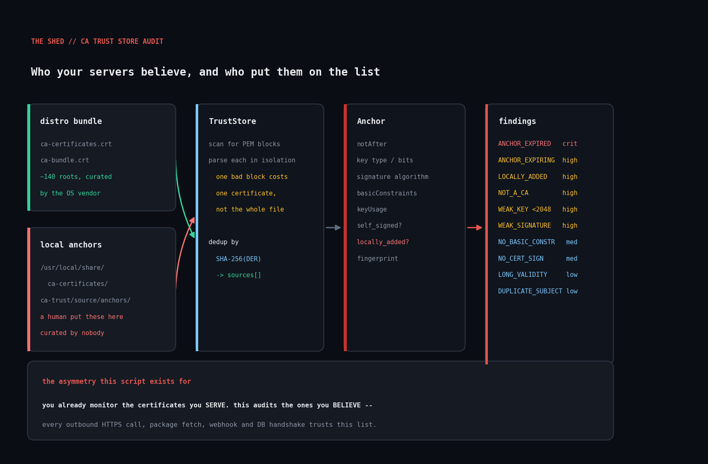

# ca-trust-store-audit

Audit the system CA trust store with Ruby's bundled OpenSSL bindings: expired
anchors, weak keys, non-CA certificates installed as anchors, and — the finding
that matters most — every anchor that was added locally rather than shipped by
the distribution.



## The problem

Everyone monitors their *server* certificates. Almost nobody audits the other
end of the trust relationship.

The ~140 root CA certificates in `/etc/ssl/certs` decide which certificates your
servers will accept when *they* are the client: every outbound HTTPS call, every
package fetch, every webhook delivery, every database TLS handshake. That store
is a single, unversioned, append-anything list.

- A contractor runs `update-ca-certificates` after dropping in a corporate
  proxy's MITM root.
- A five-year-old container base image ships a bundle with expired anchors and
  1024-bit keys.
- A developer adds their own self-signed dev CA "temporarily" and it rides into
  the golden image.
- A provisioning tool injects host CAs into `/usr/local/share/ca-certificates`
  and nobody writes it down.

None of this produces an error message. It just quietly widens what the host
will trust, permanently.

That last example is not hypothetical. Running this script against the Linux
sandbox it was developed in found **71 locally-injected anchors** in
`/usr/local/share/ca-certificates`, plus 9 expired roots, 5 RSA-1024 keys, and
an MD2-signed certificate — in an image nobody had thought of as unusual.

## Prerequisites

- **Ruby >= 2.7.** Standard library only; `openssl` ships with Ruby.
- **Linux or macOS** for default bundle auto-detection. Works on Windows too if
  you pass `--bundle` explicitly.
- No root required — trust stores are world-readable by design.

## Usage

```
ruby ca_trust_store_audit.rb                               # auto-detect
ruby ca_trust_store_audit.rb --bundle /etc/ssl/certs/ca-certificates.crt
ruby ca_trust_store_audit.rb --dir /etc/ssl/certs --expiry-days 180
ruby ca_trust_store_audit.rb --json --min-severity high
```

With no arguments the script finds the distro bundle itself (trying the
Debian/Ubuntu, RHEL/Fedora and Alpine/macOS locations) **and** includes the
local anchor directories, so injected roots show up by default rather than only
when you remember to ask.

| Flag | Meaning |
| --- | --- |
| `--bundle PATH` | concatenated PEM bundle; repeatable |
| `--dir PATH` | directory of PEM files; repeatable |
| `--local-dir PATH` | treat anchors from `PATH` as locally added; repeatable |
| `--expiry-days N` | warn this far ahead (default 90) |
| `--json` | emit JSON instead of text |
| `--min-severity SEV` | report `critical`/`high`/`medium`/`low` and above |

Exit codes: `0` clean, `1` warnings only, `2` high or critical present,
`3` nothing auditable or bad arguments.

## How it works

**`TrustStore`** handles loading. A concatenated bundle can hold hundreds of PEM
blocks, so rather than handing the whole file to OpenSSL it scans for the
`BEGIN`/`END CERTIFICATE` delimiters and parses each block on its own. That
matters because malformed entries genuinely happen — truncated writes, editors
mangling line endings — and one bad block should cost you that certificate, not
the entire audit. Failures are collected into `parse_errors` and reported, never
silently dropped.

Directories get the same treatment. `/etc/ssl/certs` is mostly hash-named
symlinks (`3513523f.0`) pointing at a smaller set of real files, so the same
certificate shows up many times. Dedup keys on **SHA-256 over the DER**, which
is the stable identity of a certificate, and records every path a given anchor
was found at in `sources[]`.

That `sources[]` array is what makes the provenance check possible.

**`Anchor`** pre-extracts everything the rules need, because
`OpenSSL::X509::Certificate` is lazy and awkward: key sizes live on a different
object, extensions come back as objects you have to stringify, and
`basicConstraints` is a string like `"CA:TRUE, pathlen:0"` that needs parsing.
Unsupported key algorithms are caught and recorded as `unreadable` rather than
aborting the run for one bad anchor.

**`Auditor`** applies the rules:

| Code | Severity | Trigger |
| --- | --- | --- |
| `ANCHOR_EXPIRED` | critical | `notAfter` in the past |
| `ANCHOR_EXPIRING` | high | expires within `--expiry-days` |
| `LOCALLY_ADDED` | high | PEM lives in a local anchor directory |
| `NOT_A_CA` | high | `basicConstraints` says `CA:FALSE` |
| `WEAK_KEY` | high | RSA/DSA < 2048 bits, or EC < 224 |
| `WEAK_SIGNATURE` | high | MD2/MD4/MD5/SHA-1 **and not self-signed** |
| `NO_BASIC_CONSTRAINTS` | medium | extension absent entirely |
| `NO_CERT_SIGN` | medium | explicit `keyUsage` omits Certificate Sign |
| `WEAK_SELF_SIGNATURE` | low | MD5/SHA-1 self-signature |
| `LONG_VALIDITY` | low | valid for more than 30 years |
| `DUPLICATE_SUBJECT` | low | two distinct certs share a CA name |

Four of these encode a judgement worth spelling out:

- **Weak signatures are split by self-signedness.** A SHA-1 *self*-signature on
  a root is cosmetic: clients never verify it, because the root is the trust
  anchor. A SHA-1 signature on a cross-signed intermediate sitting in the store
  *is* verified, and SHA-1 collisions are practical. Same algorithm, very
  different severity — collapsing them would either cry wolf on 21 legacy roots
  or miss the one that counts.
- **`NOT_A_CA` catches "just trust this one server."** A leaf certificate in the
  trust store means someone hit a verification error and made it go away. It
  cannot validate a chain, and it is a standing instruction to trust one host
  unconditionally.
- **`LOCALLY_ADDED` is high severity even though it is often legitimate.**
  Distro bundles are curated by people who follow CA/Browser Forum removals.
  Locally added anchors are curated by nobody. The finding is not "this is
  wrong", it is "confirm somebody still means this."
- **`DUPLICATE_SUBJECT` is usually benign.** A root rolling to a new key
  publishes both during the overlap. But it is also exactly what a spoofed
  anchor looks like, so the fingerprints get surfaced rather than assumed.

## Example output

Against a fixture store covering every rule:

```
CA trust store audit -- 2026-09-17 12:44:45 CDT
sources: /tmp/cademo/ca-certificates.crt, /tmp/cademo/local-anchors
==============================================================================

ANCHORS: 6 unique
  keys:       RSA-2048=5  RSA-1024=1
  signatures: sha256WithRSAEncryption=5  sha1WithRSAEncryption=1
  local:      1
  expired:    1
  next expiry: 2026-10-17 (29d) Fixture Expiring Root

FINDINGS (9)
------------------------------------------------------------------------------
[CRITICAL] ANCHOR_EXPIRED
    anchor:   Fixture Expired Root
    trust anchor expired 1096 day(s) ago but is still in the store -- every
    chain that ends here now fails, usually as an unhelpful "unable to get
    local issuer certificate"
    evidence: notAfter=2023-09-18

[HIGH] LOCALLY_ADDED
    anchor:   internal-api.corp.example
    added locally, not shipped by the distribution -- confirm this is an
    intentional corporate/internal CA and not a leftover dev or proxy root
    evidence: source=/tmp/cademo/local-anchors/internal-api.crt

[HIGH] NOT_A_CA
    anchor:   internal-api.corp.example
    basicConstraints says CA:FALSE -- this is a leaf certificate installed as
    a trust anchor, which is what "just trust this one server" usually turns into
    evidence: basicConstraints=CA:FALSE

[HIGH] WEAK_KEY
    anchor:   Fixture Legacy 1024 Root
    RSA-1024 public key is below the 2048-bit floor -- a forged certificate
    under this anchor is a factoring problem, not an impossibility
    evidence: key=RSA-1024

==============================================================================
6 anchor(s); 1 critical, 4 high, 2 medium, 2 low
```

The summary block from the real Linux sandbox store, for contrast:

```
ANCHORS: 165 unique
  keys:       RSA-4096=69  RSA-2048=46  EC-384=39  EC-256=5  RSA-1024=5  EC-521=1
  signatures: sha256WithRSAEncryption=64  ecdsa-with-SHA384=36
              sha384WithRSAEncryption=25  sha1WithRSAEncryption=21
              md5WithRSAEncryption=5  md2WithRSAEncryption=1
  local:      71
  expired:    9
  next expiry: 2026-11-27 (71d) Entrust Root Certification Authority
```

## Testing

```
ruby ca_trust_store_audit_test.rb
```

Mints six certificates in-process with Ruby's own OpenSSL bindings — no
`openssl` CLI needed — covering a healthy root, an expired root, one expiring
inside the window, a 1024-bit SHA-1 root, a `CA:FALSE` leaf, and a
pre-RFC-5280-style root with no `basicConstraints`. Then asserts all 24
behaviours: rule triggers, provenance detection, fingerprint dedup across two
files, recovery from a deliberately corrupt PEM block, `--expiry-days` widening,
and exit codes.

The real system store is useful to audit but useless as a test: you cannot make
it contain a `CA:FALSE` anchor on demand. Both were used here — fixtures for
correctness, the live store for realism.

## Troubleshooting

**`error: no CA bundle found`**
The distro puts its bundle somewhere the script does not try. Find it with
`openssl version -d` (the `OPENSSLDIR`) and pass `--bundle` explicitly.

**`LOCALLY_ADDED` fires on 70+ anchors.**
Something is injecting trust anchors — a provisioning tool, a container build
step, a corporate MDM profile. This is a real finding, not a false positive. The
`source=` line tells you which directory; the fix is to find out what writes
there. If your organisation genuinely does distribute an internal CA this way,
add its fingerprint to an allowlist rather than suppressing the whole rule.

**A certificate reports `key_type: "unreadable"`.**
OpenSSL 3 moved several legacy algorithms behind the legacy provider. The anchor
is still counted and still checked for expiry; only the key-size rule is skipped
for it.

**Lots of `WEAK_SELF_SIGNATURE` at low severity.**
Expected. Mainstream bundles still carry roots minted in the late 1990s. Because
a root's self-signature is never verified, this is a legacy marker rather than a
vulnerability — which is why it is `low` and separated from `WEAK_SIGNATURE`.

**Expired roots that "should" have been removed.**
Also expected, and worth understanding: distributions keep some expired anchors
for compatibility with old code-signing and timestamping chains. Confirm with
`openssl x509 -in <file> -noout -ext extendedKeyUsage` before deleting anything.
The script reports; it does not modify the store.

**It found nothing and you expected findings.** Default severity is `low`, so
that should be rare — but check you are auditing the store the *application*
uses. Container runtimes, Java (`cacerts`), Node (`NODE_EXTRA_CA_CERTS`) and
Python (`certifi`) all frequently use their own bundles instead of the system
one. Point `--bundle` at those separately.

## Extending it

- **Audit the bundles your runtimes actually use.** `certifi`'s `cacert.pem`,
  Java's `cacerts` (after `keytool -exportcert`), and any bundle baked into a
  container image are all just PEM files. Same script, different `--bundle`.
- **Pin an approved set.** Store the SHA-256 fingerprints you expect and flag
  additions. That turns a posture report into genuine drift detection, which is
  the version you want running on a schedule.
- **Diff across a fleet.** Collect `--json` from every host and compare
  `fingerprint_sha256` sets. One host trusting something the others do not is a
  much stronger signal than any single-host rule.
- **Cross-check against Mozilla's removal list.** CAs get distrusted between
  distro bundle updates; a root that is still present but publicly distrusted is
  a finding this script cannot currently make on its own.
- **Check the CRL and OCSP endpoints.** `crlDistributionPoints` is in the
  extensions already parsed. An anchor whose revocation endpoint has gone dark
  is a quiet operational problem.

## References

- [`OpenSSL::X509::Certificate` (Ruby stdlib)](https://docs.ruby-lang.org/en/master/OpenSSL/X509/Certificate.html)
- [`OpenSSL::X509::Extension`](https://docs.ruby-lang.org/en/master/OpenSSL/X509/Extension.html)
  — how `basicConstraints` and `keyUsage` values are exposed
- [RFC 5280 §4.2.1.9 (basicConstraints)](https://datatracker.ietf.org/doc/html/rfc5280#section-4.2.1.9)
- [`update-ca-certificates(8)`](https://manpages.debian.org/bookworm/ca-certificates/update-ca-certificates.8.en.html)
  — where locally added anchors come from on Debian/Ubuntu
- [Mozilla CA Certificate Program](https://wiki.mozilla.org/CA) — the policy
  most distro bundles ultimately track

## License

MIT, same as the rest of this repository.
