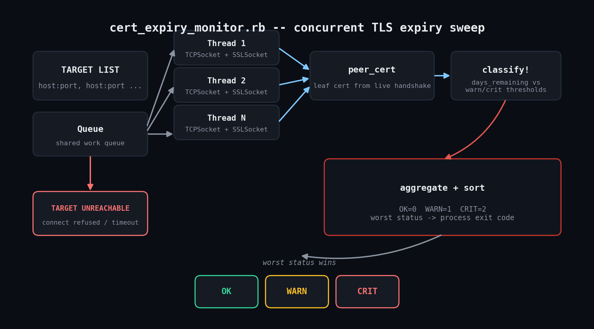

# cert-expiry-monitor

A pure Ruby, concurrent TLS certificate expiry monitor. Connects to a list of `host:port`
targets, completes a real TLS handshake, and reads the certificate the server is
**actually presenting right now** — not a cached copy. No gems required.



## Why

Expired TLS certificates are one of the few outages that are entirely predictable and
entirely preventable — the expiry date is known the moment a cert is issued. This script
gives you one command to check as many hosts as you want and get a clear OK/WARN/CRIT
verdict per host, with an exit code suitable for cron or a monitoring pipeline.

## Prerequisites

- Ruby 3.0 or newer (tested on 3.0.2; 2.5+ should work unmodified)
- No gems — uses `openssl`, `socket`, `optparse`, `json`, `timeout`, and `time` from the
  standard library
- Network access from wherever you run it to the target `host:port`s
- Linux, macOS, or Windows — nothing here is OS-specific

## Usage

```bash
# Basic check against one or more hosts (defaults to port 443)
ruby cert_expiry_monitor.rb example.com api.example.com:8443

# Custom thresholds
ruby cert_expiry_monitor.rb example.com --warn-days 21 --crit-days 5

# Machine-readable output for alerting pipelines
ruby cert_expiry_monitor.rb example.com --json
```

Exit codes: `0` = all OK, `1` = at least one WARN, `2` = at least one CRIT (including
unreachable hosts) — the worst status across all targets.

## How it works

- **`CertCheck`** opens a `TCPSocket`, wraps it in an `OpenSSL::SSL::SSLSocket` with
  `ssl.hostname` set for SNI, and completes the handshake with
  `verify_mode = OpenSSL::SSL::VERIFY_NONE` — deliberate, since the tool's job is to
  inspect certificates that might be untrusted, expired, or self-signed. Everything is
  wrapped in `Timeout.timeout` so one hung host can't stall the whole run.
- **`Runner`** fans checks out across a small thread pool (default 8, capped at the
  number of targets) reading from a shared `Queue`, so wall-clock time stays close to
  the slowest single host rather than the sum of all hosts.
- **Classification** compares `days_remaining` (from `cert.not_after`) against
  `--warn-days` / `--crit-days`. Unreachable hosts are always CRIT.

## Example output

```
$ ruby cert_expiry_monitor.rb 127.0.0.1:9101 127.0.0.1:9102 127.0.0.1:9103 127.0.0.1:9199 --warn-days 30 --crit-days 7
TARGET                           STATUS DAYS     EXPIRES (UTC)          SUBJECT / ERROR
----------------------------------------------------------------------------------------------------
127.0.0.1:9101                   OK     59       2026-10-03T17:23:49Z   localhost
127.0.0.1:9102                   WARN   14       2026-08-19T17:23:49Z   localhost
127.0.0.1:9103                   CRIT   2        2026-08-07T17:23:49Z   localhost
127.0.0.1:9199                   CRIT   -        -                      Errno::ECONNREFUSED: Connection refused - connect(2) for "127.0.0.1" port 9199

exit code: 2
```

## Testing notes

Verified live in a Linux sandbox using `test_harness.rb`, which spins up three local
`OpenSSL::SSL::SSLServer` instances presenting self-signed certificates with 60-, 15-,
and 3-day expiry windows (to exercise OK/WARN/CRIT), plus a closed port to exercise the
unreachable-host path. This means every branch of the classification logic was run
against a real TLS handshake, not mocked.

## Troubleshooting

- **CRIT with `OpenSSL::SSL::SSLError` on every target** — the port likely isn't
  speaking TLS at all; double-check you pointed at the right port.
- **`Errno::ECONNREFUSED` against a host you know is up** — a firewall/security group is
  probably blocking the port from wherever this runs; test with `nc -zv host 443` first.
- **Run seems to hang** — lower `--timeout`; a host that black-holes traffic (rather than
  refusing) eats the full timeout instead of failing fast.
- **Unexpected `subject` on a SAN-only certificate** — the script reports the CN (or full
  subject string with no CN), which is normal for certs relying purely on SANs and
  doesn't affect the expiry check.

## Extending

- Pipe `--json` output into a Slack webhook or PagerDuty Events API call on non-zero exit.
- Use `cert.extensions` for SAN inspection, or `ssl.peer_cert_chain` to also check
  intermediate certificate expiry, not just the leaf.
- Swap `ARGV` targets for a YAML/JSON fleet inventory file with per-service thresholds.
- Append each run's JSON to a rolling log to graph days-remaining over time.

## References

- [Ruby `OpenSSL::SSL::SSLSocket` docs](https://docs.ruby-lang.org/en/3.2/OpenSSL/SSL/SSLSocket.html)
- [Ruby `OpenSSL::X509::Certificate` docs](https://docs.ruby-lang.org/en/3.2/OpenSSL/X509/Certificate.html)

## License

MIT — see the repository root [LICENSE](../LICENSE).
