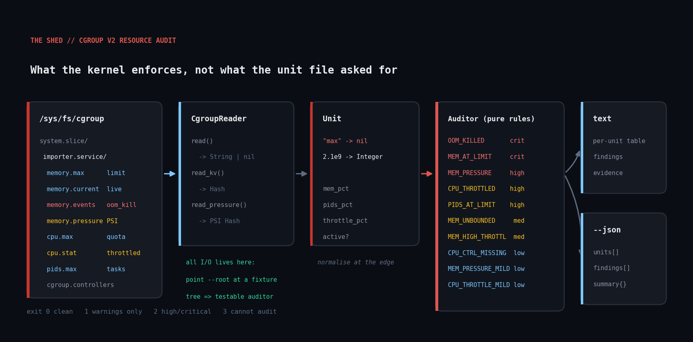

# cgroup-resource-audit

Audit systemd unit resource limits and headroom straight from the cgroup v2
filesystem — what the kernel is actually enforcing, and how close each service
is to hitting it.



## The problem

`systemctl show` tells you what a unit file *asked* for. It does not tell you
whether the kernel has already had to act on it.

Every systemd service on a modern Linux box lives in its own cgroup v2
directory under `/sys/fs/cgroup`. That directory is the authoritative record of
what the kernel will let the service do — and, more usefully, it carries live
counters for how often the kernel has already enforced those limits:

- a service that has been silently OOM-killed eleven times this week
- a service pinned at 97% of its memory cap, one allocation spike from death
- a service being CPU-throttled 40% of the time because someone set
  `CPUQuota=5%` two years ago and forgot
- a service with no `MemoryMax` at all that is quietly holding 60% of host RAM

None of these produce an error you would notice. An in-cgroup OOM kill is
especially invisible: `SIGKILL` cannot be caught, so the application never gets
to log its own death. The counter in `memory.events` is often the only evidence
it happened.

This script reads that filesystem directly — no gems, no shelling out — and
reports every unit that is in trouble or about to be.

## Prerequisites

- **Ruby >= 2.7** (standard library only: `optparse`, `json`, `time`)
- **Linux with cgroup v2** (the unified hierarchy). Check with:
  ```
  stat -fc %T /sys/fs/cgroup     # should print: cgroup2fs
  ```
- No root required to read most control files, though some values are
  restricted on hardened kernels. Unreadable files degrade to "no data" rather
  than crashing the audit.

## Usage

```
ruby cgroup_resource_audit.rb                          # audit system.slice
ruby cgroup_resource_audit.rb --slice system.slice --slice user.slice
ruby cgroup_resource_audit.rb --json                   # machine-readable
ruby cgroup_resource_audit.rb --min-severity high --quiet
ruby cgroup_resource_audit.rb --root /tmp/fixture      # audit a fixture tree
```

| Flag | Meaning |
| --- | --- |
| `--root PATH` | cgroup v2 mount point (default `/sys/fs/cgroup`) |
| `--slice NAME` | slice to audit; repeatable (default `system.slice`) |
| `--json` | emit JSON instead of the text table |
| `--quiet` | suppress the per-unit table, print findings only |
| `--min-severity SEV` | report `critical`/`high`/`medium`/`low` and above |

Exit codes, for monitoring checks and CI gates:

| Code | Meaning |
| --- | --- |
| 0 | no findings at or above the threshold |
| 1 | warnings only (medium/low) |
| 2 | at least one high or critical finding |
| 3 | could not audit (no cgroup v2, bad arguments) |

## How it works

**`CgroupReader`** is the only class that touches the filesystem. It exposes
three readers — `read` for scalar files, `read_kv` for flat key/value files like
`cpu.stat`, and `read_pressure` for PSI files — and every one of them returns
`nil` instead of raising when a file is missing or unreadable. That matters more
than it sounds: on a real box control files vanish mid-scan because the unit
stopped, and controllers you do not have delegated are simply absent. Treating
both as "no data" is the only sane behaviour for an auditor.

Keeping all I/O behind this one class is also what makes the script testable.
Point `--root` at a directory of ordinary text files and the auditor cannot tell
the difference.

**`Unit`** parses one service's worth of numbers into plain Ruby values. The
important detail is that cgroup v2 writes the literal string `max` for "no
limit". Converting that to `nil` at the boundary means the rest of the code asks
"is the limit nil?" rather than string-comparing `"max"` in six places — and it
prevents the classic bug where `"max".to_i` becomes `0` and every unbounded
service looks like it is infinitely over its limit.

`cpu.max` gets similar treatment: `"10000 100000"` is quota and period in
microseconds, which becomes a 10% quota. `"max 100000"` becomes `nil`.

**`Auditor`** holds the rules and does no I/O and no printing, so each rule is
a pure function of one `Unit`:

| Code | Severity | Trigger |
| --- | --- | --- |
| `OOM_KILLED` | critical | `memory.events` `oom_kill` > 0 |
| `MEM_AT_LIMIT` | critical | `memory.current` >= 90% of `memory.max` |
| `MEM_PRESSURE` | high | `memory.pressure` full avg60 >= 10% |
| `CPU_THROTTLED` | high | throttled >= 10% of CPU time |
| `PIDS_AT_LIMIT` | high | `pids.current` >= 85% of `pids.max` |
| `MEM_UNBOUNDED` | medium | no `MemoryMax` **and** holding >= 15% of host RAM |
| `MEM_HIGH_THROTTLED` | medium | `memory.events` `high` > 0 |
| `MEM_HEADROOM_LOW` | medium | `memory.current` >= 75% of `memory.max` |
| `CPU_CTRL_MISSING` | low | `cpu` controller not delegated to this cgroup |
| `MEM_PRESSURE_MILD` | low | full avg60 >= 2% |
| `CPU_THROTTLED_MILD` | low | throttled >= 2% |

Three of those deserve a note on *why* they are findings at all:

- **`MEM_UNBOUNDED` is conditional on size.** An unbounded 4 MB helper cannot
  take the host down; an unbounded process already holding a fifth of RAM
  absolutely can. Flagging every limitless unit would bury the one that matters.
- **`CPU_CTRL_MISSING` is a finding about a limit you do not have.** If the
  `cpu` controller is not delegated into a cgroup, `CPUQuota=` in the unit file
  is silently inert. That is exactly the kind of thing that only surfaces during
  an incident.
- **Throttling and `memory.high` breaches show up as latency, not errors.**
  Nothing fails; the service just gets slower in a way you cannot profile from
  inside the application.

Stopped units — empty `cgroup.procs`, zero memory charged — are skipped
entirely, since leftover cgroup directories are pure noise.

## Example output

Against a fixture tree covering every rule:

```
cgroup v2 resource audit -- 2026-09-17 12:41:34 CDT
root=/tmp/cgdemo  slices=system.slice
==============================================================================

UNIT                                 MEM     LIMIT    MEM%   TASKS    OOM
------------------------------------------------------------------------------
search-index.service                2.3G     unset       -      37      0
importer.service                  972.7M      1.0G   95.0%   4/512      7
api-healthy.service               256.0M      1.0G   25.0%  12/512      0
worker-pool.service               192.0M      1.0G   18.8% 463/512      0
renderer.service                  128.0M    512.0M   25.0%  20/512      0

FINDINGS (10)
------------------------------------------------------------------------------
[CRITICAL] importer.service -- OOM_KILLED
    kernel has OOM-killed 7 process(es) in this unit since boot -- the memory
    limit is too low or the service leaks
    evidence: memory.events oom_kill=7

[CRITICAL] importer.service -- MEM_AT_LIMIT
    using 95.0% of its memory limit -- the next allocation spike ends in an
    OOM kill
    evidence: memory.current=972.7M / memory.max=1.0G

[HIGH] renderer.service -- CPU_THROTTLED
    throttled 29.4% of its CPU time by a 10% quota -- this is latency you
    cannot profile away in application code
    evidence: cpu.stat throttled_usec=25000000, nr_throttled=8123

[HIGH] worker-pool.service -- PIDS_AT_LIMIT
    at 90.4% of its task limit -- fork()/pthread_create() will start failing,
    usually as an unhelpful generic error
    evidence: pids.current=463 / pids.max=512

[MEDIUM] search-index.service -- MEM_UNBOUNDED
    no MemoryMax set and already holding 60.9% of host RAM -- a leak here takes
    the whole box down, not just this service
    evidence: memory.max=max, memory.current=2.3G

==============================================================================
5 active unit(s) audited; 2 critical, 3 high, 2 medium, 3 low
```

A healthy real host is much quieter — which is the point:

```
UNIT                                 MEM     LIMIT    MEM%   TASKS    OOM
------------------------------------------------------------------------------
coworkd.service                   125.0M     unset       - 29/4657      0
systemd-journald.service           11.7M     unset       -  1/4657      0
ssh.service                         6.5M     unset       -  1/4657      0
...
10 active unit(s) audited; 0 critical, 0 high, 0 medium, 10 low
```

## Testing

```
ruby cgroup_resource_audit_test.rb
```

Builds a synthetic cgroup v2 tree in a temp directory and asserts all 18
behaviours, including the parsing edge cases: `"max"` sentinel handling,
`cpu.max` quota arithmetic, the throttle-share formula, PSI extraction, missing
`cpu.stat` fields, severity filtering, and exit codes.

This runs against real files, so it is a genuine end-to-end test of everything
except the specific contents of `/sys/fs/cgroup` — and the script was also run
against the real thing on a live systemd host with 11 units.

## Troubleshooting

**`error: /sys/fs/cgroup is not a cgroup v2 (unified) hierarchy`**
The host is on cgroup v1, which mounts one directory per controller instead of a
single unified tree. Either boot with `systemd.unified_cgroup_hierarchy=1` or
use a distro released since roughly 2021. There is no v1 fallback here on
purpose: v1's semantics are different enough that the same thresholds would be
misleading.

**`warning: the memory controller is not enabled at the cgroup root`**
Memory accounting is off, so all memory findings will be empty. Check
`cat /sys/fs/cgroup/cgroup.subtree_control` — you want `memory` in the list.

**Everything reports `CPU_CTRL_MISSING`.**
Not a bug — the `cpu` controller genuinely is not delegated. Compare
`cgroup.controllers` in a unit's directory against the root's. Containers and
some minimal images ship with only `memory` and `pids` enabled. Until `cpu` is
delegated, no `CPUQuota=` anywhere below that point does anything.

**`memory.peak` is always absent.** It landed in kernel 5.19. The script treats
it as optional.

**No units found.** Check the slice name. Units under a nested slice (for
example `getty@tty1.service` inside `system-getty.slice`) are found by
recursion, but user services live under `user.slice` — pass
`--slice user.slice` for those.

## Extending it

- **Turn it into a real monitoring check.** The exit codes already match the
  Nagios/Icinga convention. `--min-severity high --quiet` gives you a
  single-purpose check with no table noise.
- **Trend it instead of alerting on it.** Pipe `--json` into your metrics store
  and graph `memory_pct` per unit. The interesting signal is a slope, not a
  threshold: a service that climbs 2% a day will reach its cap on a predictable
  date.
- **Add `io.stat` and `io.max`.** Same reader, same pattern. Blocked-I/O
  pressure (`io.pressure`) is frequently the real cause of "the database got
  slow" and nothing in the application will tell you.
- **Recommend limits instead of just flagging their absence.** You have
  `memory.peak` (or the observed `memory.current` high-water mark over several
  runs). A `MemoryMax` of roughly 1.5x observed peak is a defensible starting
  suggestion, and the script could emit the `systemctl set-property` line.
- **Diff against the unit files.** `systemctl show -p MemoryMax <unit>` versus
  the enforced value catches drift between what is committed to Git and what is
  actually running.

## References

- [cgroup v2 kernel documentation](https://docs.kernel.org/admin-guide/cgroup-v2.html)
  — the authoritative reference for every control file read here
- [Pressure Stall Information (PSI)](https://docs.kernel.org/accounting/psi.html)
  — what `some` and `full` actually mean
- [`systemd.resource-control(5)`](https://www.freedesktop.org/software/systemd/man/latest/systemd.resource-control.html)
  — how `MemoryMax=`, `CPUQuota=` and `TasksMax=` map onto these files
- [Ruby `OptionParser`](https://docs.ruby-lang.org/en/master/OptionParser.html)

## License

MIT, same as the rest of this repository.
