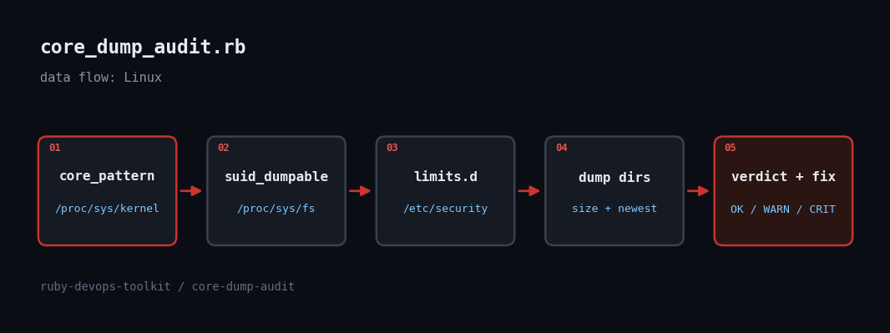

# Auditing Linux Core Dump Handling with Ruby

> Core dumps are a debugging gift and a security leak in one file: they hold passwords, keys and session data, and a crash loop can fill /var overnight. This script checks where cores go, who can read them and how much disk they already eat.



## The problem

Most teams never look at crash-dump policy until a disk fills or a security review asks why a setuid binary dumped memory into a world-readable directory. The answer lives in four places: `kernel.core_pattern` (where cores go, or which program they are piped to), `fs.suid_dumpable` (whether setuid programs may dump at all), `limits.conf` (per-login `ulimit -c`) and the dump directories themselves. The script reads all four straight from `/proc` and `/etc` and prints the exact fix for anything wrong.

## Prerequisites

- Ruby 2.7+ (tested on 3.3.6); stdlib only
- Linux; reading `/proc/sys` and `/etc/security` works unprivileged, though some dump directories are root-only (they are then skipped or undercounted)

## Usage

```
ruby core_dump_audit.rb
ruby core_dump_audit.rb --json
ruby core_dump_audit.rb --dump-warn-mb 512 --dump-crit-mb 2048
ruby core_dump_audit.rb --root ./captured_host
```

## How it works

1. **Classify core_pattern** - A leading `|` means the kernel pipes the core to a handler. Known handlers (systemd-coredump, apport, abrt) are OK; an unknown handler is WARN, because it runs as root with the crashing process's memory. A relative pattern such as `core` drops files in the process's cwd.
2. **Grade suid_dumpable** - 0 is safe, 2 (suidsafe) is only safe with a piped or absolute pattern, and 1 lets setuid processes dump memory readable by the user - CRIT.
3. **Parse limits.conf and limits.d** - Comment and blank lines are skipped, each line is split into domain/type/item/value, and only `core` items are kept. `unlimited` soft or both limits is a WARN.
4. **Measure dump directories** - Known dump dirs (`/var/lib/systemd/coredump`, `/var/crash`, apport, abrt) are walked and summed, with WARN/CRIT at configurable MB thresholds and the newest file's time shown.
5. **Portable via --root** - Every path is prefixed by `--root`, so a captured tree from another host can be audited on your laptop - and the tests build fake trees in a temp dir.

## Example output

```
core-dump-audit: CRIT
  [WARN] core_pattern                 relative pattern 'core': cores land in each crashing process's cwd (possibly world-readable)
         fix: sysctl -w kernel.core_pattern=/var/lib/coredumps/core.%e.%p.%t
  [CRIT] suid_dumpable                1 (setuid processes dump readable by the user)
         fix: sysctl -w fs.suid_dumpable=0
  [WARN] limits                       unlimited core size set in 99-core.conf
         fix: use a finite cap, e.g. "* hard core 0" on non-debug hosts
  [WARN] dumps:/var/lib/systemd/coredump 1 dump(s), 1500.0 MB, newest 2026-09-29 16:45
         fix: coredumpctl / rm old dumps; set MaxUse= in coredump.conf
exit=2
Finished in 0.547363s, 10.9617 runs/s, 16.4425 assertions/s.

6 runs, 9 assertions, 0 failures, 0 errors, 0 skips
```

## Testing

Tested live in a Linux sandbox: 6 minitest cases against fixture trees (healthy, relative pattern, unknown pipe handler, suid_dumpable=1, unlimited limit, dump-size thresholds) plus a run against the sandbox's own /proc/sys.

## Troubleshooting

- **Dump dir shows 0 files** - the directory is root-only (`0700`). Run with sudo for a true size.
- **Wrong for containers** - `core_pattern` is a host-wide (non-namespaced) setting; run the audit on the host, not inside a container.
- **Changes don't stick** - `sysctl -w` is temporary. Persist the suggested fixes in a file under `/etc/sysctl.d/`.

## Extending it

- Read `/etc/systemd/coredump.conf` and check `Storage=`, `MaxUse=`, `ProcessSizeMax=`
- Cross-check `coredumpctl list` for the most-crashing binaries
- Write the suggested sysctls to a reviewable drop-in
- Run across a fleet and diff

## References

- [core(5) man page](https://man7.org/linux/man-pages/man5/core.5.html)
- [systemd-coredump / coredump.conf](https://www.freedesktop.org/software/systemd/man/latest/coredump.conf.html)
- [Kernel docs: fs.suid_dumpable](https://docs.kernel.org/admin-guide/sysctl/fs.html)
