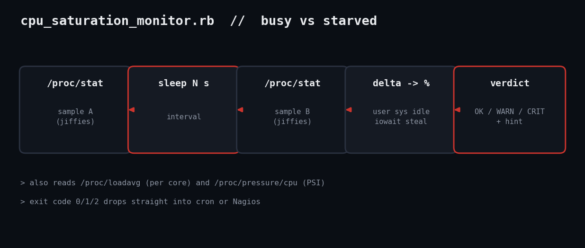

# Ruby CPU Saturation Monitor for Linux: Busy vs Starved

"The CPU is at 90%" tells you almost nothing. This script splits the number into user work, disk waiting, and hypervisor steal, so you know whether to tune code, fix storage, or call your cloud provider.



## The problem

The problem: top and load average conflate very different situations. A box with load 8 on 4 cores might be CPU-bound, or stuck waiting on a dead NFS mount (iowait), or losing cycles to a noisy neighbour on a VM (steal). Each has a different fix. This script samples `/proc/stat` twice, converts the jiffy deltas to percentages, adds load-per-core and kernel PSI pressure, and tells you which one you have.

## Prerequisites

- Ruby 3.0+ (tested on 3.3.6), Linux with `/proc`
- No gems: only `optparse`, `json`, `etc`
- Optional: `/proc/pressure/cpu` (kernel 4.20+ with PSI enabled)

## Usage

```
ruby cpu_saturation_monitor.rb --interval 5
ruby cpu_saturation_monitor.rb --json
```

## How it works

Parsing. The first line of `/proc/stat` starts with `cpu ` and lists cumulative jiffies for user, nice, system, idle, iowait, irq, softirq, steal. `parse_stat` zips those into a hash; zipping with a symbol list keeps the mapping explicit.

Deltas. The counters only ever grow, so a single sample is useless; `percentages` subtracts sample A from B and divides by the total elapsed jiffies. It raises if no time elapsed, which would otherwise divide by zero.

Judging. `THRESH` is a table of [warn, crit] pairs and `level` returns 0/1/2. Load is divided by `Etc.nprocessors` so the same threshold works on a 2-core VM and a 64-core server. PSI `some avg10` is the share of time at least one task stalled waiting for CPU.

Output. Each non-OK line carries a hint pointing at the right next tool, and the worst level becomes the exit status.

## Example output

```
CPU saturation (4 cores, load1 6.40)
  OK   busy             51.40  
  CRIT iowait           32.40  CPUs are waiting on disk/NFS - look at iostat, not at the CPU
  CRIT steal            18.40  hypervisor is taking cycles - noisy neighbour or oversold host
  WARN load_per_core     1.60  more runnable tasks than cores
  WARN psi_some_avg10   22.50  tasks are stalling waiting for CPU time
RESULT: CRIT
```

## Troubleshooting

- All zeros on a quiet box: normal. Raise `--interval` for a steadier sample.
- No PSI line: the kernel lacks PSI or booted with `psi=0`; the check is skipped, not failed.
- Containers: `/proc/stat` shows the host. Use cgroup files for per-container numbers.
- Testing note: verified in the Linux sandbox with a live run and with hand-built fixture files exercising CRIT iowait/steal.

## Extending it

- Loop mode that keeps a rolling window and alerts on sustained saturation
- Per-core breakdown from the `cpuN` lines to spot one pinned core
- Push metrics into the Prometheus exporter in this toolkit

## References

- [proc(5) /proc/stat](https://man7.org/linux/man-pages/man5/proc.5.html)
- [Kernel PSI docs](https://docs.kernel.org/accounting/psi.html)
- [Ruby Etc.nprocessors](https://docs.ruby-lang.org/en/master/Etc.html)
- Blog post: https://tha-shed.com/ruby-cpu-saturation-monitor-linux/
