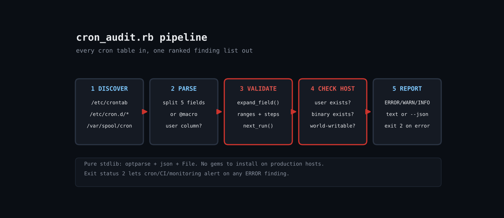

# Audit Cron Jobs with Ruby: Catch Dead, Broken and Hijackable Linux Cron Entries

Cron has no validation step and no alerting. A bad field like 61 makes cron reject the line, a job that points at a script someone deleted just fails into a mailbox nobody reads, and a root job that runs a world-writable script is a privilege-escalation gift. After a few years of hand-edited tables, every server has some of each. This script parses the cron tables itself, expands each schedule to prove it is valid and that it can ever fire, and cross-checks the command and user against the real filesystem.



## Prerequisites

- Ruby 3.0 or newer (tested on 3.3.6) - stdlib only, no gems
- Linux with Vixie/cronie-style crontabs (Debian, Ubuntu, RHEL, Alpine)
- Root (or read access to /var/spool/cron) to see per-user crontabs; --root DIR lets you audit a copy as any user

## Usage

```
ruby cron_audit.rb [--json] [--root DIR]
```

## How it works

1. **Parse a line** - parse_line skips comments, recognises VAR=value environment lines, and splits a job into five schedule fields (or a single @daily-style macro). System tables (/etc/crontab, cron.d) have an extra user column, so the function takes a system_table flag.
2. **Expand every field** - expand_field turns */15, 1-5 or 1,3,7 into a sorted array and raises ArgumentError for anything outside the legal range. That one function is both validator and engine.
3. **Prove the job can run** - next_run walks forward a minute at a time (up to a year) honouring cron's quirk that when both day-of-month and day-of-week are restricted, either may match. A schedule such as Feb 31 never fires, and is reported as never-runs.
4. **Check the host** - The first word of the command is tested: does it exist, is it executable, is it world-writable? The user column is looked up in /etc/passwd. These are the checks cron itself never does.
5. **Report and exit code** - Findings sort by severity. Exit status 2 means at least one ERROR, so you can run the audit from CI, a monitoring check or even cron itself.

## Example output

```
Scanned 2 cron file(s), 9 finding(s)
ERROR world-writable /tmp/w/etc/cron.d/app:1  /tmp/w/hijack.sh is world-writable (root cron can be hijacked)
ERROR bad-schedule   /tmp/w/etc/crontab:4  '61' outside 0..59
ERROR bad-user       /tmp/w/etc/crontab:6  no such user 'ghostuser'
ERROR missing-binary /tmp/w/etc/crontab:7  /nonexistent/backup.sh does not exist
ERROR bad-macro      /tmp/w/etc/crontab:8  unknown macro @sometimes
WARN  never-runs     /tmp/w/etc/crontab:5  schedule never fires within a year (e.g. Feb 31)
INFO  every-minute   /tmp/w/etc/crontab:3  runs every minute
INFO  no-redirect    /tmp/w/etc/crontab:3  output not redirected: cron will mail or drop it
INFO  no-redirect    /tmp/w/etc/crontab:8  output not redirected: cron will mail or drop it
```

## Troubleshooting

- No spool files found: per-user crontabs are root-readable only; run with sudo.
- False missing-binary: only absolute paths are checked; commands relying on PATH are skipped on purpose.
- Busybox/Alpine crond: tables live in /etc/crontabs/; copy them to a directory and pass --root.
- Tested honestly: verified on Linux against a fixture tree with deliberate faults (see Output tab); ran as non-root, so the spool directories were not exercised.

## Extending

- Mail or Slack the JSON output when the exit code is 2
- Add a check that scripts called by root are owned by root
- Flag jobs that overlap by estimating runtime from logs
- Cross-check against systemd timers (systemctl list-timers)

## References

- https://man7.org/linux/man-pages/man5/crontab.5.html
- https://docs.ruby-lang.org/en/3.3/OptionParser.html

Part of [ruby-devops-toolkit](https://github.com/jjam3774/ruby-devops-toolkit) (MIT).
