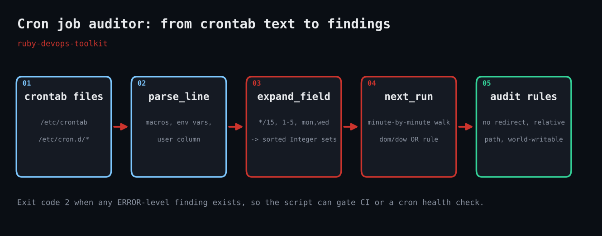

# Cron Job Auditor

Parses crontab files in pure Ruby, computes next run times and flags risky jobs (every-minute schedules, relative paths, world-writable scripts run by root).



## Prerequisites

- Ruby 3.0+ (tested on 3.3.6); standard library only
- Linux or macOS crontab files (`/etc/crontab`, `/etc/cron.d/*`, or `crontab -l > file`)
- Pass `--no-user-column` for per-user crontabs, which have no user field

## Usage

```bash
ruby cron_job_auditor.rb --now "2026-10-05 16:23" sample.crontab
```

## How it works

### `expand_field` turns text into numbers

Each of the five fields is split on commas; each part may have a `/step` and be `*`, a range, a single value or a name like `mon`. The result is a sorted array of integers, with 7 normalised to 0 for Sunday. Out-of-range values raise a parse error.

### `parse_line` handles the extras

Comments, blank lines and `VAR=value` lines are skipped. `@daily` and friends are expanded to their five-field equivalents. System crontabs have a user column that is peeled off before the command.

### `next_run` walks forward minute by minute

Starting at the next whole minute it tests `matches?` until a match or a five-year limit. Brute force is fast enough (a few hundred thousand iterations worst case) and impossible to get subtly wrong.

### The day-of-month / day-of-week quirk

Vixie cron runs a job when *either* field matches if both are restricted, but requires both when one is `*`. `matches?` implements that rule, which is why `30 3 1 * mon` fires every Monday and on the 1st.

### Audit rules

The `audit` function flags schedules at 288+ runs/day, missing output redirection, relative executables (cron's PATH is minimal), executables that do not exist, world-writable executables, unescaped `%`, and root jobs run from `/tmp` or `/home`. The exit code is 2 if any ERROR is found.

## Example output

```text
sample.crontab:3  [*/15 * * * *]  root  /usr/local/bin/sync-metrics.sh >> /var/log/sync.log 2>&1
    next run: Mon 2026-10-05 16:30
    WARN  /usr/local/bin/sync-metrics.sh does not exist on this host
sample.crontab:4  [0 2 * * 1-5]  root  /usr/bin/rsync -a /srv/ /backup/srv/
    next run: Tue 2026-10-06 02:00
    INFO  no output redirection: output is mailed to the user (or silently lost)
    WARN  /usr/bin/rsync does not exist on this host
sample.crontab:5  [* * * * *]  root  /opt/scripts/heartbeat
    next run: Mon 2026-10-05 16:24
    WARN  runs 1440x/day (every minute-level schedule is rarely intentional)
    INFO  no output redirection: output is mailed to the user (or silently lost)
    WARN  /opt/scripts/heartbeat does not exist on this host
sample.crontab:6  [30 3 1 * mon]  deploy  cleanup.sh --all
    next run: Mon 2026-10-12 03:30
    INFO  no output redirection: output is mailed to the user (or silently lost)
    WARN  relative command 'cleanup.sh': cron has a minimal PATH, use an absolute path
sample.crontab:7  [0 0 * * *]  root  /tmp/rotate.sh > /dev/null
    next run: Tue 2026-10-06 00:00
    ERROR /tmp/rotate.sh is world-writable: any local user can hijack this job
    WARN  runs as root from a writable-looking path (/tmp, /home)
sample.crontab:8  [61 * * * * root /bin/true]    
    ERROR unparseable: minute value out of range in '61'
sample.crontab:9  [0 4 * * *]  root  echo "report $(date +%F)" | logger
    next run: Tue 2026-10-06 04:00
    WARN  relative command 'echo': cron has a minimal PATH, use an absolute path

Summary: 7 jobs, 2 errors, 7 warnings, 3 notes
```

## Troubleshooting

- Every job says `does not exist on this host`: you are auditing another machine's crontab; that check only makes sense on the host that runs the job.
- Per-user crontab lines misparse: you forgot `--no-user-column`.
- Next run differs from reality: cron uses the system timezone; `--now` is parsed in the local zone of the machine running the script.
- Special macros like `@reboot` have no schedule and are reported as unparseable.

## Extending

- Read `/var/spool/cron/crontabs/*` for every user and merge into one report.
- Compare the next-run list against a maintenance window to find conflicts.
- Add a rule for jobs that lack `flock` and may overlap themselves.
- Export JSON (`--json`) into your CMDB or a Prometheus textfile collector.

## References

- [crontab(5) man page](https://man7.org/linux/man-pages/man5/crontab.5.html)
- [Ruby Time docs](https://docs.ruby-lang.org/en/3.3/Time.html)
- [Ruby OptionParser](https://docs.ruby-lang.org/en/3.3/OptionParser.html)

Part of [ruby-devops-toolkit](https://github.com/jjam3774/ruby-devops-toolkit). MIT licensed.
