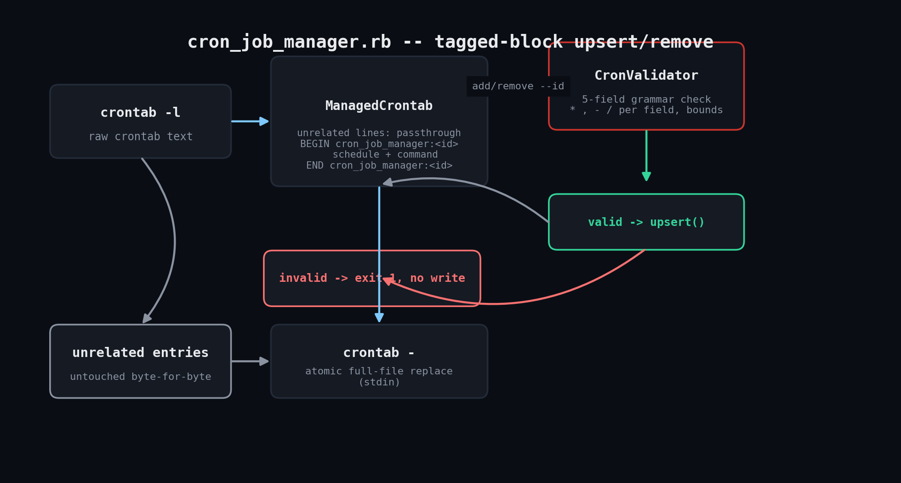

# cron-job-manager

A safe, idempotent Ruby wrapper for managing crontab entries from scripts — add, update,
and remove your own tagged entries without ever touching anyone else's, and without
hand-editing `crontab -e`.



## Why

Hand-editing a shared server's crontab is one typo away from overwriting someone else's
jobs. This tool tags every entry it creates with a uniquely-ID'd marker comment block, so
add/update/remove only ever touch the block they own. Schedules are validated against
real cron grammar *before* anything is written, so a bad schedule fails loudly in Ruby
instead of silently corrupting the crontab.

## Prerequisites

- Ruby 3.0 or newer (tested on 3.0.2; 2.5+ should work unmodified)
- No gems — uses `optparse`, `json`, and `open3` from the standard library
- The `crontab` command on `PATH` (standard on Linux/macOS with cron installed); the
  binary path is overridable via `--crontab-bin`, which is also how the test suite
  points it at a stub
- Linux or macOS — Windows doesn't have crontab; see this toolkit's
  `scheduled-task-audit` for the Task Scheduler equivalent

## Usage

```bash
# List entries this tool manages
ruby cron_job_manager.rb list
ruby cron_job_manager.rb list --json

# Add (or update, if the id already exists) an entry
ruby cron_job_manager.rb add --id nightly-backup --schedule "0 2 * * *" \
  --command "/usr/local/bin/backup.sh"

# Preview a change without writing
ruby cron_job_manager.rb add --id nightly-backup --schedule "30 2 * * *" \
  --command "/usr/local/bin/backup.sh --verbose" --dry-run

# Remove a managed entry
ruby cron_job_manager.rb remove --id nightly-backup
```

## How it works

- **`CronValidator`** checks each of the 5 cron fields (minute/hour/day-of-month/
  month/day-of-week) against its legal range and syntax (`*`, numbers, ranges,
  comma-lists, `/step`), rejecting anything else with a specific, actionable error.
- **`CrontabIO`** is a thin wrapper around `crontab -l` (read) and `crontab -` (atomic
  full-file replace from stdin) via `Open3`. Nothing else in the script talks to the OS
  directly.
- **`ManagedCrontab`** parses the raw crontab into lines, finds/creates a block bounded
  by `# BEGIN cron_job_manager:<id>` / `# END cron_job_manager:<id>` comments, and
  upserts or removes just that block — everything else passes through byte-for-byte
  unchanged.
- Re-running `add` with the same `--id` updates the existing entry in place rather than
  duplicating it, so it's safe to call from a provisioning script on every run.

## Example output

```
$ ruby cron_job_manager.rb add --id nightly-backup --schedule "0 2 * * *" --command "/usr/local/bin/backup.sh"
Added entry 'nightly-backup': 0 2 * * * /usr/local/bin/backup.sh

$ ruby cron_job_manager.rb add --id bad --schedule "99 2 * * *" --command "/bin/true"
error: invalid schedule -- field 1 (minute) invalid: value 99 out of range 0..59 in "99"
exit=1

$ ruby cron_job_manager.rb remove --id weekly-report
Removed entry 'weekly-report'
```

Resulting crontab (unrelated pre-existing entries untouched):

```
# unrelated pre-existing entry, should never be touched
17 4 * * * /usr/local/bin/some-other-job.sh
# BEGIN cron_job_manager:nightly-backup
30 2 * * * /usr/local/bin/backup.sh --verbose
# END cron_job_manager:nightly-backup
```

## Testing notes

Verified live in a Linux sandbox against a stub `crontab` shell script
(included in this folder as [`fake_crontab`](fake_crontab)) that emulates `-l`/`-`
against a plain file instead of the real system crontab store. The stub speaks the exact
same interface as the real binary, so the Ruby code exercised is identical to what runs
against a real crontab. The test run covers: listing, add, invalid-schedule rejection, a
second add (weekly-report), JSON list output, idempotent update-in-place of an existing
id, dry-run remove, real remove, and removing a nonexistent id. Point `--crontab-bin` at
`./fake_crontab` to reproduce the run yourself.

## Troubleshooting

- **`crontab -l` failed: you are not allowed to use this program** — `/etc/cron.allow` /
  `/etc/cron.deny` is restricting cron access; that's a system policy, not something the
  script can work around.
- **Entries vanish after a cron package upgrade** — some distros migrate crontabs during
  upgrades; run `list` right after any OS/cron update to confirm managed entries
  survived.
- **Two automation runs stomp on each other** — `crontab -l` + `crontab -` is a
  read-then-write, not atomic; wrap calls in `flock` if multiple processes might modify
  the same user's crontab concurrently.
- **Managing another user's crontab** — real `crontab` supports `-u user` but requires
  root; point `--crontab-bin` at a wrapper script calling `crontab -u thatuser "$@"`.

## Extending

- Declarative mode: reconcile a whole YAML file of desired entries in one call.
- `--dry-run` diff output: print a unified diff before/after for CI review.
- Timezone-aware scheduling warnings.
- Pair with this toolkit's `scheduled-task-audit` for a cross-platform "what's
  scheduled to run on this fleet" inventory.

## References

- [`crontab(1)` man page](https://man7.org/linux/man-pages/man1/crontab.1.html)
- [`crontab(5)` man page — file format](https://man7.org/linux/man-pages/man5/crontab.5.html)
- [Ruby `Open3` docs](https://docs.ruby-lang.org/en/3.2/Open3.html)

## License

MIT — see the repository root [LICENSE](../LICENSE).
