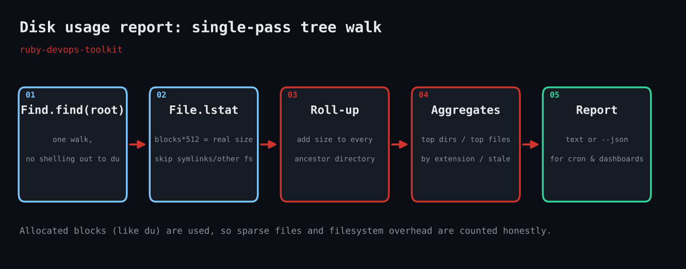

# Disk Usage Report

A single-pass, pure-Ruby disk usage report: biggest directories, biggest files, usage by extension and stale giants. Text or JSON output.



## Prerequisites

- Ruby 3.0+ (tested on 3.3.6); standard library only (`find`, `optparse`, `json`)
- Linux or macOS; read access to the tree you scan (unreadable entries are counted, not fatal)
- No gems required

## Usage

```bash
ruby disk_usage_report.rb -n 5 /srv/data
```

## How it works

### `Find.find` and one-filesystem pruning

`Find.find` yields every path under the root. We call `Find.prune` when a directory's device number differs from the root's, so scanning `/` will not wander into `/proc` or a network mount unless you pass `--cross-fs`.

### Allocated size, not apparent size

`st.blocks * 512` is the space actually allocated on disk, which is what `du` reports. Sparse files and tiny files rounded up to a block are therefore counted honestly.

### Rolling sizes up the tree

For every file we loop from its directory up to the root, adding the size to each ancestor in a Hash. That makes directory totals cumulative without a second pass.

### Stale giants

Files above `--min-stale-mb` whose mtime is older than `--stale-days` are listed separately: big, cold and probably safe to compress or move.

### Failing soft

`Errno::EACCES`, `ENOENT` and `EPERM` are rescued per file and counted, so one unreadable directory or a file deleted mid-scan never aborts the run.

## Example output

```text
Disk usage report for /home/claude/w/tree
Total: 100.2 MiB in 6 files (0 unreadable)

== Biggest directories ==
  57.2 MiB   57.1%  /home/claude/w/tree/cache
  28.6 MiB   28.6%  /home/claude/w/tree/media/video
  28.6 MiB   28.6%  /home/claude/w/tree/media
  14.3 MiB   14.3%  /home/claude/w/tree/logs
   8.0 KiB    0.0%  /home/claude/w/tree/src

== Biggest files ==
  57.2 MiB  /home/claude/w/tree/cache/old_dump.sql
  28.6 MiB  /home/claude/w/tree/media/video/demo.mp4
  11.4 MiB  /home/claude/w/tree/logs/app.log
   2.9 MiB  /home/claude/w/tree/logs/app.log.1.gz
   8.0 KiB  /home/claude/w/tree/src/main.rb

== By extension ==
  57.2 MiB       1 files  .sql
  28.6 MiB       1 files  .mp4
  11.4 MiB       1 files  .log
   2.9 MiB       1 files  .gz
   8.0 KiB       1 files  .rb

== Stale giants (>= 50 MiB, untouched 180+ days) ==
  57.2 MiB  2025-11-01  /home/claude/w/tree/cache/old_dump.sql
```

## Troubleshooting

- Totals smaller than `df`: deleted-but-open files and other filesystems are not visible to a tree walk; check `lsof +L1`.
- Many unreadable entries: run with sudo or scan a narrower path.
- Slow on huge trees: the walk is IO-bound; run it with `ionice -c3`.
- Sizes differ slightly from `du -sh`: `du` also counts directory entries themselves; this tool counts regular files only.

## Extending

- Alert (non-zero exit) when any top directory exceeds a percentage of the filesystem.
- Write the JSON daily and diff two days to find fast-growing directories.
- Add an `--exclude` glob list for build caches.
- Report inode usage per directory for filesystems that run out of inodes first.

## References

- [Ruby Find docs](https://docs.ruby-lang.org/en/3.3/Find.html)
- [File::Stat#blocks](https://docs.ruby-lang.org/en/3.3/File/Stat.html)
- [OptionParser](https://docs.ruby-lang.org/en/3.3/OptionParser.html)

Part of [ruby-devops-toolkit](https://github.com/jjam3774/ruby-devops-toolkit). MIT licensed.
