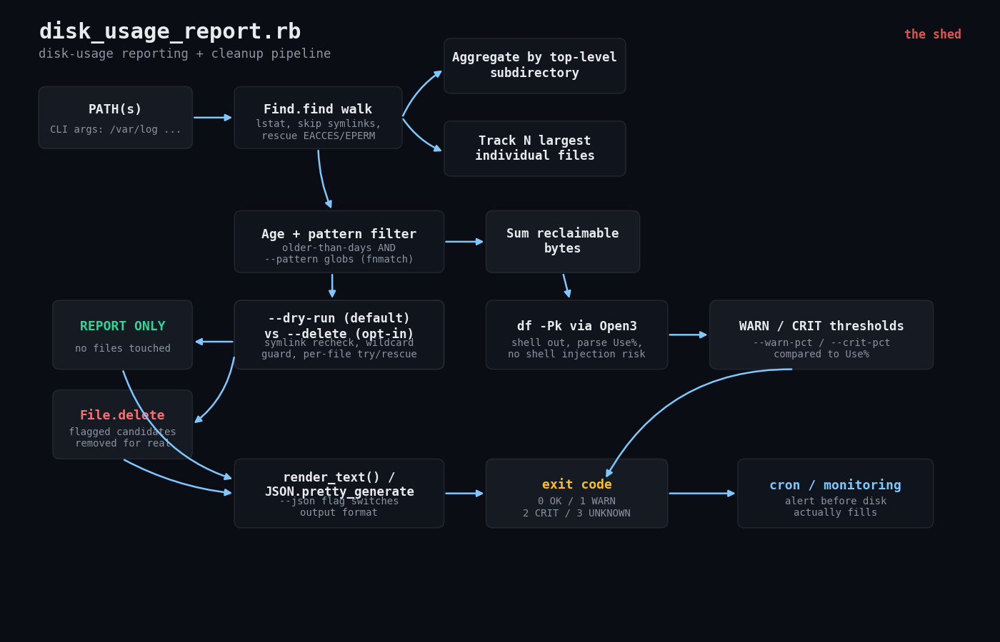

# Disk-Usage Reporting and Automated Cleanup Tool

A pure Ruby stdlib script that walks a directory tree, tells you what's
eating your disk, flags stale files that are safe to clean up, and can
optionally delete them for you -- with a dry-run-by-default safety model
and cron-friendly threshold exit codes so you can get paged *before* a
disk actually fills.



## The problem

Disks fill up silently. A log rotation job stops working, a tmp directory
never gets swept, a service starts writing core dumps, and nobody notices
until `df` reads 100% and something falls over at 3am. This script gives
you one command that:

1. Reports the biggest space consumers -- both by top-level subdirectory
   and by individual file -- so you know *where* the space went.
2. Flags "cleanup candidate" files: old, matching a known-safe pattern
   (`*.log`, `*.tmp`, `core.*`, etc.), and shows how much space you'd
   reclaim by removing them.
3. Optionally deletes those candidates, with layered safety checks.
4. Runs a `df`-based threshold check and exits with a status code your
   monitoring/cron setup can act on -- so you get a WARN before you get
   an outage.

## Prerequisites

- Ruby 3.0 or newer (developed and tested against Ruby 3.0.2).
- Linux or macOS. Relies on the `df` binary being on `PATH` (present on
  every mainstream Linux distro and macOS/BSD by default).
- No gems. Everything used (`Find`, `OptionParser`, `JSON`, `Open3`,
  `Time`) ships in Ruby's standard library.
- Read access to whatever paths you point it at; write/delete access
  only required if you pass `--delete`.

## Usage

```bash
# Safe by default: report only, nothing is touched
ruby disk_usage_report.rb /var/log /var/tmp

# Show the 8 biggest files, flag anything older than 30 days
ruby disk_usage_report.rb --top-n 8 --older-than-days 30 /var/log

# Custom cleanup patterns (comma-separated globs, matched on basename)
ruby disk_usage_report.rb --pattern '*.log,*.tmp,core.*' /var/log

# Machine-readable output for another script / log shipper
ruby disk_usage_report.rb --json /var/log > /var/tmp/disk_report.json

# Actually delete flagged candidates (explicit opt-in, still guarded)
ruby disk_usage_report.rb --older-than-days 30 --delete /var/log

# Threshold-only style check, tuned for cron/monitoring
ruby disk_usage_report.rb --skip-threshold=false \
  --warn-pct 80 --crit-pct 90 --df-path /var /var/log
```

Full flag reference:

| Flag | Default | Meaning |
|---|---|---|
| `PATH [PATH ...]` | `.` | One or more directory trees to scan |
| `--top-n=N` | `15` | How many of the largest individual files to report |
| `--older-than-days=N` | `30` | Age threshold for cleanup candidates |
| `--pattern=LIST` | `*.log,*.tmp,core.*,*.core,*~` | Comma-separated basename globs |
| `--dry-run` | on | Report only, delete nothing (this is the default even if you don't pass the flag) |
| `--delete` | off | Explicit opt-in to actually remove flagged candidates |
| `--force-wildcard` | off | Required in addition to `--delete` if `--pattern` is a bare `*` |
| `--json` | off | Emit JSON instead of human-readable text |
| `--warn-pct=N` | `80` | Filesystem use% that triggers a WARN exit |
| `--crit-pct=N` | `90` | Filesystem use% that triggers a CRIT exit |
| `--df-path=PATH` | scanned paths | Repeatable; filesystem(s) to threshold-check via `df`. Defaults to the scanned `PATH`s |
| `--skip-threshold` | off | Skip the `df` check entirely |
| `-q`, `--quiet-skips` | off | Don't list individual permission-denied paths in text output |
| `-h`, `--help` | -- | Show usage |

### Exit codes (cron/monitoring convention)

| Code | Status | Meaning |
|---|---|---|
| `0` | OK | Filesystem use% is under `--warn-pct` (or threshold check was skipped) |
| `1` | WARN | Use% is at or above `--warn-pct` |
| `2` | CRIT | Use% is at or above `--crit-pct` |
| `3` | UNKNOWN | Couldn't run/parse `df`, or refused an unsafe `--delete` (bare `*` pattern without `--force-wildcard`) |

This mirrors the classic Nagios/Icinga plugin convention, so you can wire
this straight into cron + your existing alert pipeline: `0`/`1`/`2` map
directly onto OK/WARNING/CRITICAL.

## How it works

### 1. Walking the tree

The script uses Ruby's `Find` module (`Find.find`) rather than
`Dir.glob('**/*')` because `Find` yields paths incrementally as it
descends, which lets us:

- `File.lstat` every entry without following symlinks (a symlinked
  directory is pruned with `Find.prune` instead of being descended into
  -- this avoids double-counting size and, more importantly, avoids
  ever deleting through a symlink into a location outside the scanned
  tree).
- Wrap each `lstat` in a `rescue Errno::EACCES, Errno::EPERM` so one
  unreadable file or directory (permission denied, deleted mid-walk,
  whatever) gets logged to a `skipped` list and the walk simply
  continues, rather than the whole script crashing.

### 2. Aggregating usage

Every file we can stat becomes a `FileRecord` (`path`, `size`, `mtime`,
`top_dir`). Two aggregations run off that flat list:

- **Per-directory totals**: each record is bucketed by its first path
  segment under the scanned root (e.g. scanning `/var/log`, a file at
  `/var/log/nginx/access.log` buckets under `nginx`), summed and sorted
  descending by bytes.
- **Largest N files**: the full record list is sorted by size and
  truncated to `--top-n`.

### 3. Flagging cleanup candidates

A file is a "cleanup candidate" only if **both** conditions hold:

- its `mtime` is older than `Time.now - (older_than_days * 86_400)`, and
- its basename matches one of the `--pattern` globs, checked with
  `File.fnmatch(glob, basename, File::FNM_EXTGLOB)`.

Age-only or pattern-only is deliberately not enough -- that's the "belt
and suspenders" part of the safety model. Note that `File.fnmatch` does
literal glob matching, not substring matching: `*.log` matches
`access.log` but **not** `app.log.1` (a rotated log). If you rotate logs
with numeric suffixes, add a pattern like `*.log.*` or `*.log.[0-9]*`
explicitly.

### 4. The dry-run / delete safety model

- **Default is always `--dry-run`.** Even if you never pass the flag,
  nothing is ever deleted unless `--delete` is present on the command
  line.
- **`--delete` is the only opt-in.** There's no config file setting, no
  environment variable -- it has to be a conscious, explicit flag on
  that invocation.
- **Wildcard guard**: `--delete` combined with a bare `--pattern '*'`
  (which would match literally every file) is refused with exit code
  `3` unless you also pass `--force-wildcard`.
- **Symlinks are never deleted.** Checked once during the walk (via
  `lstat`) and re-checked immediately before `File.delete` (a small
  TOCTOU hardening -- something could theoretically change between the
  walk and the delete on a long-running scan).
- **Per-file rescue.** Deletion failures (permission denied, file
  vanished) are caught per-file and reported in a `delete_failed` list;
  one bad file doesn't stop the rest of the batch.

### 5. The `df`-based threshold check

There's no `statvfs`/filesystem-stats call in Ruby's standard library --
the two realistic options for filesystem-usage-percent are (a) add the
`sys-filesystem` gem, or (b) shell out to `df`, which exists on every
Linux/macOS box by definition. Since this toolkit is stdlib-only, the
script shells out to **`df -Pk PATH`** using `Open3.capture3`:

- `-P` forces POSIX output format -- a stable column layout across
  GNU/Linux and macOS/BSD `df` implementations, which is not guaranteed
  for the default (non-POSIX) output on some platforms.
- `-k` forces 1024-byte blocks, again for stable, portable parsing.
- `Open3.capture3` (rather than backticks or `system`) runs `df` as an
  argv array with no shell in between, so a path containing spaces or
  shell metacharacters can't cause command injection, and we get
  separate stdout/stderr plus a real `Process::Status` to check.
- The `Use%` column is parsed and compared against `--warn-pct` /
  `--crit-pct` to produce `OK` / `WARN` / `CRIT` / `UNKNOWN`.

### 6. Output

Every run renders either human-readable text (default) or, with
`--json`, a single `JSON.pretty_generate`'d document containing the
per-root breakdown, largest files, cleanup candidates, skipped paths,
and threshold results -- so this script drops into a log shipper,
dashboard, or another Ruby script just as easily as a terminal.

## Example output (captured from a real run)

Test tree built under `/tmp/disk_test` with `File.write`/`head -c` for
size variation and `touch -d "N days ago"` to backdate mtimes, including
an intentionally unreadable `noperm/` directory (`chmod 000`) to exercise
the permission-error handling.

Dry-run:

```
$ ruby disk_usage_report.rb --top-n 8 --older-than-days 30 /tmp/disk_test
disk_usage_report -- 2026-07-31T19:39:08-05:00
mode: DRY-RUN (no files deleted)
======================================================================

PATH: /tmp/disk_test
  total: 119.49 MB across 10 files
  by subdirectory (top-level):
    backups                          60.00 MB  (2 files)
    app                              59.49 MB  (8 files)

TOP 8 LARGEST FILES
   1.   50.00 MB  /tmp/disk_test/backups/full_backup_2026-05-01.tar  (mtime 2026-06-16T19:39:04-05:00)
   2.   20.00 MB  /tmp/disk_test/app/tmp/core.31337  (mtime 2026-06-16T19:39:04-05:00)
   3.   15.00 MB  /tmp/disk_test/app/logs/access.log  (mtime 2026-06-16T19:39:04-05:00)
   4.   10.00 MB  /tmp/disk_test/app/logs/app.log.1  (mtime 2026-06-21T19:39:04-05:00)
   5.   10.00 MB  /tmp/disk_test/backups/full_backup_2026-07-28.tar  (mtime 2026-07-31T19:39:04-05:00)
   6.    8.00 MB  /tmp/disk_test/app/logs/app.log.2  (mtime 2026-06-26T19:39:04-05:00)
   7.    3.00 MB  /tmp/disk_test/app/tmp/upload_8f3a.tmp  (mtime 2026-06-16T19:39:04-05:00)
   8.    2.00 MB  /tmp/disk_test/app/data/current_dataset.bin  (mtime 2026-07-31T19:39:04-05:00)

CLEANUP CANDIDATES (older than 30d, matching *.log, *.tmp, core.*, *.core, *~)
  candidates: 4
  reclaimable: 39.00 MB
      15.00 MB  /tmp/disk_test/app/logs/access.log  (mtime 2026-06-16T19:39:04-05:00)
      20.00 MB  /tmp/disk_test/app/tmp/core.31337  (mtime 2026-06-16T19:39:04-05:00)
       1.00 MB  /tmp/disk_test/app/tmp/session_22c.tmp  (mtime 2026-06-16T19:39:04-05:00)
       3.00 MB  /tmp/disk_test/app/tmp/upload_8f3a.tmp  (mtime 2026-06-16T19:39:04-05:00)

(dry-run: nothing deleted -- rerun with --delete to actually remove these files)

SKIPPED (permission errors, 1 total):
    /tmp/disk_test/noperm: Permission denied @ dir_initialize - /tmp/disk_test/noperm

FILESYSTEM THRESHOLD CHECK (warn>=80% crit>=90%)
  /tmp/disk_test                  64%  [OK]  fs=/dev/sda1 mount=/
exit status: 0
```

Note that `app.log.1` and `app.log.2` are **not** flagged as cleanup
candidates even though they're old logs -- `*.log` doesn't match a
`.1`/`.2` rotation suffix. This is the fnmatch behavior called out above,
demonstrated for real rather than just described.

Delete mode (same tree, `--delete`):

```
$ ruby disk_usage_report.rb --older-than-days 30 --delete /tmp/disk_test
disk_usage_report -- 2026-07-31T19:39:14-05:00
mode: DELETE (files removed below)
...
CLEANUP CANDIDATES (older than 30d, matching *.log, *.tmp, core.*, *.core, *~)
  candidates: 4
  reclaimable: 39.00 MB
      15.00 MB  /tmp/disk_test/app/logs/access.log  (mtime 2026-06-16T19:39:04-05:00)
      20.00 MB  /tmp/disk_test/app/tmp/core.31337  (mtime 2026-06-16T19:39:04-05:00)
       1.00 MB  /tmp/disk_test/app/tmp/session_22c.tmp  (mtime 2026-06-16T19:39:04-05:00)
       3.00 MB  /tmp/disk_test/app/tmp/upload_8f3a.tmp  (mtime 2026-06-16T19:39:04-05:00)

DELETED: 4 files, 39.00 MB reclaimed

SKIPPED (permission errors, 1 total):
    /tmp/disk_test/noperm: Permission denied @ dir_initialize - /tmp/disk_test/noperm

FILESYSTEM THRESHOLD CHECK (warn>=80% crit>=90%)
  /tmp/disk_test                  64%  [OK]  fs=/dev/sda1 mount=/
exit status: 0
```

`find /tmp/disk_test -type f` after that run confirmed exactly the 4
flagged files were gone and everything else (fresh log, fresh dataset,
both rotated logs, both backups) was untouched.

Threshold check forced into WARN and CRIT (same tree, real mounted `/`,
thresholds lowered to force the state) against the real `df -h` output
of `64%` used:

```
$ ruby disk_usage_report.rb --warn-pct 50 --crit-pct 99 --df-path / /tmp/disk_test
...
FILESYSTEM THRESHOLD CHECK (warn>=50% crit>=99%)
  /                               64%  [WARN]  fs=/dev/sda1 mount=/
exit status: 1

$ ruby disk_usage_report.rb --warn-pct 1 --crit-pct 2 --df-path / /tmp/disk_test
...
FILESYSTEM THRESHOLD CHECK (warn>=1% crit>=2%)
  /                               64%  [CRIT]  fs=/dev/sda1 mount=/
exit status: 2
```

## Troubleshooting

- **`df: command not found` / status `UNKNOWN`** -- the script shells
  out to the system `df` binary. If it's not on `PATH` (unusual, but
  possible in a stripped-down container), the threshold check reports
  `UNKNOWN` (exit `3`) rather than crashing. Install `coreutils` or add
  `df` to `PATH`.
- **A known-old file isn't showing up as a cleanup candidate** -- check
  it against `File.fnmatch(pattern, File.basename(path), File::FNM_EXTGLOB)`
  directly in `irb`. The most common gotcha is a rotated log
  (`app.log.1`) not matching `*.log` -- see the walkthrough above.
- **Script reports files as "skipped" that you expect to be readable**
  -- the process needs read access to the file *and* execute (traverse)
  access on every parent directory. Run it as the same user/service
  account that owns the data, or with sufficient privileges, rather than
  widening permissions on the data itself.
- **`--delete` refused with exit 3 and a wildcard warning** -- you
  passed `--pattern '*'` (or a list containing a bare `*`) together with
  `--delete`. This is intentional. Either narrow the pattern or pass
  `--force-wildcard` if you genuinely want to delete everything old
  under the scanned path.
- **Numbers look off vs `du -sh`** -- this script sums `stat.size`
  (apparent file size) per file, not on-disk block usage, and it does
  not currently account for hardlinks (a file linked twice is counted
  twice). For byte-for-byte parity with `du`, that's a known, documented
  simplification.

## Extending this

- **Archive instead of delete**: swap `File.delete` in
  `delete_candidates` for a `FileUtils.mv` into a designated archive
  directory (with `gzip` via `Zlib::GzipWriter` if you want compression,
  still stdlib-only).
- **Multiple filesystem checks in one run**: `--df-path` is already
  repeatable -- point it at every mount you care about and the run will
  report the worst status across all of them for the process exit code.
- **Per-subdirectory quotas**: extend the `per_root` aggregation to
  compare each subdirectory's total against a configured quota and flag
  the offenders individually, rather than only looking at file-level age.
- **Slack/webhook alerting**: since `--json` is a single, complete
  document, pipe it into `curl` or a small wrapper script that posts a
  summary when the exit code is `1` or `2`.
- **Inode exhaustion**: `df -i` reports inode usage the same way `df`
  reports block usage -- a second `Open3.capture3('df', '-Pi', path)`
  call parsing the `IUse%` column would catch the "plenty of bytes free
  but out of inodes" failure mode this script doesn't currently check.

## References

- Ruby `Find` module documentation: https://docs.ruby-lang.org/en/3.0/Find.html
- Ruby `Open3` module documentation: https://docs.ruby-lang.org/en/3.0/Open3.html
- `df(1)` man page (POSIX/GNU coreutils): https://man7.org/linux/man-pages/man1/df.1.html
