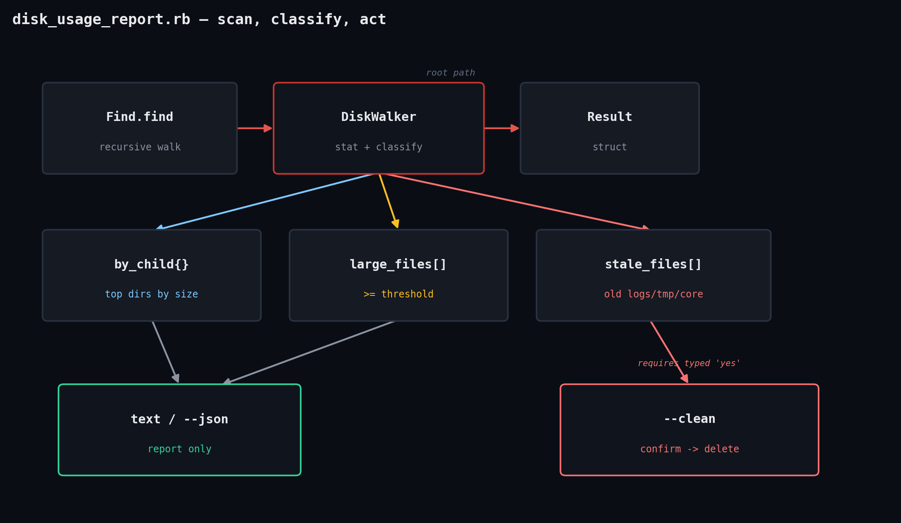

# disk-usage-report

Disk usage reporting and safe cleanup for Linux/macOS, in pure-Ruby stdlib (no gems required).

Walks a directory tree, reports the biggest top-level subdirectories, flags individual files above a size threshold, and finds "stale junk" (old logs, `.tmp` files, core dumps, editor swap files) that's conventionally safe to reclaim — dry-run by default, with an explicit `--clean` flag (and a typed `yes` confirmation) required to actually delete anything.



## Prerequisites

- Ruby 3.0+ (tested on 3.3.6)
- No gems — only stdlib (`find`, `optparse`, `json`, `fileutils`, `time`)
- Read access to the directory you're scanning; `--clean` additionally needs delete permission on whatever it removes

## Usage

```bash
# Report only (default) — never deletes anything
ruby disk_usage_report.rb /var

# Tune thresholds and see the top 15 entries
ruby disk_usage_report.rb /var --top 15 --large-mb 50 --stale-days 30

# Machine-readable output for piping into another tool
ruby disk_usage_report.rb /var --json

# Actually delete stale junk (asks for a typed "yes" first)
ruby disk_usage_report.rb /var/log --stale-days 30 --clean
```

Options:

| Flag | Default | Meaning |
|---|---|---|
| `--top N` | 10 | How many top directories/files to display |
| `--large-mb N` | 100 | Flag individual files >= N MB |
| `--stale-days N` | 60 | Junk files older than this are "stale" |
| `--exclude PATH` | — | Exclude a path from the scan (repeatable) |
| `--json` | off | Emit JSON instead of text |
| `--clean` | off | Delete stale junk after confirmation |

## How it works

1. **`Find.find`** walks the tree once. Symlinks are never followed or double-counted, and any directory Ruby can't `lstat`/read (permission denied) is counted as skipped rather than raising and aborting the whole scan.
2. **`DiskWalker#walk`** classifies every file it sees into three buckets in the same pass:
   - `by_child` — bytes rolled up under the first path segment below the scan root (so `/var/log/*` and `/var/cache/*` both roll up cleanly when the root is `/var`)
   - `large_files` — any single file at or above `--large-mb`
   - `stale_files` — files matching a conservative allowlist of throwaway patterns (`*.log`, `*.log.N`, `*.log.N.gz`, `*.tmp`, `core`, `core.N`, `*.old`, editor swap/autosave files) whose mtime is older than `--stale-days`
3. The **report** is printed as human-readable text or `--json`.
4. **`--clean`** re-uses the already-computed `stale_files` list, prints an explicit count and total size, and requires a typed `yes` on stdin before deleting anything — it never deletes on the strength of a flag alone.

## Example output

```
Disk usage report for /var
Files scanned: 3  |  Unreadable dirs skipped: 0
Total size: 158.0M

== Top 3 subdirectories by size ==
  home                           150.0M  (94.9%)
  var                              8.0M  (5.1%)

== Files >= 100.0M (top 3) ==
      150.0M  /var/home/appuser/data/dataset.bin

== Stale junk older than 30d (logs/tmp/core/swap) ==
  1 files, 3.0M reclaimable
        3.0M  /var/log/old.log.1  (mtime 2026-06-30)
```

## Troubleshooting

- **`Errno::EACCES` noise** — expected on directories you don't own; the script counts them in `dirs_skipped` and keeps going rather than aborting. Run with `sudo` if you need a complete picture of a system-owned path.
- **Nothing shows up as "stale"** — `STALE_PATTERNS` is intentionally conservative (it will never flag, say, a `.rb` or `.conf` file). Extend the regex list if your fleet has other well-known junk file conventions (e.g. `*.dump`, `*.core.gz`).
- **`--clean` asks for confirmation every time** — that's by design; it's meant to run interactively. For a cron job, pipe `yes |` into it deliberately once you trust the pattern list on that host, or script around the underlying `DiskWalker`/`clean_stale_files!` methods directly.
- **Large filesystems are slow** — this does a single synchronous `Find.find`; for multi-terabyte trees with millions of files, consider running it scoped to one subtree at a time via `--exclude`, or pair it with `du -x` for a coarse first pass.

## Extending it

- Add a `--min-free-gb` flag that only runs cleanup if free space actually drops below a threshold (check via `Sys::Filesystem` or `` `df -k` ``).
- Gzip stale logs instead of deleting them outright (`Zlib::GzipWriter`) before removing the original.
- Emit Prometheus-format metrics (`disk_usage_bytes{dir="..."}`) instead of/alongside the text report — see the `prometheus-exporter` script elsewhere in this repo for a pure-Ruby exporter you could wire this into.
- Add a `--older-than-access` mode using `File#atime` instead of `mtime`, for caches where "last read" matters more than "last written".

## References

- Full script + this README: [`ruby-devops-toolkit/disk-usage-report`](https://github.com/jjam3774/ruby-devops-toolkit/tree/main/disk-usage-report)
- Ruby `Find` stdlib docs: https://docs.ruby-lang.org/en/3.3/Find.html
- Ruby `OptionParser` docs: https://docs.ruby-lang.org/en/3.3/OptionParser.html
