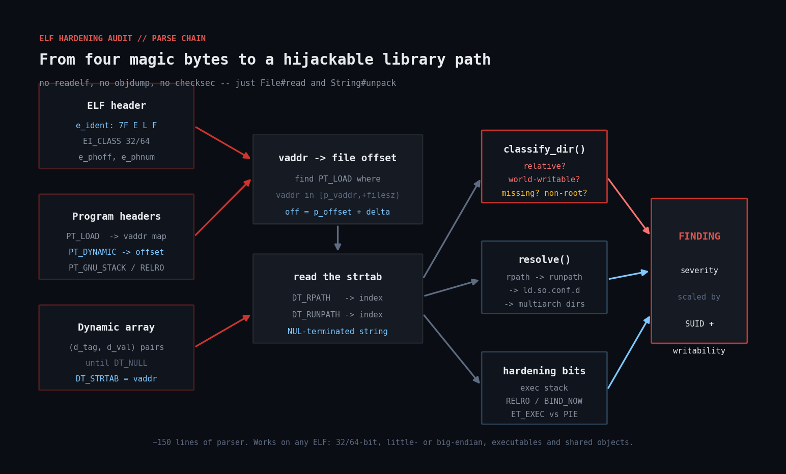
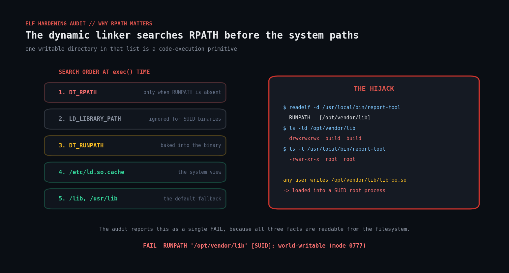

# elf-rpath-audit

A pure-Ruby ELF parser that audits binaries for **RPATH hijacking** and **missing compiler
hardening**. No `readelf`, no `objdump`, no `checksec`, no gems — just `File#read` and
`String#unpack`.



## The problem

A binary's `RPATH`/`RUNPATH` is a list of directories the dynamic linker searches for
shared libraries **before** the system paths. If one of those directories is writable by a
non-root user — or is a *relative* path, which resolves against whatever the current
working directory happens to be — then anyone who can write there can drop a malicious
`.so` and have it loaded into the process.

When the binary is also SUID root, that is a straight local privilege escalation.



This is not hypothetical. It is one of the most common findings in any serious
build-pipeline review, and it is almost always introduced by accident: a
`-Wl,-rpath,./lib` that someone added to get a test running, or a build system that bakes
in the temporary build directory and ships it.

Meanwhile the same ELF headers tell you whether the binary was compiled with the
mitigations every distro has shipped by default for a decade — RELRO, a non-executable
stack, PIE. Vendor-shipped binaries and in-house build pipelines routinely miss them, and
nobody notices because nothing breaks.

## What the script checks

| Check | Severity | Why |
| --- | --- | --- |
| `RPATH`/`RUNPATH` entry is **relative** | FAIL | resolves against the caller's CWD |
| entry is **world-writable** | FAIL | anyone can preload a library |
| entry is **group-writable** or **non-root-owned** | FAIL on SUID, else WARN | a smaller set of users can |
| entry is **missing** | FAIL on SUID, else WARN | inert until someone creates it |
| uses legacy `DT_RPATH` rather than `DT_RUNPATH` | WARN on SUID, else INFO | cannot be overridden, deprecated |
| `DT_NEEDED` library does **not resolve** | WARN | the binary will fail at `exec()` |
| **executable stack** | FAIL | `PT_GNU_STACK` carries `PF_X`, or is absent |
| **no RELRO** | FAIL on SUID, else WARN | the GOT stays writable for the process lifetime |
| **partial RELRO** | WARN | lazy binding leaves the GOT writable |
| **not a PIE** | FAIL on SUID, else WARN | fixed load address defeats ASLR |

Severity scales with privilege. A world-writable RPATH on a user-level tool is bad; on a
SUID root binary it is an incident.

Read-only: it opens files, reads a few hundred bytes of headers, and never writes,
patches or executes anything it scans.

## Prerequisites

* **Ruby 2.7+** (tested on 3.0.2). Standard library only.
* **Linux** (or any ELF platform — the parser handles 32- and 64-bit, little- and
  big-endian). Library resolution assumes a Linux-style `/etc/ld.so.conf.d` layout.
* Root is not required to parse binaries, but you need read access to the directories
  you scan, and `stat()` on the RPATH directories to judge their permissions.

## Usage

```bash
# Audit a couple of directories
ruby elf_hardening_audit.rb /usr/bin /usr/local/bin

# Just the SUID/SGID binaries, across the whole box
sudo ruby elf_hardening_audit.rb --suid-only /usr /opt

# A vendor drop, everything including INFO
ruby elf_hardening_audit.rb /opt/vendor-app

# Only hard failures, as JSON, for CI
ruby elf_hardening_audit.rb --json --min-severity FAIL /opt/build-output
```

### Options

| Flag | Effect |
| --- | --- |
| `--json` | machine-readable output, including the resolved search path |
| `--suid-only` | only report on SUID/SGID binaries |
| `--min-severity FAIL\|WARN\|INFO` | filter (default `INFO`) |
| `--no-recursive` | do not descend into subdirectories |
| `--root PATH` | treat `PATH` as `/` when resolving libraries (for chroots/images) |
| `--verbose` | report files that could not be parsed |

### Exit codes

`0` clean · `1` warnings · `2` failures · `3` usage error

## How it works

### Reading an ELF without a library

The parser is about 150 lines because it only understands what the audit needs.

1. **Identify.** Bytes 0–3 are `\x7FELF`. Byte 4 is `EI_CLASS` (1 = 32-bit, 2 = 64-bit),
   byte 5 is `EI_DATA` (1 = little-endian). Everything downstream depends on those two.
2. **Program headers.** `e_phoff`, `e_phentsize` and `e_phnum` from the header locate the
   program header table. Each entry has a `p_type`; the ones that matter are `PT_LOAD`
   (for the address map), `PT_DYNAMIC`, `PT_INTERP`, `PT_GNU_STACK` and `PT_GNU_RELRO`.
   Note the field order differs between 32- and 64-bit — it is not just a width change.
3. **The dynamic array.** `PT_DYNAMIC` points at an array of `(d_tag, d_val)` pairs,
   terminated by `DT_NULL`. `DT_NEEDED`, `DT_SONAME`, `DT_RPATH` and `DT_RUNPATH` all
   store an *offset into the dynamic string table* rather than a string.
4. **The vaddr→offset translation.** This is the one genuinely fiddly step. `DT_STRTAB`
   is a *virtual address*, not a file offset. To read it you find the `PT_LOAD` segment
   containing that vaddr and compute:

   ```
   file_offset = p_offset + (strtab_vaddr - p_vaddr)
   ```

   Skip this and you read garbage from the middle of the file, which is exactly the bug
   that makes hand-rolled ELF parsers produce mysterious empty RPATHs.
5. **Read the strings.** Each `DT_NEEDED`/`DT_RPATH` value is an index into that buffer;
   the string runs to the next NUL. `RPATH` entries are colon-separated, like `PATH`.

### Judging a directory

`classify_dir` returns one of `:relative`, `:missing`, `:world_writable`,
`:group_writable`, `:nonroot_owner`, `:unresolvable` or `:ok`. `$ORIGIN` is expanded
against the binary's real directory first — an `$ORIGIN`-relative RPATH is the *correct*
way to ship a bundled application, so flagging it would be noise.

### Resolving NEEDED libraries

`LibraryResolver` mirrors a useful subset of the linker's search order: `DT_RPATH` (only
when `DT_RUNPATH` is absent — that precedence rule surprises people), then `DT_RUNPATH`,
then `/etc/ld.so.conf` + `ld.so.conf.d/*.conf`, the multiarch directories
(`/usr/lib/x86_64-linux-gnu`) and the hardcoded defaults. `LD_LIBRARY_PATH` is
deliberately not consulted: it is ignored for SUID binaries anyway, and an audit should
not depend on the auditor's environment.

### Hardening flags

* **Executable stack** — `PT_GNU_STACK` with `PF_X` set. A *missing* `PT_GNU_STACK` is
  also a finding: the kernel then falls back to an executable stack.
* **RELRO** — `PT_GNU_RELRO` present is partial RELRO. Full RELRO additionally needs
  `DT_BIND_NOW`, or `DF_BIND_NOW` in `DT_FLAGS`, or `DF_1_NOW` in `DT_FLAGS_1`.
* **PIE** — `ET_DYN` *with* a `PT_INTERP`. A shared library is also `ET_DYN` but has no
  interpreter, and "is this `.so` a PIE" is a meaningless question, so the check is
  skipped for libraries rather than reported wrongly.

## Example output

Four deliberately broken binaries built with `gcc`:

```bash
gcc -o vendor-agent  app.c -Wl,-rpath,./lib -Wl,--disable-new-dtags
gcc -o legacy-daemon app.c -Wl,-rpath,/tmp/elfdemo/badlib -no-pie -Wl,-z,norelro -z execstack
gcc -o report-tool   app.c -Wl,-rpath,/opt/reporting/lib && chmod u+s report-tool
gcc -o metrics-agent app.c -Wl,-z,relro -Wl,-z,lazy
```

```
==============================================================================
  ELF HARDENING & RPATH AUDIT -- 2026-09-16 12:15:46
==============================================================================

  Files examined    : 5
  ELF objects       : 4  (1 SUID/SGID)
  Findings          : 8

------------------------------------------------------------------------------

  /tmp/elfdemo/legacy-daemon
    [FAIL] RUNPATH '/tmp/elfdemo/badlib': world-writable (mode 0777)
           -> Anyone who can write to /tmp/elfdemo/badlib can preload code into this
              process. Fix the directory permissions (`chmod go-w ...`) or strip the
              entry with `patchelf --remove-rpath`.
    [FAIL] executable stack (PT_GNU_STACK carries PF_X, or is absent)
           -> Rebuild with `-z noexecstack`.
    [WARN] no RELRO -- the GOT stays writable for the life of the process
    [WARN] not a PIE -- the executable loads at a fixed address, defeating ASLR

  /tmp/elfdemo/report-tool
    [FAIL] RUNPATH '/opt/reporting/lib' [SUID]: directory does not exist
           -> ... inert -- until somebody with write access to its parent creates it.

  /tmp/elfdemo/vendor-agent
    [FAIL] RPATH './lib': relative path -- resolves against the CWD of whoever runs it
    [INFO] uses legacy DT_RPATH (./lib) instead of DT_RUNPATH

  /tmp/elfdemo/metrics-agent
    [WARN] partial RELRO only (lazy binding leaves the GOT writable)

------------------------------------------------------------------------------
  4 fail   3 warn   1 info
==============================================================================
```

A full sweep of `/usr/bin` on a stock Debian container parses **1,081 ELF objects** and
reports one finding — which is the right shape for an audit tool. If a hardening scanner
is noisy on a distro's own binaries, you will stop reading its output.

## Troubleshooting

**"skipped: not an ELF file" on things you expected to be binaries.**
Use `--verbose` to see them. Usually shell scripts, or `ar` archives (`.a`), or on some
distros the "binary" in `/usr/bin` is a symlink into `/etc/alternatives`. Symlinks are
skipped on purpose — the real target is scanned separately, so you do not get duplicates.

**A `DT_NEEDED` library is reported missing but the binary runs fine.**
The resolver does not read `/etc/ld.so.cache` (a binary format), only the `.conf` files it
is built from. If a package installs into a directory added via `ldconfig` at runtime
without a `.conf` file, the resolver will not see it. Compare against `ldd <binary>`.

**Everything reports "no RELRO" on a musl/Alpine system.**
Check the toolchain defaults rather than assuming a finding. `ld --verbose | grep -i relro`
and `gcc -Q --help=common | grep -i pie` tell you what your compiler actually does.

**A `$ORIGIN` RPATH shows as `unresolvable`.**
`$LIB` and `$PLATFORM` are expanded approximately — getting them exactly right requires
the loader's own platform string. Anything still containing a `$` after expansion is
reported as `unresolvable` rather than silently judged safe.

**`patchelf` is suggested but not installed.**
`patchelf` is the standard tool for editing RPATH after the fact
(`apt install patchelf` / `dnf install patchelf`). The real fix is at build time; the
`patchelf` suggestion is for binaries you cannot rebuild, like vendor drops.

## Extending it

* **CI gate.** `--json --min-severity FAIL` plus a non-zero exit is a drop-in build-break
  for any pipeline that produces binaries. Start with `--suid-only` if the full sweep is
  too noisy on day one.
* **Baseline and diff.** Store the JSON, and fail only on findings that are new relative
  to the last run. Existing debt stops drowning out regressions.
* **Add more hardening checks.** Stack canaries (look for `__stack_chk_fail` in the
  dynamic symbol table), FORTIFY_SOURCE (`*_chk` symbols), and `.note.gnu.property`
  CET/IBT markers are all readable from the same headers — they need the section header
  table, which this parser deliberately skips.
* **Symbol interposition.** Parse `DT_SYMBOLIC` and `DF_1_NODELETE` to reason about which
  binaries can be interposed at all.
* **Package correlation.** Map each finding back to its owning package
  (`dpkg -S` / `rpm -qf`) so the report can be routed to whoever owns that package.
* **Container images.** Point `--root` at an unpacked image layer and audit it before it
  ships, rather than after it is running.

## References

* [ELF specification (Tool Interface Standard, portable formats)](https://refspecs.linuxfoundation.org/elf/elf.pdf)
* [`elf(5)` man page](https://man7.org/linux/man-pages/man5/elf.5.html)
* [`ld.so(8)` — dynamic linker search order](https://man7.org/linux/man-pages/man8/ld.so.8.html)
* [`patchelf`](https://github.com/NixOS/patchelf)
* [Debian Hardening wiki](https://wiki.debian.org/Hardening)
* [Ruby `String#unpack` format directives](https://docs.ruby-lang.org/en/master/packed_data_rdoc.html)

## License

MIT — see the repository [LICENSE](../LICENSE).
