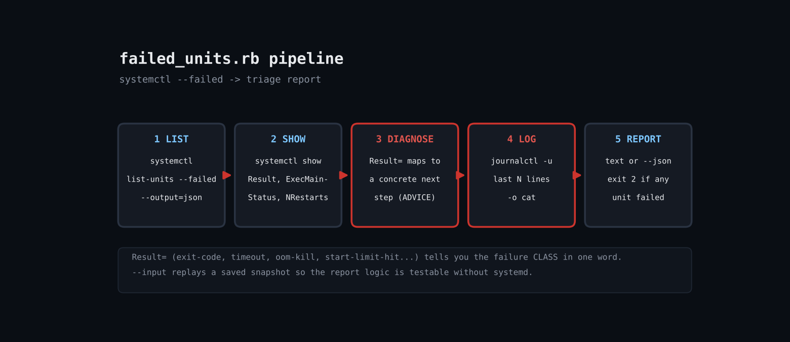

# Triage Failed systemd Units in Ruby: Turn systemctl --failed into Actionable Advice

After a deploy or reboot you run systemctl --failed and get a list of names. The real triage then happens by hand: systemctl status, journalctl -u, working out whether it was a timeout, an OOM kill or a restart loop. systemd already exposes the failure class in Result=; this script automates the loop, maps each class to a concrete next step and prints the last log lines, so the first minute of an incident is one command.



## Prerequisites

- Ruby 3.0+ (tested on 3.3.6), stdlib only
- systemd 250+ for list-units --output=json
- Permission to read the journal (root or systemd-journal group)

## Usage

```
ruby failed_units.rb [--lines 3] [--json] [--input units.json] [--user]
```

## How it works

1. **List failed units** - systemctl list-units --failed --all --output=json returns a JSON array that JSON.parse consumes directly, no column scraping.
2. **Query each unit** - systemctl show -p Result,ExecMainStatus,NRestarts prints stable KEY=value lines, parsed with to_h.
3. **Map Result to advice** - A frozen ADVICE hash maps exit-code, timeout, oom-kill, start-limit-hit and others to what you should do next.
4. **Tail the journal** - journalctl -u UNIT -n N -o cat gives the last lines with timestamps stripped for compact reports.
5. **Exit code** - Exit status 2 when anything failed, 0 when clean &mdash; so it doubles as a deploy gate.

## Example output

```
$ ruby failed_units.rb --input units.json
3 failed unit(s)

backup.service  [failed]  Nightly backup
  advice: See `systemctl status` and the journal.

app.service  [timeout]  App server
  advice: Start/stop timed out. Raise TimeoutStartSec= or fix a hanging dependency.

cache.service  [oom-kill]  Redis cache
  advice: Out-of-memory kill. Raise MemoryMax= or fix the leak.
$ ruby failed_units.rb   # live host, nothing failed
No failed units. All good.
```

## Troubleshooting

- Honest testing note: the sandbox has no running systemd, so the live path was only exercised on a host with nothing failed (prints the all-good message). The triage output above was produced from a saved JSON snapshot via --input; in that mode Result comes from the snapshot's sub field and per-unit systemctl show / journal lookups are skipped unless you add --live.
- Unknown option --output=json: systemd older than ~250; use --plain and parse columns instead.
- Empty logs: add your user to systemd-journal or run with sudo.
- User services: pass --user.

## Extending

- Post the JSON to Slack or a chat webhook
- Auto-run systemctl reset-failed after a ticket is filed
- Include coredumpctl summary for core-dump results
- Group by dependency chain using systemctl list-dependencies --reverse

## References

- https://www.freedesktop.org/software/systemd/man/latest/systemctl.html
- https://www.freedesktop.org/software/systemd/man/latest/systemd.service.html

Part of [ruby-devops-toolkit](https://github.com/jjam3774/ruby-devops-toolkit) (MIT).
