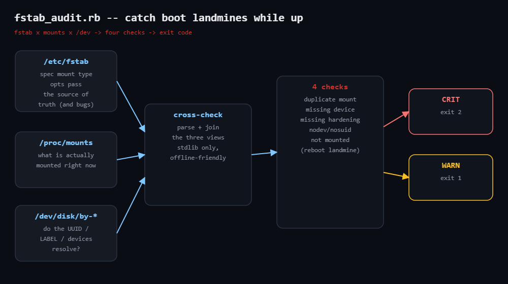

# fstab-audit

Audits `/etc/fstab` for the mistakes that only bite at the next reboot:
duplicate mount points, references to devices that no longer resolve, entries
declared in fstab but not actually mounted, and missing hardening options on
the directories that hold untrusted files. Stdlib only.



## Prerequisites

- Ruby 2.7+; standard library only (`json`, `optparse`)
- A Linux host for the live checks (`/proc/mounts`, `/dev/disk/by-*`)
- Or copied files: `--fstab` / `--mounts` audit an image or backup offline

## Usage

```bash
ruby fstab_audit.rb                       # audit the live system
sudo ruby fstab_audit.rb --json           # for pipelines
ruby fstab_audit.rb --fstab ./fstab.copy --mounts ./mounts.copy
```

Exit codes: `0` clean · `1` warnings · `2` at least one CRIT.

## How it works

1. **Parse fstab defensively** — comments stripped, blank lines skipped, each
   entry split into `spec / mount / type / opts / passno`. Lines with fewer
   than three fields warn instead of crashing.
2. **Cross-reference three views** — `/proc/mounts` (what's mounted now) and
   `/dev/disk/by-uuid` / `by-label` (do the specs resolve?). A device that
   won't resolve but whose mount point is active is downgraded CRIT → WARN
   (common in containers).
3. **Four checks** — `duplicate-mount` (CRIT), `missing-device`,
   `missing-hardening` (nodev/nosuid/noexec on `/tmp`, `/var/tmp`, `/dev/shm`,
   `/home`, `/boot`), and `not-mounted` (the reboot landmine).

## Example output (demo fstab)

```
fstab_audit: 6 entries in ./fstab.demo
CRIT duplicate-mount    /home                  mount point declared 2 times (lines 5, 6)
CRIT missing-device     line 3                 UUID=dead-beef for /boot not found under /dev
WARN missing-hardening  /tmp                   missing nodev, nosuid, noexec (has: rw,size=2G)
WARN not-mounted        /data                  fstab entry (line 7) is not currently mounted
3 CRIT, 10 WARN
```

## Troubleshooting

- **missing-device on a live root** — your distro uses `LABEL=` and the
  `by-label` link isn't present here (minimal containers). Already downgraded
  to WARN when the mount is active.
- **Network/bind mounts** — NFS, CIFS and `PARTUUID=` specs are deliberately
  not resolved; they won't raise `missing-device`.
- **not-mounted noise for swap** — swap and `none` targets are excluded.
- **Hardening warnings you accept** — edit the `HARDENING` map to your baseline.

## Extending

- Shell out to `mount --fake -a` for the ultimate boot-safety check.
- Save the JSON and alert on new entries.
- Warn when an entry's `type` disagrees with `blkid` for the device.
- Flag root filesystems with `passno` other than 1, or data mounts with 0.

## References

- Blog post: https://tha-shed.com/ (Ruby for DevOps series)
- `man 5 fstab`: https://man7.org/linux/man-pages/man5/fstab.5.html
- `man 8 mount`: https://man7.org/linux/man-pages/man8/mount.8.html
- Ruby stdlib `OptionParser`: https://docs.ruby-lang.org/en/3.3/OptionParser.html
