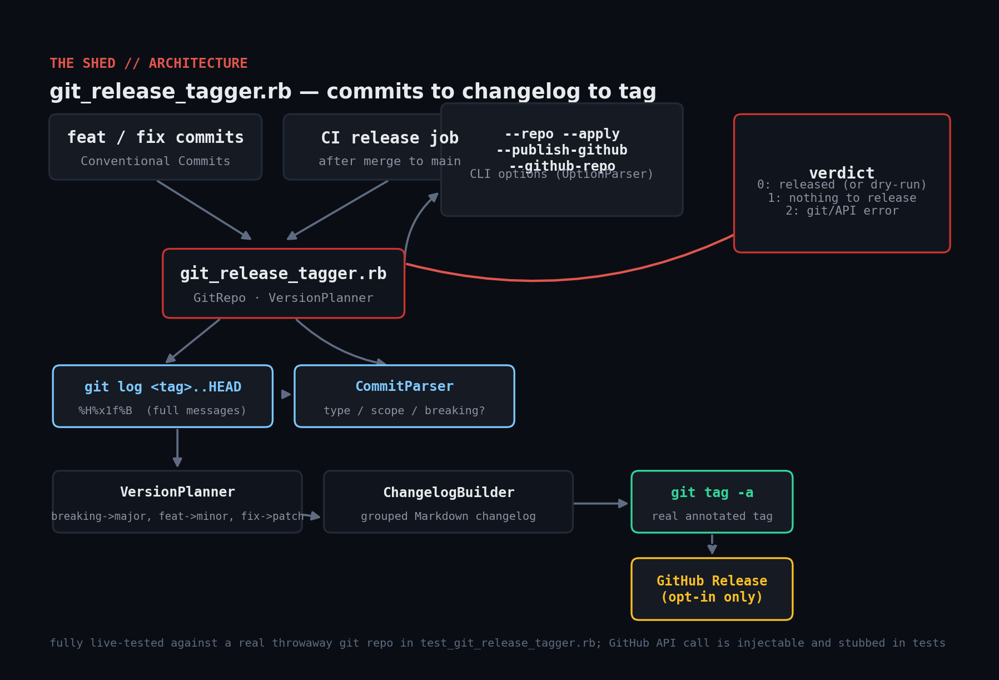

# git-release-tagger

Compute the next semantic version from Conventional Commits since the last
tag, generate a grouped changelog, and create an annotated git tag
(optionally publishing a GitHub Release too). Pure Ruby, no gems — shells
out to `git`, and `Net::HTTP` for the optional GitHub call.



## Prerequisites

- Ruby >= 2.7 and `git` on `PATH`. No gems.
- A repository whose commit subjects follow (at least loosely) the
  [Conventional Commits](https://www.conventionalcommits.org/) convention
  (`feat: ...`, `fix: ...`, `feat!: ...` or a `BREAKING CHANGE:` footer).
- For `--publish-github`: a `GITHUB_TOKEN` environment variable with
  `repo` scope, and `--github-repo owner/name`. Never pass a token on the
  command line.

## Usage

```console
$ ruby git_release_tagger.rb --repo . --dry-run     # or just omit --apply
$ ruby git_release_tagger.rb --repo . --apply
$ GITHUB_TOKEN=ghp_xxx ruby git_release_tagger.rb --repo . --apply \
    --publish-github --github-repo owner/name
```

Exit codes:

| Code | Meaning |
|------|---------|
| 0 | A release was computed (and created, if `--apply`) successfully |
| 1 | No releasable commits since the last tag — nothing to do, not an error |
| 2 | Fatal error (not a git repo, `git` command failed, GitHub API call failed) |

## How it works

- **`GitRepo`** routes every `git` invocation through one injectable
  `@runner` (default: `Open3.capture3`), the same seam used by the
  systemd/Task-Scheduler tools elsewhere in this repo — except here `git`
  actually runs in any test environment, so the test suite exercises it
  against a real throwaway repository instead of a stub.
- **`CommitParser`** matches each commit's subject line against a
  Conventional Commits regex, and separately scans the *full* commit
  message (not just the subject) for a `BREAKING CHANGE` footer — a commit
  can be `feat: add endpoint` on the subject line with the breaking
  declaration only in the body.
- **`VersionPlanner`** picks the bump: any breaking commit forces **major**,
  else any `feat` forces **minor**, else any `fix` forces **patch**; a
  batch of only `docs`/`chore`/etc. commits produces no bump at all (exit 1).
- **`ChangelogBuilder`** groups commits into BREAKING CHANGES / Features /
  Fixes / Other sections as Markdown, which becomes both the tag's
  annotation message and the GitHub Release body.
- **`GitHubReleaser`** only ever runs when `--publish-github` is passed
  explicitly (and `GITHUB_TOKEN` is set) — there's no code path where this
  tool talks to GitHub by default.

## Example output

```console
$ ruby git_release_tagger.rb --repo demo-repo
previous tag: v1.2.0
next version: v2.0.0 (major bump, 3 commit(s))

## v2.0.0

### BREAKING CHANGES
- add /v2/orders endpoint (faf397a)

### Features
- add /v2/orders endpoint (faf397a)

### Fixes
- correct off-by-one in pagination (9191712)

### Other
- fix typo in README (bb0478d)
(dry run — pass --apply to actually create the tag)
```

## Testing

`git` is available in any normal dev/CI environment, so this is tested
against a **real throwaway repository** built fresh in a temp directory —
real commits, a real prior tag, and a real `git tag -a` call at the end,
verified by reading the tag back out of the repo afterward. Only the
GitHub Release HTTP call is stubbed (via the same injectable-requester
pattern as the webhook tool elsewhere in this repo), since a test must
never make a real API call with a real token:

```console
$ ruby test_git_release_tagger.rb
...
ALL CHECKS PASSED (18 assertions, against a real git repository)
```

## Troubleshooting

- **"is not a git repository"** — `--repo` must point at a directory
  containing a `.git` folder (or a worktree of one).
- **"No releasable commits since ..." (exit 1)** — every commit since the
  last tag was `docs:`/`chore:`/`test:`/unrecognized; this is treated as
  "nothing to do," not a failure, on purpose — don't wire `exit 1` here
  into a pipeline failure.
- **Version doesn't match expectations** — remember a bare `BREAKING
  CHANGE:` footer always wins the bump, even if every subject line is a
  humble `fix:`. Check the full commit body, not just `git log --oneline`.
- **`--publish-github` fails immediately** — it requires both
  `GITHUB_TOKEN` in the environment *and* `--github-repo`; either missing
  is treated as a configuration error (exit 2), not silently skipped.

## Extending

- Pull the actual `BREAKING CHANGE:` footer text into the changelog entry
  instead of reusing the commit's main description.
- Add a `--prerelease` mode that appends `-rc.N` and skips the git-tag
  push step until promoted.
- Support scanning multiple remotes/branches for a monorepo with
  independently versioned packages (one tag prefix per package).
- Add a `CHANGELOG.md`-file mode that prepends each release's section
  instead of (or in addition to) the tag annotation.

## References

- [Conventional Commits](https://www.conventionalcommits.org/en/v1.0.0/)
- [Semantic Versioning](https://semver.org/)
- [GitHub REST API: Create a release](https://docs.github.com/en/rest/releases/releases#create-a-release)
