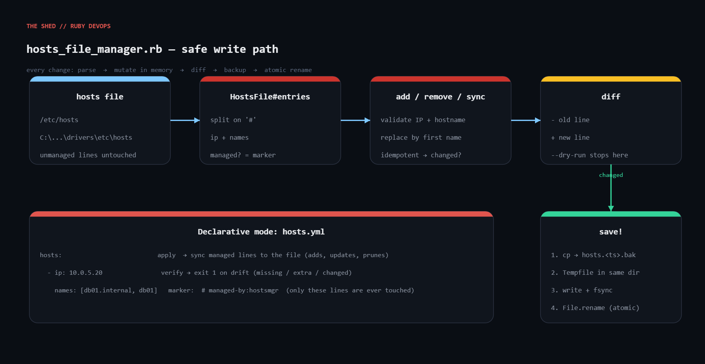

# hosts-file-manager

Idempotent hosts-file management for Linux, macOS and Windows in one stdlib-only Ruby script. Adds, removes, lists and declaratively syncs entries in `/etc/hosts` or `C:\Windows\System32\drivers\etc\hosts`. Every line it writes carries a `# managed-by:<tag>` marker so it never touches entries it does not own; every write goes backup → temp file → fsync → atomic rename.



## Prerequisites

- Linux / macOS (`sudo`) or Windows (RubyInstaller, **elevated** prompt)
- Ruby 2.7+ (tested on 3.0.2), stdlib only: `fileutils`, `optparse`, `tempfile`, `yaml`
- Try it on a scratch copy first with `--file ./hosts`

## Usage

```bash
ruby hosts_file_manager.rb list
ruby hosts_file_manager.rb add    10.0.5.20 db01.internal db01
ruby hosts_file_manager.rb add    10.0.5.20 db01.internal db01 --dry-run   # show diff only
ruby hosts_file_manager.rb remove db01.internal
ruby hosts_file_manager.rb apply  hosts.yml      # declarative sync of managed lines
ruby hosts_file_manager.rb verify hosts.yml      # exit 1 on drift (monitoring check)
```

Global flags: `--file PATH` (operate on another file), `--dry-run`, `--tag NAME` (marker, default `hostsmgr`).

`hosts.yml` format:

```yaml
hosts:
  - ip: 10.0.5.20
    names: [db01.internal, db01]
  - ip: 10.0.5.21
    names: [db02.internal, db02]
  - ip: 10.0.9.4
    names: [vault.internal]
```

## How it works

1. **Parse** — the file is read into raw lines (split on `\r?\n`, so CRLF files parse anywhere). `entries` turns each non-comment line into an `Entry(ip, names, managed)`; `managed` is true when the comment contains `managed-by:<tag>`.
2. **Validate** — IPv4 octets must be 0–255 (the first test run happily accepted `999.1.1.1`, which is why the check exists), IPv6 by character class, hostnames per RFC 1123. Bad input → `ArgumentError` → exit 2.
3. **Mutate in memory** — `add` keys on the first hostname: replace an existing managed line, or append; returns `false` if nothing changed. `remove` deletes managed lines only. `sync` prunes managed names absent from the YAML, then adds everything desired. `drift` compares without writing.
4. **Diff** — simple set difference (`- old`, `+ new`). `--dry-run` stops here.
5. **Save** — `FileUtils.cp(preserve: true)` to `hosts.<timestamp>.bak`, `Tempfile.create` in the same directory, write + `fsync`, chmod 0644 on POSIX, `File.rename` over the original (atomic on POSIX, single replace on Windows). Line endings follow the platform.

## Example output

```
$ ruby hosts_file_manager.rb --file ./hosts add 10.0.5.20 db01.internal db01 --dry-run
+ 10.0.5.20       db01.internal db01  # managed-by:hostsmgr

--dry-run: ./hosts not modified.
exit=0

$ ruby hosts_file_manager.rb --file ./hosts add 10.0.5.20 db01.internal db01
+ 10.0.5.20       db01.internal db01  # managed-by:hostsmgr

Wrote ./hosts (backup: ./hosts.20260909-103820207.bak)
exit=0

$ ruby hosts_file_manager.rb --file ./hosts add 10.0.5.20 db01.internal db01   # again - idempotent
No changes needed (already in desired state).
exit=0

$ ruby hosts_file_manager.rb --file ./hosts verify ./hosts.yml
DRIFT - missing: ["db02.internal", "vault.internal"] extra: [] changed: []
exit=1

$ ruby hosts_file_manager.rb --file ./hosts apply ./hosts.yml
+ 10.0.5.21       db02.internal db02  # managed-by:hostsmgr
+ 10.0.9.4        vault.internal  # managed-by:hostsmgr

Wrote ./hosts (backup: ./hosts.20260909-103820435.bak)
exit=0

$ ruby hosts_file_manager.rb --file ./hosts verify ./hosts.yml
OK - 3 managed entries match ./hosts.yml
exit=0

$ ruby hosts_file_manager.rb --file ./hosts add 999.1.1.1 bad
error: invalid IP address: 999.1.1.1
exit=2

$ ruby hosts_file_manager.rb --file ./hosts list
IP               NAMES                                    MANAGED
127.0.0.1        localhost                                -
::1              localhost ip6-localhost                  -
192.168.1.5      nas.local nas                            -
10.0.5.20        db01.internal db01                       yes
10.0.9.4         vault.internal                           yes
```

## Troubleshooting

- **`Errno::EACCES`** — not root / not elevated. `sudo ruby ...` or *Run as administrator*.
- **Windows changes not taking effect** — `ipconfig /flushdns`; make sure the file was not saved as `hosts.txt`.
- **Defender/EDR blocks the write** — hosts tampering is a malware heuristic; add an exclusion or run via your management tool.
- **Entries you did not add get removed** — they carry the marker from an earlier run with the same `--tag`. Use distinct tags per tool/environment.
- **Mixed line endings** — the script normalises to the platform ending on save; change `line_ending` if you need otherwise.
- **Tempfile error on `/etc`** — `Tempfile.create` needs write on the directory, not just the file; ACL-granted write on `/etc/hosts` alone is not enough.

## Extending

- Pull the desired list from Consul/etcd/an API and run `apply` on a timer to converge a fleet.
- `--comment TEXT` to record the change ticket on each managed line.
- Wire `verify` into monitoring: exit 1 = someone hand-edited a managed entry.
- Keep only the last N backups; emit a JSON diff for change-management evidence.

## References

- Ruby `Tempfile`: https://docs.ruby-lang.org/en/3.3/Tempfile.html
- Ruby `Psych.safe_load`: https://docs.ruby-lang.org/en/3.3/Psych.html#method-c-safe_load
- hosts(5): https://man7.org/linux/man-pages/man5/hosts.5.html
- RFC 1123 §2 host names: https://www.rfc-editor.org/rfc/rfc1123#section-2
