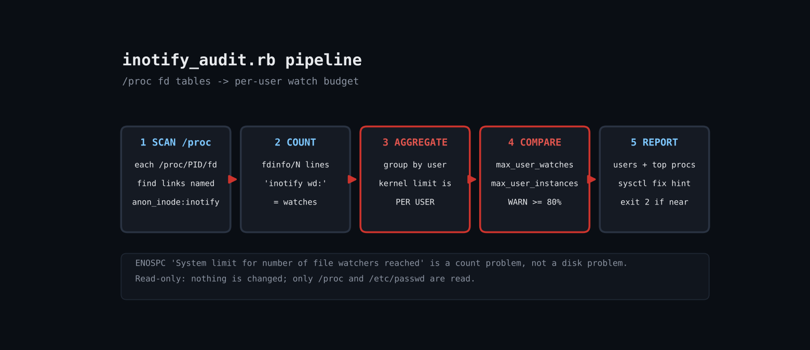

# Fix "Too Many Open Files" Watcher Errors: An inotify Watch Auditor in Ruby

The error ENOSPC: System limit for number of file watchers reached has nothing to do with disk space. The kernel caps inotify watches (fs.inotify.max_user_watches) and instances (max_user_instances) per user, and every file-watching tool spends from the same pool. Raising the sysctl blindly hides leaks; this script finds who is spending the watches so you can decide whether to raise the limit or fix a process. It works by walking /proc/PID/fd, spotting inotify descriptors, and counting the inotify wd: lines in the matching fdinfo file.



## Prerequisites

- Ruby 3.0+ (tested on 3.3.6), stdlib only
- Linux with procfs; run as root to see every user's processes
- Optional: --proc DIR to point at a copy of a procfs tree

## Usage

```
ruby inotify_audit.rb [--top 10] [--warn 80] [--json] [--proc DIR]
```

## How it works

1. **Find inotify descriptors** - For each numeric directory in /proc, File.readlink on every fd. An inotify instance resolves to the literal string anon_inode:inotify.
2. **Count watches** - The matching /proc/PID/fdinfo/N file has one inotify wd: line per watch, so counting lines gives the watch count with no ptrace and no external tools.
3. **Handle races** - Processes exit while you scan; ENOENT, ESRCH and EACCES are rescued per process so one vanished PID never aborts the run.
4. **Aggregate per user** - The kernel limit is per UID, so processes are grouped by owner (resolved via /etc/passwd) before computing percentages of both limits.
5. **Report** - A per-user table, the top N processes, and a sysctl hint when any user is over --warn percent. Exit code 2 makes it usable as a monitoring check.

## Example output

```
$ ruby inotify_audit.rb --top 5
Limits (per user): max_user_watches=64818 max_user_instances=128

USER           WATCHES  WATCH% INSTANCES   INST%
root                 8    0.0%         2    1.6%

PID     USER         COMMAND              WATCHES INSTANCES
403     root         python3                    6         1
81      root         claude                     2         1

$ ruby inotify_audit.rb --warn 1 --top 1   # lowered threshold to show the alert path
Limits (per user): max_user_watches=64818 max_user_instances=128

USER           WATCHES  WATCH% INSTANCES   INST%
root                 8    0.0%         2    1.6%  <-- NEAR LIMIT

PID     USER         COMMAND              WATCHES INSTANCES
439     root         python3                    6         1

Fix: sudo sysctl fs.inotify.max_user_watches=524288  (persist in /etc/sysctl.d/)
```

## Troubleshooting

- Only your own processes show up: run with sudo; fdinfo is root-readable for other users.
- Zero results on containers: the container's procfs shows only its PID namespace; run the audit on the host or inside each container.
- Counts differ from sysctl hints online: the limit is per user, so two services under one account share a budget.
- Tested honestly: run on a Linux sandbox with a Python helper holding real inotify watches (see Output tab); the threshold was lowered to demonstrate the alert path.

## Extending

- Emit Prometheus metrics (pair with the prometheus-exporter tool in this repo)
- Resolve watched paths by reading ino:/sdev: from fdinfo
- Auto-open a ticket when a user crosses 80%
- Compare against cgroup membership to attribute watches to services

## References

- https://man7.org/linux/man-pages/man7/inotify.7.html
- https://man7.org/linux/man-pages/man5/proc_pid_fdinfo.5.html

Part of [ruby-devops-toolkit](https://github.com/jjam3774/ruby-devops-toolkit) (MIT).
