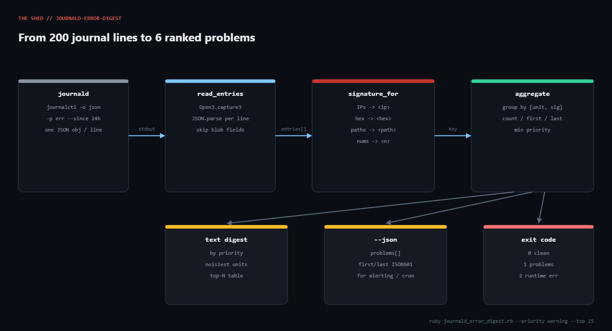

# journald-error-digest

**Platform:** Linux  
**Script:** [`journald_error_digest.rb`](journald_error_digest.rb)

journalctl -p err gives you 4,000 lines; what you actually need is the six distinct things that went wrong, ranked by severity, with counts. This script normalises PIDs, IPs and paths out of every message so identical failures collapse into one row.



## Prerequisites

- Ruby 3.0+ (stdlib only: json, optparse, open3, time). No gems.
- A systemd-based Linux (tested on Ubuntu 22.04, systemd 249). Any distro with journalctl works.
- Permission to read the journal: run as root, or add your user to the systemd-journal group.

## Usage

```bash
ruby journald_error_digest.rb                                  # last 24h, priority <= err
ruby journald_error_digest.rb --since "2 hours ago" --priority warning
ruby journald_error_digest.rb --boot --unit nginx.service --top 5
ruby journald_error_digest.rb --json > digest.json
journalctl -o json --since yesterday | ruby journald_error_digest.rb --stdin
```

## How it works

### 1. Ask journald for JSON

build_journalctl_cmd assembles journalctl -o json --no-pager -q -p err --since '24 hours ago'. Passing -p means journald filters priority 0..N itself; Ruby only parses what matters. --boot swaps --since for -b, and --unit adds -u.

### 2. Parse defensively

read_entries runs the command with Open3.capture3 so stderr is captured separately, then JSON.parses each line inside a rescue JSON::ParserError. journald can embed binary blobs for some fields and those lines are simply skipped.

### 3. Normalise into a signature

signature_for is a chain of gsub calls: IPv4 (with optional port) to <ip>, 0x... to <hex>, UUIDs to <uuid>, two-or-more-segment paths to <path>, then any remaining number (optionally with ms/s/MB/% suffix) to <n>. It is truncated to 160 chars so very long messages don't produce unique keys.

### 4. Aggregate

aggregate uses a Hash.new with a default block to build a record per [unit, signature]: count, first/last seen (from __REALTIME_TIMESTAMP, microseconds since epoch), the lowest (worst) priority, and the first raw message as a human-readable sample. Side tallies by unit and by priority feed the summary sections.

### 5. Render and exit

Text mode prints a priority breakdown, the noisiest units, and a top-N table. --json emits the same data with ISO-8601 timestamps for a dashboard or alerting hook. Exit 0 means the journal was clean, 1 means problems were found, 2 means journalctl itself failed.

## Example output

```text
journald error digest  (since: 24 hours ago, priority <= warning)
==============================================================================
Total entries: 87   Distinct problems: 6

By priority:
  crit          3
  err          70
  warning      14

Noisiest units:
  sshd.service                                 41
  nginx.service                                27
  postgresql@14-main.service                    9
  docker.service                                5
  kernel                                        3
  systemd                                       2

Top 6 problems (ranked by severity, then frequency):
  COUNT PRIO    UNIT                       LAST SEEN           MESSAGE (sample)
  3     crit    kernel                     09-06 09:34:30      EXT4-fs error (device sda1): ext4_find_entry:1450: inode #303051: comm
  41    err     sshd.service               09-06 15:35:12      error: maximum authentication attempts exceeded for root from 185.220.
  27    err     nginx.service              09-06 14:40:25      connect() failed (111: Connection refused) while connecting to upstrea
  2     err     systemd                    09-06 15:29:07      backup-nightly.service: Failed with result 'exit-code'.
  9     warning postgresql@14-main.service 09-06 14:37:06      checkpoints are occurring too frequently (21 seconds apart)
  5     warning docker.service             09-06 15:31:19      failed to retrieve docker-runc version: exec: "docker-runc": executabl
exit code: 1 (problems found)
```

## Troubleshooting

- "No journal files were opened due to insufficient permissions" (exit 2): you are not root and not in systemd-journal. sudo usermod -aG systemd-journal $USER, then log in again. This is exactly what the Linux sandbox returned during testing, which is why the shown output was produced from a synthetic journalctl -o json fixture piped through --stdin.
- Everything shows as unit kernel. Kernel messages have no _SYSTEMD_UNIT; that is expected. If user-space messages also land there, your journald is not recording _SYSTEMD_UNIT (containers with a shared journal do this). The fallback chain also tries UNIT, SYSLOG_IDENTIFIER and _COMM.
- Counts look too low. The --since default is 24 hours and --priority defaults to err, so warnings are excluded. Try --priority warning.
- Two rows that are obviously the same problem. The message contains a variable token the normaliser doesn't know about (a hostname, a username). Add one more gsub to signature_for.
- Timestamps are off by hours. They are rendered in the local timezone of the machine running the script, not the host that produced the journal. Use --json for zone-aware ISO-8601 output.

## Extending

- Wire it into cron: 0 7 * * * journald_error_digest.rb --since '24 hours ago' || mail -s "$(hostname) journal digest" ops@example.com. Exit 1 triggers the mail only when there is something to read.
- Fleet mode: run journalctl -o json --since yesterday over SSH on each host and pipe into --stdin; add a _HOSTNAME column to the key to keep hosts separate.
- Baseline diffing: save --json output daily and alert only on signatures that did not appear yesterday.
- Push the by_unit hash to Prometheus via a textfile collector so unit error rates show up on a Grafana panel.
- Add --ignore REGEX to suppress known-noisy signatures (that SSH brute-force line, for example) without losing them from the totals.

## References

- [journalctl(1) man page](https://www.freedesktop.org/software/systemd/man/latest/journalctl.html)
- [systemd.journal-fields(7)](https://www.freedesktop.org/software/systemd/man/latest/systemd.journal-fields.html)
- [Ruby Open3 docs](https://docs.ruby-lang.org/en/3.3/Open3.html)
- [Ruby JSON docs](https://docs.ruby-lang.org/en/3.3/JSON.html)

- Tutorial post: https://tha-shed.com/ ("Ruby for DevOps: A journald Error Digest That Ranks Real Problems, Not Log Lines")

---

Part of [ruby-devops-toolkit](https://github.com/jjam3774/ruby-devops-toolkit). MIT licensed.
