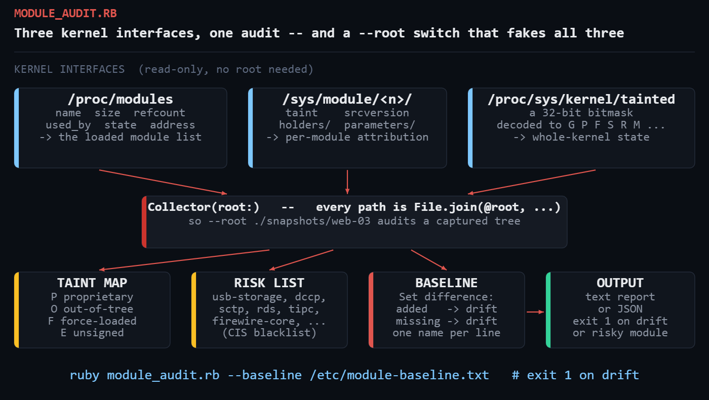

# kernel-module-audit

Audit the Linux kernel modules loaded on a host: what is resident, what is
holding it there, which module tainted the kernel, and what appeared since
your approved baseline.

Reads `/proc/modules`, `/proc/sys/kernel/tainted` and `/sys/module/<name>/*`.
Pure Ruby stdlib — no gems, no `modinfo` shell-outs, no root required.



---

## The problem

`lsmod` gives you three columns and no judgement. It will not tell you that
`vboxdrv` appeared on a production web server last Tuesday, that the kernel is
tainted because someone force-loaded a driver during an outage, or that
`usb_storage` is loaded on a headless box that has no business mounting USB
devices.

Those are the three questions that actually come up:

1. **What is loaded, and what depends on it?** You cannot `rmmod` something
   another module is holding, and `/proc/modules`' `used_by` column is not
   always the full story.
2. **Why is the kernel tainted?** A tainted kernel changes how a vendor
   handles your support case, and the taint bitmask alone does not name the
   culprit. `/sys/module/<name>/taint` does.
3. **What changed?** Module drift is a genuinely useful intrusion signal —
   rootkits are kernel modules — and an equally useful configuration-drift
   signal on a fleet that is supposed to be identical.

## Prerequisites

| Requirement | Notes |
|---|---|
| Ruby | 3.0 or newer |
| Gems | none — `optparse`, `json`, `time`, `set` are stdlib |
| OS | Linux (needs `/proc/modules`). Tested on kernel 6.8 |
| Privileges | none for the audit; `/proc` and `/sys` reads are world-readable |

## Usage

```console
# audit this host
ruby module_audit.rb

# capture the approved state
sudo ruby module_audit.rb --write-baseline /etc/module-baseline.txt

# check for drift -- exits 1 if anything appeared
ruby module_audit.rb --baseline /etc/module-baseline.txt

# machine-readable, for shipping into your monitoring stack
ruby module_audit.rb --format json

# audit a snapshot captured from another host
ruby module_audit.rb --root ./snapshots/web-03
```

Exit codes: `0` clean · `1` drift, taint, or a flagged module · `2` I/O or
usage error.

## Example output

Against a captured fixture host with an NVIDIA driver, VirtualBox, and a
baseline that predates both:

```
==============================================================================
  KERNEL MODULE AUDIT   2026-08-19 14:53:26
  root: /tmp/hostfix   kernel: 6.8.0-136-generic
==============================================================================
  modules loaded: 9       resident: 64.0 MiB    removable: 3

  KERNEL TAINT
  --------------------------------------------------------------------------
    mask 12481
      G/P  proprietary module loaded
      U    userspace-requested taint
      D    kernel has died (oops/BUG)
      O    out-of-tree module loaded
      E    unsigned module loaded

  TAINTING MODULES
  --------------------------------------------------------------------------
    nvidia                   [PO]
        P=proprietary (Proprietary (non-GPL) module)
        O=out-of-tree (Built outside the mainline kernel tree)
    nvidia_uvm               [PO]
        P=proprietary (Proprietary (non-GPL) module)
        O=out-of-tree (Built outside the mainline kernel tree)
    vboxdrv                  [OE]
        O=out-of-tree (Built outside the mainline kernel tree)
        E=unsigned (Loaded unsigned on a signature-enforcing kernel)

  MODULES FLAGGED BY HARDENING GUIDES
  --------------------------------------------------------------------------
    bluetooth        Bluetooth stack -- unnecessary on a server
    usb_storage      USB mass storage -- data exfiltration path

  BASELINE DRIFT -- 2 module(s) not in baseline
  --------------------------------------------------------------------------
    + bluetooth
    + vboxdrv

  TOP 10 BY RESIDENT SIZE
  --------------------------------------------------------------------------
    MODULE                           SIZE  REFS  USED BY
    nvidia                       59.6 MiB    12  nvidia_uvm
    nvidia_uvm                    1.4 MiB     2  -
    bluetooth                     1.0 MiB     0  -
    ext4                        948.0 KiB     1  -
    vboxdrv                     648.0 KiB     0  -
    overlay                     196.0 KiB     3  -
    usb_storage                  80.0 KiB     1  uas
    uas                          32.0 KiB     0  -
    xt_conntrack                 12.0 KiB     2  -

==============================================================================
```

The `D` bit in that taint mask is the one to notice: the kernel has already
oopsed on this host. Nothing else in the report tells you that, and neither
does `lsmod`.

## How it works

### Parsing `/proc/modules`

Seven whitespace-separated columns, with `-` standing in for an empty
dependency list:

```
nvidia 62513152 12 nvidia_uvm, Live 0x0000000000000000 (PO)
name   size     refcount used_by   state address          taint
```

```ruby
def parse_proc_modules_line(line)
  f = line.split
  return nil if f.size < 5
  used_by = f[3] == '-' ? [] : f[3].split(',').reject(&:empty?)
  Mod.new(name: f[0], size: f[1].to_i, refcount: f[2].to_i,
          used_by: used_by, state: f[4], address: f[5], ...)
end
```

The trailing `.reject(&:empty?)` matters: the kernel writes a **trailing
comma** in that column, so a naive `split(',')` yields a phantom empty
dependency.

### Attributing the taint

`/proc/sys/kernel/tainted` is a single integer. Decoding it is a bitmask walk:

```ruby
mask = File.read('/proc/sys/kernel/tainted').strip.to_i
flags = (0..31).select { |b| mask.anybits?(1 << b) }
               .map { |b| KERNEL_TAINT_BITS.fetch(b, "bit #{b}") }
```

`Integer#anybits?` (Ruby 2.5+) reads better than `mask & (1 << b) != 0` and
means the same thing.

But the mask only says *that* the kernel is tainted. To say *which module did
it*, read the per-module file:

```console
$ cat /sys/module/nvidia/taint
PO
```

Each letter maps to a documented cause, from
`Documentation/admin-guide/tainted-kernels.rst`:

| Letter | Meaning | Why you care |
|---|---|---|
| `P` | proprietary (non-GPL) module | vendor support boundary |
| `O` | built out of tree | not covered by distro kernel updates |
| `F` | force-loaded with `insmod -f` | someone overrode a version check |
| `E` | unsigned on a signature-enforcing kernel | Secure Boot bypass |
| `C` | staging tree driver | known unstable |
| `X` | vendor auxiliary taint | usually benign |

### The `--root` switch

Every filesystem path in the collector is built through one method:

```ruby
def path(*parts) = File.join(@root, *parts)
```

That single indirection is what makes the tool testable and useful beyond the
local host. `--root ./snapshots/web-03` runs the identical code against a
captured tree, so you can:

* build fixtures for tests (this is exactly how the sample output above was
  produced — a fake `/proc/modules` plus fake `/sys/module/*/taint` files);
* triage a host you cannot SSH into any more, from a `tar` someone grabbed
  before it was reimaged;
* diff two hosts by collecting from both and comparing the JSON.

Capturing a snapshot is three commands:

```sh
mkdir -p snap/proc/sys/kernel snap/sys
cp /proc/modules snap/proc/ && cp /proc/sys/kernel/tainted /proc/sys/kernel/osrelease snap/proc/sys/kernel/
cp -r /sys/module snap/sys/ 2>/dev/null   # expect some EACCES; they are non-fatal
```

### Reads that are allowed to fail

Sysfs is a live view of kernel state, so a module can unload *while you are
walking it*. Every read goes through one rescuing helper:

```ruby
def read(file)
  File.read(file)
rescue SystemCallError, IOError
  nil
end
```

`EACCES` on a root-only parameter, `ENODEV` on a module that just went away,
`EINVAL` on an attribute the driver refuses to render — none of them should
abort a fleet-wide audit.

### Baseline as a set difference

The baseline is deliberately the dumbest possible format: one module name per
line, `#` for comments. That makes it reviewable in a pull request and easy to
manage with your existing config management.

```ruby
names   = Set.new(mods.map(&:name))
@added   = (names - baseline).to_a.sort   # appeared: investigate
@missing = (baseline - names).to_a.sort   # gone: hardware or config change
```

Both directions are reported. `missing` is usually benign (different
hardware), but on a fleet that is supposed to be identical it is a real
signal.

### The hardening list

`RISKY_MODULES` is drawn from the CIS Benchmark / DISA STIG recommendations
for a hardened Linux server: obsolete filesystem drivers, rarely used network
protocols with long CVE histories, and physical-access attack surface.

Presence is **not** automatically a finding — a laptop legitimately needs
`bluetooth`, and a container host legitimately needs `squashfs`. It is a
prompt to justify, not an alarm. Names are matched with `_` and `-`
normalised, because the kernel is inconsistent about which it uses.

## Troubleshooting

**`cannot read /proc/modules`.** You are not on Linux, or you are in a
container with a restricted `/proc` mount. Inside a container you will see the
*host's* modules — which is correct, since containers share the host kernel,
but may be surprising.

**Every module shows `refcount 0` but `rmmod` says the module is in use.**
The refcount column is not always maintained by every driver. Trust
`/sys/module/<name>/holders/` instead — the script reads it and prefers it in
the `USED BY` column for exactly this reason.

**No taint letters even though the kernel mask is non-zero.** Some taint bits
are not attributable to a module at all (`D` for a previous oops, `W` for a
warning, `M` for a machine check). Those show in the mask and never in a
`/sys/module/*/taint` file.

**`--write-baseline` fails with EACCES.** Write it somewhere you own, or use
`sudo`. The audit itself needs no privileges; only writing to `/etc` does.

**Module parameters section is empty.** Many parameters are `0400` (root
read only). Run as root if you specifically need them; the rest of the audit
is unaffected.

**Fleet-wide `-` in the taint column.** Good. That is a clean kernel.

## Extending it

* **Signature verification.** `modinfo -F signer <name>` reports who signed a
  module. Shelling out to it for every out-of-tree module would turn the `E`
  taint letter into an actionable "signed by whom".
* **Alert on `rmmod` candidates.** `removable?` already identifies modules
  with a zero refcount and no holders. Feed that into a change request to
  shrink attack surface.
* **Push to Prometheus.** The JSON output maps cleanly onto a textfile
  collector: `node_kernel_modules_total`, `node_kernel_tainted`, and a
  `node_kernel_module_drift` gauge.
* **Fleet diff.** Collect `--format json` from every host into one directory,
  then report modules present on fewer than N hosts — that is where the
  interesting outliers live.
* **Blacklist enforcement.** Pair the risky-module list with writing
  `install <module> /bin/true` into `/etc/modprobe.d/`, and re-audit to
  confirm it stuck across a reboot.

## References

- [The Linux kernel: tainted kernels](https://docs.kernel.org/admin-guide/tainted-kernels.html) — the authoritative taint-letter reference
- [`proc(5)` — `/proc/modules`](https://man7.org/linux/man-pages/man5/proc.5.html)
- [`sysfs(5)`](https://man7.org/linux/man-pages/man5/sysfs.5.html)
- [`lsmod(8)`](https://man7.org/linux/man-pages/man8/lsmod.8.html) and [`modprobe(8)`](https://man7.org/linux/man-pages/man8/modprobe.8.html)
- [Ruby `Integer#anybits?`](https://docs.ruby-lang.org/en/3.0/Integer.html#method-i-anybits-3F)
- [Ruby `Set`](https://docs.ruby-lang.org/en/3.0/Set.html)
- [CIS Benchmarks](https://www.cisecurity.org/cis-benchmarks) — source of the flagged-module list

## License

MIT — see the repository [LICENSE](../LICENSE).
