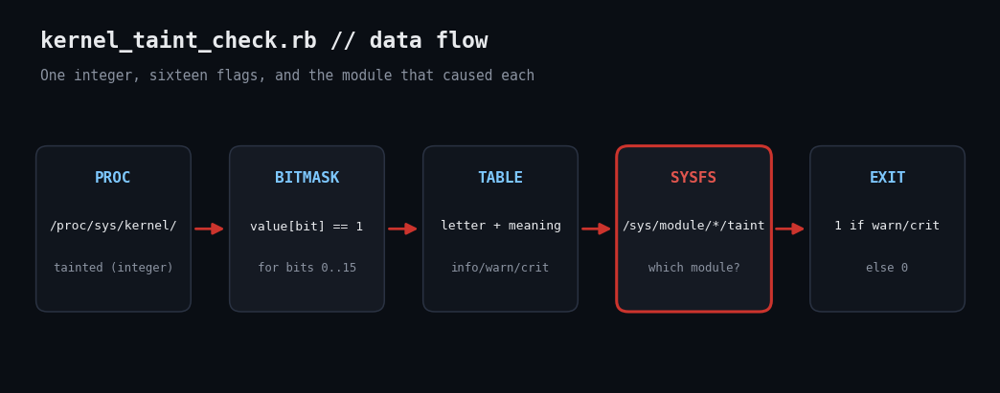

# Decode the Linux Kernel Taint Flag with Ruby

`cat /proc/sys/kernel/tainted` prints `4609`. Is that bad? A 70-line Ruby script turns the bitmask into plain English and names the module that caused it.



## The problem

When a kernel is tainted, upstream maintainers may ignore your bug report, and more importantly it tells you something happened: a proprietary or unsigned module loaded, the kernel logged a WARN, a machine-check fired, or it survived an OOPS. Fleet monitoring rarely tracks this, yet a jump from 0 to 512 (a kernel WARN) after a driver update is exactly the early signal you want.

## Prerequisites

- Ruby 2.7+ (tested on 3.3.6), standard library only
- Linux with /proc/sys/kernel/tainted and /sys/module
- No root needed

## Usage

```
ruby kernel_taint_check.rb
```

## How it works

1. **A table of bit meanings.** FLAGS maps bit numbers 0–15 to the kernel's letter code, a description, and a concern level (:info, :warn, :crit). Proprietary and out-of-tree modules are informational; a machine check, bad page, OOPS or soft lockup is critical.
2. **Test each bit.** value[bit] == 1 is Ruby's built-in Integer bit reference, so decoding is one filter_map with no manual shifting.
3. **Find the culprit modules.** Modules that taint the kernel expose /sys/module/NAME/taint containing letters such as PO. We glob those and list non-empty ones.
4. **Exit code policy.** Only :warn and :crit flags fail the check; a box running the NVIDIA driver (P, O) is reported but not paged.

## Example output

```
tainted = 4609 (TAINTED)
  [INFO] bit 0  P (proprietary module loaded)
  [WARN] bit 9  W (kernel issued a WARN)
  [INFO] bit 12 O (out-of-tree module loaded)
```

## Troubleshooting

- Use --value N to decode any number, handy when pasting from a bug report or another host.
- Taint is sticky until reboot: a single WARN keeps bit 9 set. Alert on change, not just presence, by storing the last value.
- Bits above 15 exist on newer kernels; unknown bits are ignored, so extend FLAGS from the kernel docs.

## Extending

- Persist the last value and alert only on new bits.
- Correlate with journalctl -k lines matching 'Tainted:'.
- Expose the value as a Prometheus gauge.

## References

- [Kernel docs: tainted kernels](https://docs.kernel.org/admin-guide/tainted-kernels.html)
- [Ruby Integer#[]](https://docs.ruby-lang.org/en/3.3/Integer.html#method-i-5B-5D)
- [Ruby Dir.glob](https://docs.ruby-lang.org/en/3.3/Dir.html#method-c-glob)
