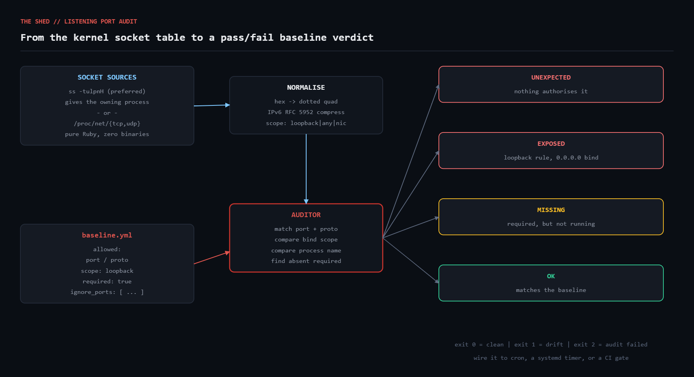

# listening-port-audit

Audit every TCP/UDP socket a Linux host is listening on against a declarative
YAML baseline. Catches the three failures that matter: something listening that
nobody authorised, an authorised service bound world-wide when it should be
loopback-only, and a required service that quietly stopped.



## The problem

`ss -tulpn` tells you what is listening *right now*. It does not tell you
whether that is what is *supposed* to be listening. On a fleet of any size the
interesting question is never "what ports are open" but "what changed since the
last time someone looked".

The classic incident is Redis. It ships with no authentication because the
documented deployment model is loopback-only. Someone edits `redis.conf` to
test something from another host, sets `bind 0.0.0.0`, and forgets. Nothing
alerts, because Redis is up and healthy — it is just now up and healthy for the
entire internet. A port scan finds it in minutes.

This script turns "what should be listening" into a file you commit next to
your config management, and turns drift from that file into a non-zero exit
code you can wire into cron or CI.

## Prerequisites

| Requirement | Notes |
|---|---|
| Ruby | >= 2.7 (uses `filter_map`, endless methods). Tested on 3.0.2. |
| Gems | None. Stdlib only (`yaml`, `json`, `optparse`, `set`). |
| OS | Linux. Needs either `iproute2` (`ss`) or a readable `/proc/net`. |
| Privileges | Runs unprivileged. Process names in `ss` output require root for sockets you do not own. |

## Usage

```bash
# Bootstrap a baseline from a host you believe is correct, then edit it
ruby port_audit.rb --discover > baseline.yml

# Audit
ruby port_audit.rb --baseline baseline.yml

# Machine-readable, for shipping to a log pipeline
ruby port_audit.rb --baseline baseline.yml --json

# Force the dependency-free backend (useful in minimal containers)
ruby port_audit.rb --baseline baseline.yml --force-proc
```

Exit codes: `0` clean, `1` drift found, `2` the audit itself failed.

## Baseline format

```yaml
ignore_ports: [1080, 3128]      # never reported at all

allowed:
  - port: 22
    proto: tcp
    scope: any                  # any | loopback | specific
    process: sshd               # optional; mismatch reports DRIFT
    required: true              # absent -> MISSING
    note: fleet SSH access

  - port: 6379
    proto: tcp
    scope: loopback             # bound to 0.0.0.0 -> EXPOSED
    note: redis -- no auth configured, loopback only
```

## How it works

### Two socket backends

`SsBackend` shells out to `ss -tulpnH` (`-H` suppresses the header, so there is
no row to skip). It is preferred because it is the only source that gives you
the owning process name without walking every `/proc/*/fd` symlink as root.

`ProcNetBackend` parses `/proc/net/tcp`, `tcp6`, `udp` and `udp6` in pure Ruby.
No external binary, so it works in a scratch container or a locked-down
appliance where `iproute2` was never installed. `PortAudit.backend` picks the
first available one; `--force-proc` overrides.

### Decoding /proc/net addresses

This is the only genuinely fiddly part. `/proc/net/tcp` writes an IPv4 address
as a single little-endian 32-bit hex word, so `0100007F` is `127.0.0.1` — read
the byte pairs back to front:

```ruby
hex.scan(/../).reverse.map { |b| b.to_i(16) }.join('.')
```

IPv6 is four little-endian 32-bit words. Reverse the bytes *inside each word*,
join into eight groups, then collapse the longest run of zero groups per
RFC 5952 so `::1` prints as `::1` and not as
`0000:0000:0000:0000:0000:0000:0000:0001`.

The state column matters too. `0A` is `TCP_LISTEN`. UDP has no listen state, so
a bound UDP socket sits in `07`, which is `TCP_CLOSE` reused to mean
"unconnected". Filtering on the wrong constant gives you either nothing or
every established connection on the box.

### Scope, not just address

The security-relevant question about a listener is not its address string but
who can reach it. `Listener#scope` collapses the address into three cases:

- `:loopback` — `127.0.0.0/8` or `::1`; local processes only
- `:any` — `0.0.0.0` or `::`; every interface, including whatever faces the internet
- `:specific` — one particular NIC

The `EXPOSED` finding is exactly the case where the baseline says `:loopback`
and the live scope is anything else. That one rule is the whole reason to run
this script.

### Splitting endpoints

`ss` writes IPv6 endpoints as `[::1]:8080` and a wildcard v6 bind as `*:8080`.
Split on the **last** colon, not the first, or the address itself gets eaten:

```ruby
idx  = endpoint.rindex(':')
addr = endpoint[0...idx].delete('[]')
port = endpoint[(idx + 1)..]
```

## Example output

```
==========================================================================
  LISTENING PORT AUDIT   source=ss   2026-08-18 14:30:50
==========================================================================
  STATUS  PROTO  PORT   ADDRESS                PROCESS
--------------------------------------------------------------------------
  [FAIL]  tcp    8080   0.0.0.0                ruby
          -> no baseline rule authorises this listener
  [FAIL]  tcp    6379   0.0.0.0                ruby
          -> baseline says loopback-only, bound to 0.0.0.0
  [WARN]  tcp    22     -                      sshd
          -> required listener is not running
  [ OK ]  tcp    3000   0.0.0.0                ruby
  [ OK ]  tcp    5432   127.0.0.1              ruby
  [ OK ]  tcp    9100   0.0.0.0                ruby
--------------------------------------------------------------------------
  6 listeners checked | unexpected=1 exposed=1 missing=1 drift=0 ok=3
==========================================================================
```

Same host, dependency-free backend — note that process names are gone, because
`/proc/net` does not carry them:

```
  [FAIL]  tcp    8080   0.0.0.0                -
          -> no baseline rule authorises this listener
  [FAIL]  tcp    6379   0.0.0.0                -
          -> baseline says loopback-only, bound to 0.0.0.0
```

## Troubleshooting

**Every listener shows `-` for the process.** You are either on the
`/proc/net` backend or running unprivileged. `ss` only reveals the owning
process for sockets your uid owns; run under `sudo` for the full picture.

**A service you know is running reports MISSING.** Check the protocol. A
`required: true` rule with `proto: tcp` will not be satisfied by a UDP
listener, and vice versa. Check the port is what you think — `--discover` on
the live host will tell you.

**Everything is UNEXPECTED after a distro upgrade.** Systemd socket activation
moves listeners between units without changing the port. Re-run `--discover`,
diff it against your committed baseline, and accept the changes you understand.

**IPv6 addresses look wrong.** If you are seeing raw hex, `ss` is absent and
the `/proc` decoder hit an address length it did not expect. Both decoders
return `nil` on a malformed address rather than guessing, so the listener is
skipped instead of being misreported.

**`ss` exists but returns nothing in a container.** A container in its own
network namespace genuinely has no listeners from the host's point of view.
Run the audit inside the namespace, not beside it.

## Extending

- **Fleet mode.** Wrap it in `net-ssh`, run `--json` on every host, and merge
  the results into one report keyed by hostname.
- **Baseline inheritance.** Split `baseline.yml` into `common.yml` plus a
  role file and deep-merge them, so `webserver` inherits the base rules.
- **Process fingerprinting.** Extend the `DRIFT` rule to compare the binary's
  checksum from `/proc/<pid>/exe` rather than just the process name.
- **Prometheus.** Emit the counts as a textfile-collector metric and alert on
  `port_audit_unexpected > 0`.
- **Unix sockets.** `ss -xlpn` lists them; a fourth finding class for
  world-writable socket files is a natural addition.

## References

- [`ss(8)` — iproute2 socket statistics](https://man7.org/linux/man-pages/man8/ss.8.html)
- [`proc(5)` — /proc/net/tcp format](https://man7.org/linux/man-pages/man5/proc.5.html)
- [RFC 5952 — A Recommendation for IPv6 Address Text Representation](https://datatracker.ietf.org/doc/html/rfc5952)
- [Ruby `YAML` / Psych](https://docs.ruby-lang.org/en/master/Psych.html)
- [Ruby `OptionParser`](https://docs.ruby-lang.org/en/master/OptionParser.html)

## License

MIT — see the repository root.
