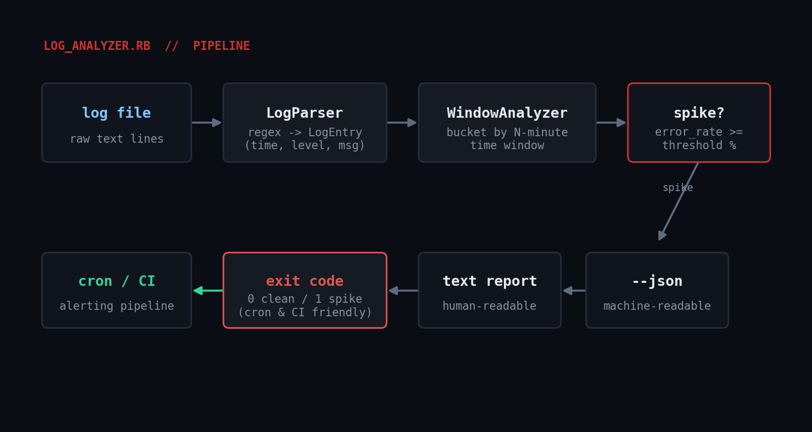

# log_analyzer.rb

Parse a log file, bucket entries into time windows, and flag any window
where the error rate spikes above a threshold. Built for the "something
broke overnight and I need to find exactly when" moment - point it at a
log after the fact, or drop it into cron for proactive alerting.



## Prerequisites

- **Ruby 2.7+** (tested on Ruby 3.0.2). No gems required - only stdlib:
  `optparse`, `time`, `json`.
- Works on Linux, macOS, or Windows - it just reads a text file.
- A log file with a timestamp and a severity word (`ERROR`, `WARN`, etc.)
  on each line. Both `2026-07-27 14:03:01 ERROR ...` (ISO-ish) and
  `Jul 27 14:03:01 host app[1234]: ERROR ...` (rsyslog-style) are supported.

## Usage

```bash
ruby log_analyzer.rb /var/log/app.log
ruby log_analyzer.rb /var/log/app.log --window 5 --threshold 10
ruby log_analyzer.rb /var/log/app.log --json
ruby log_analyzer.rb /var/log/app.log --since "2026-07-27 00:00:00"
```

Flags:

| Flag | Default | Meaning |
|---|---|---|
| `-w, --window MINUTES` | 5 | Size of each time bucket |
| `-t, --threshold PCT` | 10 | Error-rate %% that counts as a spike |
| `-m, --min-events N` | 3 | Minimum events in a window before it can spike |
| `-s, --since TIME` | none | Only consider entries at/after this time |
| `-j, --json` | off | Emit JSON instead of a text report |

**Exit codes:** `0` no spikes, `1` at least one spike found (cron/CI
friendly), `2` usage or input error.

## How it works

1. **`LogParser`** applies a named-capture regex (`%r{...}x`, not `/.../x`
   - a stray unescaped `/` in a comment truncates a slash-delimited regex
   literal early) to each line, silently skipping anything that doesn't
   match, and produces `LogEntry` structs (`time`, `level`, `message`).
2. **`WindowAnalyzer`** buckets entries by
   `(timestamp - first_timestamp) / window_seconds`, integer-divided.
   `window_seconds` is explicitly cast to `Integer` - dividing by a Float
   there silently produces a unique bucket key per entry, and every
   "window" ends up with exactly one event, so no spike ever triggers.
   Each window computes an error rate and a per-level breakdown.
3. A window counts as a spike only once it has `--min-events` entries
   *and* an error rate at or above `--threshold`, so a single unlucky
   error in an otherwise-quiet window doesn't read as a 100% spike.
4. The CLI prints either a human-readable text report or `--json`, and
   exits non-zero if any window spiked - safe to drop straight into
   cron: `ruby log_analyzer.rb /var/log/app.log --json || alert-team`.

## Example output

```
$ ruby log_analyzer.rb sample.log --window 5 --threshold 10
log_analyzer report for sample.log
windows analyzed: 3, spikes: 1
------------------------------------------------------------
2026-07-27 09:00     total=101  errors=0    rate=  0.00%
2026-07-27 09:05     total=110  errors=30   rate= 27.27% !! SPIKE
2026-07-27 09:10     total=69   errors=0    rate=  0.00%
------------------------------------------------------------
Spike detail:
  2026-07-27 09:05 - INFO:53, WARN:13, DEBUG:14, ERROR:30
```

Exit code is `1` because a spike window was found. The same run with
`--json` emits the equivalent data as structured JSON for a monitoring
pipeline.

## Troubleshooting

- **"no parseable log lines found"** - your format doesn't match
  `LOG_LINE_RE`. Confirm each line starts with `YYYY-MM-DD HH:MM:SS` or
  `Mon DD HH:MM:SS`, followed eventually by a whole-word level
  (`DEBUG/INFO/WARN/ERROR/FATAL/CRIT`).
- **Every window shows exactly 1 event** - the Integer/Float bucket bug
  described above; make sure `@window_seconds` is `.to_i`'d.
- **Deeply nested rsyslog fields don't match** - the regex allows up to
  3 optional `token:`/`token ` prefixes between the timestamp and level;
  bump the `{0,3}` quantifier in `LOG_LINE_RE` if your format nests
  deeper.
- **Non-greedy prefix matching can grab the wrong word** if a message's
  free text itself contains a level keyword before the real one (rare
  but possible) - tighten the prefix pattern for your specific source.

## Extending it

- **Alerting integration**: pipe `--json` into a script that posts to
  Slack/PagerDuty/Opsgenie only when `spike_count > 0`.
- **Multi-host scanning**: loop over `Dir.glob("/var/log/app/*.log")` to
  scan a whole fleet's rotated logs, merging JSON reports per host.
- **Baseline-aware thresholds**: compute a rolling average error rate
  instead of a fixed `--threshold`, and flag deviation from *that*.
- **Structured logs**: swap `LogParser` for one that calls `JSON.parse`
  per line if your app already emits JSON lines - the windowing and
  spike-detection logic doesn't need to change.

## Testing notes

Verified in a Linux sandbox against a generated sample log containing a
deliberate 5-minute error spike (`gen_sample.rb`-style script, not
included here) plus an rsyslog-format sample, exercising both timestamp
formats, `--json`, `--help`, and the missing-file error path.

## References

- [Ruby stdlib: OptionParser](https://docs.ruby-lang.org/en/3.0/OptionParser.html)
- [Ruby stdlib: Time](https://docs.ruby-lang.org/en/3.0/Time.html)
- [Ruby stdlib: Regexp (extended mode)](https://docs.ruby-lang.org/en/3.0/Regexp.html)
