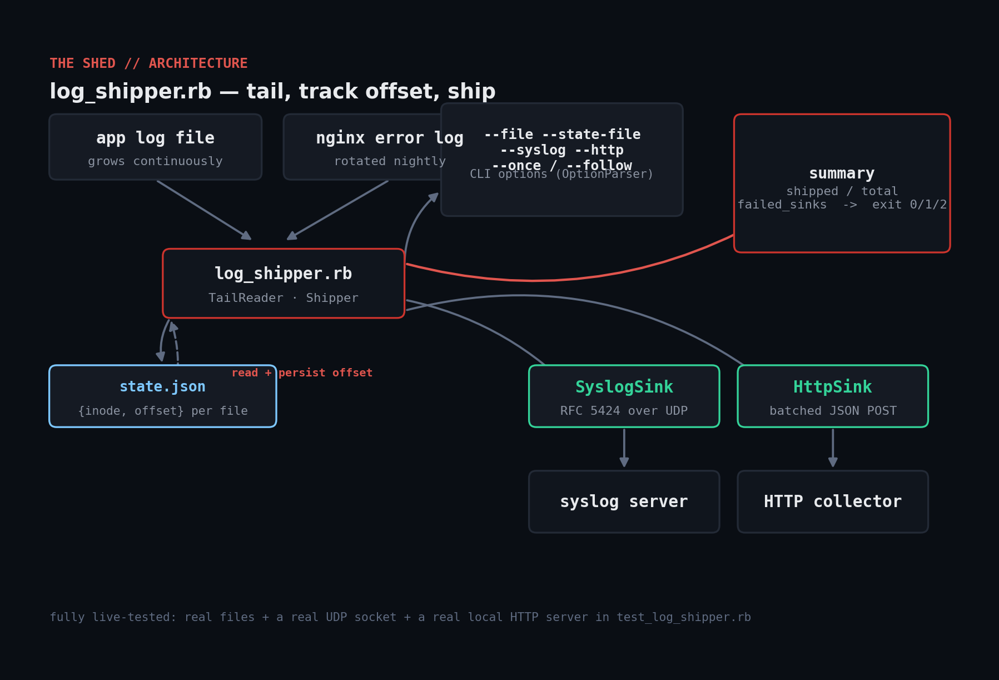

# log-shipper

Tail one or more log files and forward new lines to a syslog (RFC 5424 /
UDP) and/or HTTP sink in real time, picking up exactly where it left off
after a restart and coping with log rotation. Pure Ruby, no gems.



## Prerequisites

- Ruby >= 2.7. No gems — `socket`, `net/http`, `json` are all stdlib.
- Works on Linux, macOS, and Windows (plain file I/O + sockets, no
  OS-specific APIs).
- A syslog receiver and/or an HTTP endpoint to ship to (or run with neither
  configured to just exercise the offset-tracking bookkeeping).

## Usage

```console
$ ruby log_shipper.rb --file /var/log/app.log --http http://collector:9000/ingest --once
$ ruby log_shipper.rb --file /var/log/app.log --file /var/log/nginx/error.log \
    --syslog logs.example.com:514 --follow
```

Exit codes:

| Code | Meaning |
|------|---------|
| 0 | Every new line shipped to every configured sink |
| 1 | Some lines failed to ship to at least one sink (partial failure) |
| 2 | Fatal error (no files found, unreadable/corrupt state file) |

## How it works

- **`StateStore`** persists an `{inode, offset}` pair per watched file to a
  JSON state file between runs. A `--once` cron invocation reloads it, so
  restarts never re-ship or drop lines.
- **`TailReader`** compares the current file's inode against the recorded
  one — a changed inode means the file was rotated (renamed away and
  recreated), so it's read from byte 0 instead of silently going stale; a
  file that shrank (truncated in place) also resets to 0.
- **`SyslogSink`**/**`HttpSink`** are isolated behind a `#send`/`#send_batch`
  call each, which is what lets this be fully live-tested (see Testing)
  against a real UDP socket and a real local HTTP server rather than mocks.
- Fan-out to multiple sinks is per-line: a line only counts as "shipped" if
  *every* configured sink accepted it; a sink that's down is recorded in
  `failed_sinks` without blocking delivery to the others.

## Example output

```console
$ ruby log_shipper.rb --file /tmp/demo.log --state-file /tmp/demo_state.json --once
/tmp/demo.log: shipped 3/3 new lines [ok]

$ ruby log_shipper.rb --file /tmp/demo.log --state-file /tmp/demo_state.json --once --json
{
  "/tmp/demo.log": {
    "shipped": 2,
    "total_new_lines": 2,
    "failed_sinks": []
  }
}
```

## Testing

Unlike the Windows/systemd tools elsewhere in this repo, this one only
needs real files and real sockets — so the test suite doesn't mock
anything: it writes real files to a temp directory, opens a real
`UDPSocket` standing in for a syslog server, and runs a real local
`TCPServer` HTTP stub, then exercises offset tracking, rotation detection,
both sink types, partial-sink-failure handling, and state persistence
across simulated "runs" end to end:

```console
$ ruby test_log_shipper.rb
...
ALL CHECKS PASSED (9 assertions, against real files + a real UDP socket + a real local HTTP server)
```

## Troubleshooting

- **Lines get re-shipped after every run** — check `--state-file` is
  writable and points at a persistent path, not `/tmp` on a system that
  clears it, and that nothing else is truncating it between runs.
- **A rotated file's first few lines are missing** — if the log rotator
  truncates-in-place instead of rename+recreate, the inode doesn't change;
  `TailReader` also resets to 0 when the file has shrunk below the last
  recorded offset, which covers that case too.
- **`failed_sinks` always includes `syslog`** — UDP delivery is fire-and-forget;
  a wrong host/port won't raise on send, it'll just never arrive on the
  other end. Verify with `tcpdump`/`nc -ul` on the receiver.
- **`--follow` mode uses noticeable CPU** — raise `--poll-interval` for
  low-traffic files; this is a polling tail, not an inotify-based one.

## Extending

- Add inotify (Linux) / FSEvents (macOS) support behind `--follow` instead
  of polling, falling back to polling on platforms without one.
- Add a `--filter REGEX` to ship only matching lines (e.g. `ERROR|WARN`).
- Batch multiple lines into a single HTTP POST instead of one per line, for
  high-volume files.
- Add a TLS syslog sink (RFC 5425) alongside the existing UDP one.

## References

- [Ruby stdlib: Socket / UDPSocket](https://docs.ruby-lang.org/en/3.3/UDPSocket.html)
- [Ruby stdlib: Net::HTTP](https://docs.ruby-lang.org/en/3.3/Net/HTTP.html)
- [RFC 5424: The Syslog Protocol](https://www.rfc-editor.org/rfc/rfc5424)
