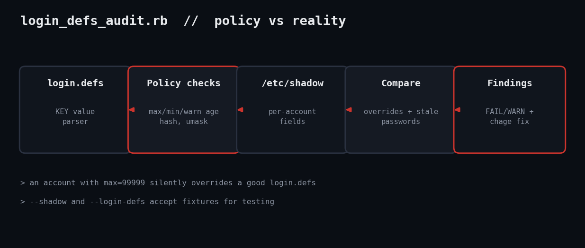

# Audit login.defs Password Aging and Shadow Compliance with Ruby

A good /etc/login.defs means nothing if accounts override it. This script checks the policy and then the real /etc/shadow entries, and hands you the chage command for each offender.



## The problem

The problem: `login.defs` only sets defaults for <em>new</em> accounts. Existing users keep whatever was written into `/etc/shadow` at creation, so an account with max-age 99999 sits happily outside a 90-day policy. Auditors check both, and so should you.

## Prerequisites

- Ruby 3.0+ (tested on 3.3.6) on Linux
- No gems: `optparse`, `json`, `date`
- Root to read `/etc/shadow`; `--shadow` accepts a copy

## Usage

```
sudo ruby login_defs_audit.rb
ruby login_defs_audit.rb --login-defs fx/login.defs --shadow fx/shadow --json
```

## How it works

Parsing. `parse_login_defs` strips `#` comments and splits on first whitespace, mirroring shadow-utils where later lines win.

Policy. `policy_findings` returns tuples of severity, key, message and fix. A max over 365 or negative is a FAIL; the UMASK check masks the octal value against 027.

Accounts. Shadow has colon-separated fields: name, hash, last-change (days since epoch), min, max, warn. An empty max field inherits the global value. Age is today minus last-change in days, which is why `--today` exists: deterministic tests.

Remediation. Every finding carries its fix: `chage -M`, `chage -d 0` to force a change, or `passwd -l`.

## Example output

```
FAIL policy   PASS_MAX_DAYS   99999 - passwords effectively never expire  -> PASS_MAX_DAYS 365 (CIS: <= 365)
WARN policy   PASS_MIN_DAYS   0 - users can change passwords repeatedly to cycle history  -> PASS_MIN_DAYS 1
FAIL policy   ENCRYPT_METHOD  MD5 - weak or default hash  -> ENCRYPT_METHOD SHA512 (or YESCRYPT)
WARN policy   UMASK           022 - new files group/world readable  -> UMASK 027
FAIL account  root            account max=99999 never expires (overrides login.defs)  -> chage -M 365 root
WARN account  alice           password 1727 days old, policy max 90  -> chage -d 0 alice
FAIL account  bob             empty password hash  -> passwd -l bob
FAIL account  bob             account max=99999 never expires (overrides login.defs)  -> chage -M 365 bob
RESULT: 5 FAIL, 3 WARN
```

## Troubleshooting

- "not readable": run with sudo or pass `--shadow`.
- YESCRYPT unknown: accepted alongside SHA512; add others to the list as your distro requires.
- PAM may override: some distros set aging via PAM modules; this tool reads login.defs only.
- Testing note: tested in the sandbox against hand-built login.defs and shadow fixtures with deliberate violations.

## Extending it

- Check `INACTIVE` and account expiry fields
- Compare UID_MIN/MAX and system accounts with shells
- Emit JSON into your alerting pipeline (already supported via `--json`)

## References

- [login.defs(5)](https://man7.org/linux/man-pages/man5/login.defs.5.html)
- [shadow(5)](https://man7.org/linux/man-pages/man5/shadow.5.html)
- [chage(1)](https://man7.org/linux/man-pages/man1/chage.1.html)
- Blog post: https://tha-shed.com/ruby-login-defs-password-aging-audit/
