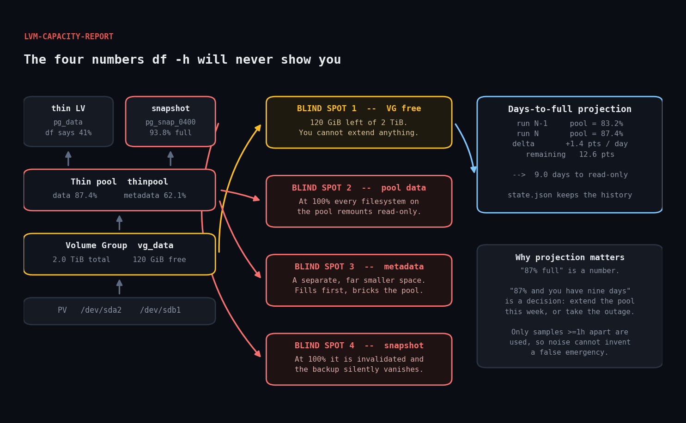

# lvm-capacity-report

Ruby tool that reports LVM volume group free space, thin-pool data and metadata
usage, and snapshot fill — then projects a days-to-full figure from observed
growth between runs.



## The problem

`df -h` tells you how full a *filesystem* is. On LVM that leaves four numbers
invisible, and those four numbers are where LVM outages actually come from:

1. **Volume group free space.** How much unallocated extent space is left —
   i.e. whether you can still grow that filesystem at all, or take a snapshot.
2. **Thin pool data usage.** A thin LV can report 41% used in `df` while its
   pool sits at 99%. When a thin pool fills, writes fail and ext4/XFS remount
   read-only — every filesystem on that pool, at once.
3. **Thin pool metadata usage.** A separate, much smaller space. It fills faster
   than you expect and bricks the pool just as hard, with plenty of data space
   still free.
4. **Snapshot fill.** A snapshot that reaches 100% is silently invalidated. The
   backup you thought you had is gone, and nothing tells you.

## Prerequisites

| | |
|---|---|
| Ruby | >= 2.7 (stdlib only — no gems) |
| lvm2 | >= 2.02.107 for `--reportformat json` |
| Privileges | root (reading LVM metadata requires it) |

No root needed for `--from-fixture`, which is how the offline demo and tests run.

## Usage

```bash
# report on this host
sudo ruby lvm_capacity_report.rb

# keep growth history somewhere persistent (enables projection)
sudo ruby lvm_capacity_report.rb --state /var/lib/lvmreport/state.json

# offline demo against the bundled fixture — no LVM required
ruby lvm_capacity_report.rb --from-fixture fixtures/sample.json --no-state

# JSON for a monitoring pipeline
sudo ruby lvm_capacity_report.rb --format json
```

### Exit codes

| Code | Meaning |
|---|---|
| `0` | Everything within thresholds |
| `1` | At least one WARN |
| `2` | At least one CRIT, or LVM could not be read |

### Thresholds

| Metric | WARN | CRIT |
|---|---|---|
| VG free (below) | 20% | 10% |
| Thin pool data | 75% | 85% |
| Thin pool metadata | 50% | 75% |
| Snapshot fill | 70% | 90% |
| Days to full (below) | 30 | 7 |

Metadata gets a tighter threshold than data on purpose: thin pool metadata is
typically a few hundred MB against hundreds of GB of data, so it has far less
headroom and far less warning time.

## How it works

### 1. Reading LVM

```ruby
cmd = [entity_command(entity), '--reportformat', 'json',
       '--units', 'b', '--nosuffix', '-o', columns.join(',')]
```

`--units b --nosuffix` makes every size a plain byte count, which removes an
entire class of parsing bug around `1.5t` vs `1.50 TiB` vs locale decimal
commas.

LVM nests output under `report[0].<entity>`. Older lvm2 emits a single report
object, newer versions can emit several, so the collector flattens across all
report entries rather than assuming `report[0]`.

### 2. An injectable command runner

The collector takes its runner as a constructor argument:

```ruby
def initialize(runner: method(:shell))
  @runner = runner
end
```

That single decision is what makes the script testable on a machine with no LVM
at all — `FixtureCollector` satisfies the same interface from a JSON file. Every
example in this README was produced that way.

It also means `Errno::ENOENT` has to be handled, not left to escape:

```ruby
rescue Errno::ENOENT
  ['', "#{cmd.first} not found in PATH -- is lvm2 installed?", false]
```

A missing tool is an expected operational state, not a crash. Without this, a
host without lvm2 gets a five-line Ruby backtrace instead of a sentence.

### 3. Identifying volume types

`lv_attr[0]` is the volume type character:

| Char | Meaning |
|---|---|
| `t` | thin pool |
| `V` | thin volume |
| `s` | snapshot |
| `-` | linear / plain LV |

So a thin pool is `attr[0] == 't'` — no name-matching heuristics needed.

### 4. Days-to-full projection

The state file records `{pct, at}` per pool per metric. On the next run:

```ruby
delta = current_pct - prev['pct'].to_f
return nil if delta <= 0.0
remaining = 100.0 - current_pct
(remaining / (delta / elapsed_days)).round(1)
```

Two deliberate guards:

- **Only positive growth projects.** A pool that shrank is not "filling".
- **Samples must be at least an hour apart.** A five-minute delta amplifies
  noise into nonsense — "full in 4 hours!" — and trains people to ignore the
  alert. This is the guard that decides whether anyone trusts the tool.

A corrupt state file is swallowed and rebuilt rather than raising. Losing one
run's projection is much better than losing the whole report.

## Example output

```
==============================================================================
LVM capacity report
==============================================================================

VOLUME GROUPS
------------------------------------------------------------------------------
  VG                     SIZE         FREE    FREE%  ALLOCATED
  vg_data             2.0 TiB    120.0 GiB     6.0%  #######################.
  vg_system         240.0 GiB     96.0 GiB    40.0%  ##############..........

THIN POOLS
------------------------------------------------------------------------------
  POOL                      DATA%    META%  DAYS(DAT)  DAYS(MET)
  vg_data/thinpool          87.4%    62.1%        9.0      162.4
                         data #####################...
                         meta ###############.........

SNAPSHOTS
------------------------------------------------------------------------------
  vg_data/pg_snap_0400   origin=pg_data          93.8% #################.

FINDINGS
------------------------------------------------------------------------------
  [CRIT] volume group vg_data has only 120.0 GiB free (6.0%) -- no room to extend LVs or take snapshots
  [CRIT] thin pool vg_data/thinpool data is 87.4% full -- at 100% every filesystem on this pool goes read-only
  [CRIT] snapshot vg_data/pg_snap_0400 is 93.8% full -- at 100% it is dropped and any backup depending on it is invalid
  [WARN] thin pool vg_data/thinpool METADATA is 62.1% full -- metadata exhaustion breaks the pool even with free data space
  [WARN] vg_data/thinpool data is projected to reach 100% in 9.0 days at the current growth rate

RESULT: CRIT
```

The projection reads 9.0 days because the pool moved 83.2% → 87.4% over three
days: 1.4 points/day against 12.6 points remaining.

## Troubleshooting

**`vgs not found in PATH -- is lvm2 installed?`**
Exactly what it says. On a container or minimal image, lvm2 is usually absent.
Use `--from-fixture` to exercise the reporting path.

**`vgs failed: ... Permission denied`**
LVM metadata is root-only. Use `sudo`. The script hints at this on failure when
it detects a non-root UID.

**`DAYS(DAT)` always shows `-`**
Projection needs two samples at least an hour apart. Check that `--state` points
somewhere persistent — the default lives under `/var/lib`, and if you have been
running with `--no-state` there is no history to compare against.

**Thin pool shows `0.0%` for metadata**
Some lvm2 versions leave `metadata_percent` empty for non-thin LVs and for
pools queried without the right columns. Empty is treated as "not reported"
rather than zero, so it will not trigger a false CRIT, but verify with
`lvs -o +metadata_percent`.

**Numbers disagree with `df`**
They should. `df` measures filesystem usage inside a thin LV; this measures the
pool underneath it. A 41%-full filesystem on a 99%-full pool is the exact
scenario this tool exists to surface.

## Extending

- **Alerting.** Exit codes map to Nagios/Icinga directly (0/1/2).
- **Prometheus.** The `--format json` output is a short hop from a textfile
  collector for `node_exporter`.
- **Auto-extend.** With free VG space, `lvextend --poolmetadatasize` /
  `lvextend -L` could run automatically at WARN — guard it carefully and
  always leave VG headroom.
- **Better projection.** Linear is deliberate and conservative. With a longer
  history, a rolling median of daily deltas resists a single bulk import
  skewing the forecast.
- **Snapshot age.** Combining fill percentage with snapshot age finds forgotten
  snapshots that are quietly consuming the pool.
- **`thin_pool_autoextend_threshold`.** Reading `/etc/lvm/lvm.conf` and warning
  when autoextend is disabled on a pool nearing capacity is a natural addition.

## References

- [lvs(8)](https://man7.org/linux/man-pages/man8/lvs.8.html) — `lv_attr` field meanings
- [vgs(8)](https://man7.org/linux/man-pages/man8/vgs.8.html)
- [lvmthin(7)](https://man7.org/linux/man-pages/man7/lvmthin.7.html) — thin pools, metadata and autoextend
- [lvm.conf(5)](https://man7.org/linux/man-pages/man5/lvm.conf.5.html)
- [Ruby Open3](https://docs.ruby-lang.org/en/3.3/Open3.html)
- [Ruby JSON](https://docs.ruby-lang.org/en/3.3/JSON.html)

## License

MIT — see [LICENSE](../LICENSE).
