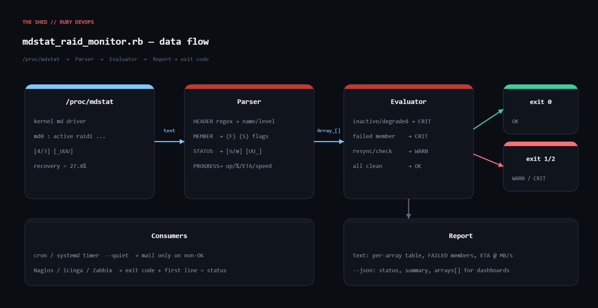

# mdstat-raid-monitor

Linux software RAID (md) health monitor written in Ruby. Parses `/proc/mdstat` — no root, no `mdadm` binary — and reports every array's level, members, failed/spare disks, and any running resync/recovery/check/reshape with progress and ETA. Exits with a Nagios-compatible code so it drops straight into cron, a systemd timer, or Icinga/Zabbix.



| Exit | Meaning |
|------|---------|
| 0 | OK — all arrays clean |
| 1 | WARNING — a resync/recovery/check/reshape is running on an otherwise healthy array |
| 2 | CRITICAL — an array is degraded, inactive, or has a failed member |
| 3 | UNKNOWN — `/proc/mdstat` unreadable or no md arrays found |

## Prerequisites

- Linux with the md driver (anything that shows arrays in `cat /proc/mdstat`)
- Ruby 2.7+ (tested on 3.0.2), stdlib only (`json`, `optparse`, `time`)
- No root needed — `/proc/mdstat` is world-readable

## Usage

```bash
ruby mdstat_raid_monitor.rb                    # human-readable report, exit 0-3
ruby mdstat_raid_monitor.rb --quiet            # print nothing when OK (cron + MAILTO friendly)
ruby mdstat_raid_monitor.rb --json             # machine-readable
ruby mdstat_raid_monitor.rb --file saved.txt   # parse a saved mdstat (testing)
```

Cron example that only emails when something is wrong:

```
MAILTO=ops@example.com
*/10 * * * * /usr/bin/ruby /opt/toolkit/mdstat_raid_monitor.rb --quiet
```

## How it works

1. **Read** `/proc/mdstat` (or `--file`). Unreadable → `UNKNOWN`, exit 3, no stack trace.
2. **Parse** with four regexes:
   - `HEADER` — `md1 : active raid5 sdd2[3] sdc2[2] sdb2[1] sda2[0](F)` → name, active flag, level, member list (tolerates `(read-only)`/`(auto-read-only)`).
   - `MEMBER` — `dev[slot](FLAGS)` triples; `(F)` → failed, `(S)` → spare.
   - `STATUS` — `[4/3] [_UUU]` → total/working slots; degraded if counts differ or an `_` is present.
   - `PROGRESS` — `recovery = 27.4% ... finish=118.2min speed=199568K/sec` → operation, %, ETA, speed. `resync=PENDING|DELAYED` is recorded too.
3. **Evaluate**: inactive / degraded / failed member → CRITICAL; running operation → WARNING; else OK. Empty input → UNKNOWN. A degraded array that is rebuilding stays CRITICAL until the rebuild finishes.
4. **Report** as a text table or `--json`; exit with the verdict.

## Example output

Fixture `mdstat_degraded.txt` (RAID5 with a failed member mid-recovery, RAID10 mid-scrub):

```
Personalities : [raid1] [raid6] [raid5] [raid4] [raid10]
md0 : active raid1 sdb1[1] sda1[0]
      1046528 blocks super 1.2 [2/2] [UU]

md1 : active raid5 sdd2[3] sdc2[2] sdb2[1] sda2[0](F)
      5860270080 blocks super 1.2 level 5, 512k chunk, algorithm 2 [4/3] [_UUU]
      [=====>...............]  recovery = 27.4% (535938432/1953423360) finish=118.2min speed=199568K/sec
      bitmap: 3/15 pages [12KB], 65536KB chunk

md2 : active raid10 sdh1[3] sdg1[2] sdf1[1] sde1[0]
      3906764800 blocks super 1.2 512K chunks 2 near-copies [4/4] [UUUU]
      [==>..................]  check = 12.0% (468811776/3906764800) finish=290.1min speed=197482K/sec

unused devices: <none>
```

```
$ ruby mdstat_raid_monitor.rb --file mdstat_degraded.txt
CRITICAL - md1 DEGRADED

md0    raid1    CLEAN     slots 2/2 UU
       members : sdb1 sda1
md1    raid5    DEGRADED  slots 3/4 _UUU
       members : sdd2 sdc2 sdb2 sda2
       FAILED  : sda2
       recovery: 27.4%  ETA 2.0h  @ 194 MB/s
md2    raid10   CHECK     slots 4/4 UUUU
       members : sdh1 sdg1 sdf1 sde1
       check   : 12.0%  ETA 4.8h  @ 192 MB/s
exit=2
```

`--json` emits `{status, summary, checked_at, arrays: [...]}` with every field of the struct plus `state`.

## Troubleshooting

- **`UNKNOWN - no md arrays found`** on a host with RAID: you are in a container/VM whose `/proc/mdstat` is empty. Run on the host or pass `--file`.
- **CLEAN but `mdadm --detail` says degraded**: save your raw `/proc/mdstat` and run it through `--file`; adjust `STATUS` if your kernel's layout differs.
- **No progress line for a scrub**: `check` only shows a bar while running. `echo check > /sys/block/md0/md/sync_action` to test.
- **Exit code always 0 in cron**: you are piping into `tee`/`mail`. Use `set -o pipefail` or write to a file first.
- Tested in a Linux sandbox with saved fixtures via `--file`; the sandbox has no md devices, so a bare run correctly returned UNKNOWN (exit 3).

## Extending

- `--warn-eta HOURS` to escalate rebuilds that exceed your recovery window.
- Prometheus text output (`md_array_degraded{name="md1"} 1`) for the toolkit's `prometheus-exporter`.
- Join failed members to `smartctl -H` for drive serials in the alert.
- Webhook/Slack push on state transitions; track `speed_kbs` to detect stalled rebuilds.

## References

- Linux kernel md admin guide: https://docs.kernel.org/admin-guide/md.html
- mdadm(8): https://man7.org/linux/man-pages/man8/mdadm.8.html
- Ruby `Struct`: https://docs.ruby-lang.org/en/3.3/Struct.html
- Nagios plugin return codes: https://nagios-plugins.org/doc/guidelines.html#AEN78
