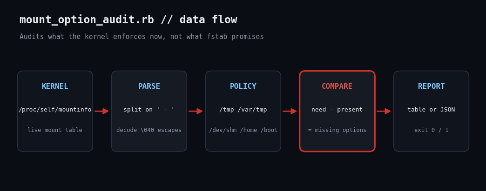

# Audit Live Mount Options on Linux with Ruby: Is /tmp Really noexec?

Your fstab says /tmp is `noexec`. The kernel may disagree. This script reads `/proc/self/mountinfo` and reports what is actually enforced right now.



## The problem

Hardening guides (CIS, STIG) demand that world-writable locations like /tmp, /var/tmp and /dev/shm be mounted nosuid,nodev,noexec, so an attacker who drops a payload there cannot run it or abuse a SUID binary. Teams usually verify this by grepping /etc/fstab, but fstab is only intent: a remount, a systemd tmp.mount unit, or a container runtime can leave the live table different. /proc/self/mountinfo is the kernel's own answer.

## Prerequisites

- Ruby 2.7+ (tested on 3.3.6), standard library only - no gems
- Linux with /proc mounted (any modern distro)
- No root needed: mountinfo is world-readable

## Usage

```
ruby mount_option_audit.rb
```

## How it works

1. **Parse mountinfo safely.** Each line has a variable number of optional fields before a literal  -  separator, so the parser splits on that first. Field 5 is the mount point and field 6 the per-mount options. Paths encode spaces as octal escapes like \040, which we decode with gsub.
2. **Encode policy as data.** A POLICY hash maps each mount point to the options it must carry and a severity. Adding /var/log is one new line, not new logic.
3. **Compare with set difference.** need - present yields exactly the missing options. Mounts that are not separate filesystems are reported as NOT_SEPARATE (informational) because they inherit the parent's options — itself a finding worth knowing about.
4. **Report and exit code.** Text table or --json; exit 1 if anything failed, so cron, CI or a monitoring agent can alert on it.

## Example output

```
MOUNT      STATUS        SEVERITY DETAIL
/tmp       OK            OK       rw,nosuid,nodev,noexec,relatime
/var/tmp   NOT_SEPARATE  INFO     not a separate mount; inherits options of parent filesystem
/dev/shm   FAIL          HIGH     missing: noexec
/home      OK            OK       rw,nosuid,nodev,relatime
/boot      FAIL          MEDIUM   missing: nosuid, nodev
```

## Troubleshooting

- Every line reports NOT_SEPARATE: you are probably in a container where /tmp is part of the overlay root. Audit the host or the container's mounts instead.
- Later mounts shadow earlier ones; the script keeps the last entry per mount point, matching kernel behaviour.
- Use --mountinfo FILE to test against a saved file, as shown in the output tab.

## Extending

- Add bind-mount checks for /var/tmp -> /tmp (a common way to satisfy the rule).
- Cross-check against /etc/fstab and flag drift between intent and reality.
- Push exit codes into Prometheus via a textfile collector.

## References

- [proc(5) mountinfo](https://man7.org/linux/man-pages/man5/proc_pid_mountinfo.5.html)
- [mount(8) options](https://man7.org/linux/man-pages/man8/mount.8.html)
- [Ruby OptionParser](https://docs.ruby-lang.org/en/3.3/OptionParser.html)
