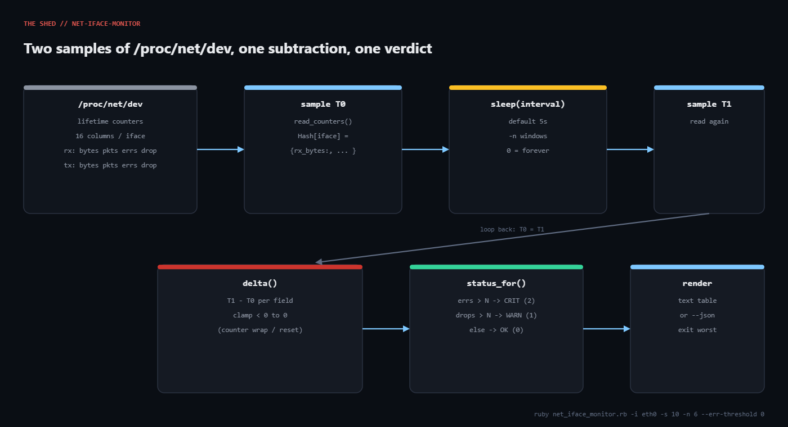

# net-iface-monitor

**Platform:** Linux  
**Script:** [`net_iface_monitor.rb`](net_iface_monitor.rb)

ip -s link shows lifetime counters, which is useless at 3 AM. What you need is "how many packets did eth0 drop in the last ten seconds". Two reads of /proc/net/dev, one subtraction, and a threshold turn Ruby into a NIC health check that fits any monitoring system.



## Prerequisites

- Ruby 3.0+, stdlib only (optparse, json, time).
- Linux with procfs mounted (every mainstream distro). --link-state additionally reads /sys/class/net/<iface>/{operstate,carrier,speed,mtu}.
- No root needed; /proc/net/dev is world-readable. Inside a container you only see the container's network namespace.

## Usage

```bash
ruby net_iface_monitor.rb                       # one 5s window, all physical NICs
ruby net_iface_monitor.rb -i eth0 -n 3 -s 10    # eth0 only, three 10s windows
ruby net_iface_monitor.rb --drop-threshold 0 --err-threshold 0   # alert on ANY drop/err
ruby net_iface_monitor.rb --json -n 0 -s 10     # stream JSON forever
ruby net_iface_monitor.rb --link-state          # add carrier/speed/mtu from sysfs
```

## How it works

### 1. Map the columns once

RX_FIELDS and TX_FIELDS list the sixteen counters in the exact order the kernel prints them (documented in proc(5) and net/core/net-procfs.c). read_counters splits each data line on the first :, converts the rest to integers, and builds { 'eth0' => { rx_bytes: ..., tx_drop: ... } }.

### 2. Select interfaces

select_ifaces drops anything matching the VIRTUAL regex (lo, docker*, veth*, br-*, virbr*, tun/tap, WireGuard, CNI) unless --include-virtual, then intersects with -i eth0,eth1 if given.

### 3. Sample, sleep, sample

The main loop keeps before, sleeps --interval seconds, reads after, and computes delta for each selected interface. After rendering, before = after and it repeats for --count windows (0 = run forever, ideal under a systemd service).

### 4. Classify

status_for returns [2, 'CRIT'] if rx_errs + tx_errs exceeds --err-threshold (default 0: any error is bad), [1, 'WARN'] if drops exceed --drop-threshold (default 10 per window), else OK. The worst code seen across all windows becomes the exit status.

### 5. Render

human_rate converts bytes-per-window to bps/Kbps/Mbps/Gbps. Text mode prints one row per interface (plus a link-state line with --link-state); --json prints one JSON document per window with the full 16-field delta, which is what you want to feed a time-series store.

## Example output

```text
$ ruby net_iface_monitor.rb -s 2 -n 1 --drop-threshold 10
window 1  (2.0s)  15:44:34
  IFACE      STATE            RX           TX RX pkt/s TX pkt/s  RXerr  TXerr  RXdrp  TXdrp
  eth0       CRIT     250.0 Mbps   120.0 Mbps    25500    10500      3      0     62      0
  eth1       OK         1.0 Mbps     1.6 Mbps     1000     1250      0      0      0      0

exit=2  (2 = CRITICAL: eth0 logged RX errors)

$ ruby net_iface_monitor.rb -s 1 -n 1 --json
{
    "window": 1,
    "seconds": 1.0,
    "at": "2026-09-06T15:44:35-05:00",
    "interfaces": [
        {
            "iface": "eth0",
            "status": "OK",
            "delta": {
                "rx_bytes": 0,
                "rx_packets": 0,
                "rx_errs": 0,
                "rx_drop": 0,
                "rx_fifo": 0,
                "rx_frame": 0,
                "rx_compressed": 0,
                "rx_multicast": 0,
                "tx_bytes": 0,
                "tx_packets": 0,
                "tx_errs": 0,
                "tx_drop": 0,
                "tx_fifo": 0,
                "tx_colls": 0,
                "tx_carrier": 0,
                "tx_compressed": 0
            },
            "link": null
        },
        {
            "iface": "eth1",
```

## Troubleshooting

- Only lo shows up. You are inside a container or the sandbox; run on the host, or use --include-virtual to see what the namespace has. This is exactly what happened in the Linux test sandbox, hence the simulated /proc/net/dev used for the captured output.
- Rates look doubled on bonded interfaces. bond0 plus its slaves all appear; use -i bond0 to count traffic once.
- CRIT on a healthy box. Some virtio and cloud NICs report a handful of rx_errs during DHCP renewals. Set --err-threshold 2 and watch for sustained counts instead of single blips.
- Huge negative-looking numbers before the fix? They are impossible now; delta clamps to zero. If a window shows all zeros for an interface, the counters were probably reset mid-window.
- speed reads n/a. Virtual and some wireless drivers don't expose /sys/class/net/X/speed; the value is informational only.

## Extending

- Run it as a service: -n 0 --json -s 10 under a systemd unit with StandardOutput=append:/var/log/nic-rates.jsonl.
- Nagios/Icinga plugin: the exit codes already match; add a one-line NIC OK - eth0 12.4 Mbps rx, 0 drops summary as the first output line.
- Prometheus textfile collector: write nic_rx_drop_delta{iface="eth0"} 62 style lines to /var/lib/node_exporter/textfile/.
- Correlate with ring buffer size: shell out to ethtool -g eth0 when a WARN fires and print the current vs max RX ring so the fix (ethtool -G eth0 rx 4096) is one copy-paste away.
- Add --busy-threshold-mbps to flag interfaces running near line rate, which is usually the real cause of drops.

## References

- [proc(5): /proc/net/dev](https://man7.org/linux/man-pages/man5/proc.5.html)
- [Linux kernel: net/core/net-procfs.c](https://github.com/torvalds/linux/blob/master/net/core/net-procfs.c)
- [Ruby OptionParser docs](https://docs.ruby-lang.org/en/3.3/OptionParser.html)
- [Nagios plugin return codes](https://nagios-plugins.org/doc/guidelines.html#AEN78)

- Tutorial post: https://tha-shed.com/ ("Ruby for DevOps: Catching NIC Errors and Drops Before Users Notice, Straight From /proc/net/dev")

---

Part of [ruby-devops-toolkit](https://github.com/jjam3774/ruby-devops-toolkit). MIT licensed.
