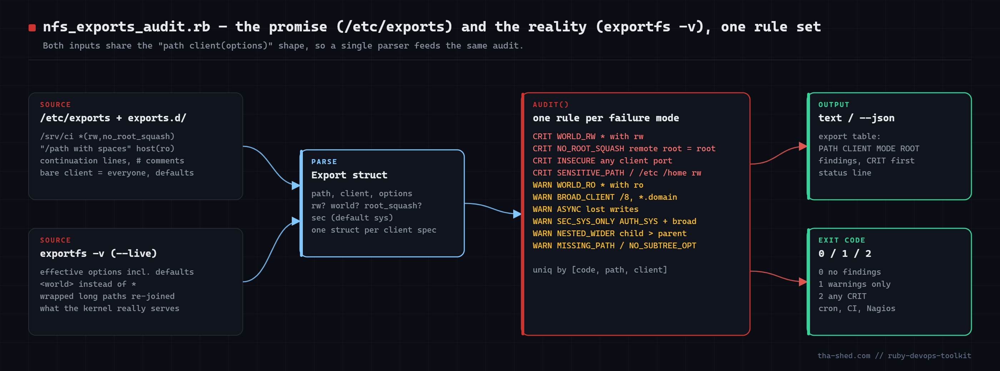

# nfs-exports-audit

Audit `/etc/exports` (plus `/etc/exports.d/*.exports`) and the live `exportfs -v` table for the
NFS options that hand out root: `no_root_squash`, `insecure`, world (`*`) exports, sensitive paths
exported read-write, over-broad client specs, `async`, AUTH_SYS on big networks, and sub-directories
exported more openly than their parents. Pure Ruby, no gems, cron-friendly exit codes.



Companion article: https://tha-shed.com/ — *Ruby for DevOps: Auditing /etc/exports and exportfs for the NFS Options That Hand Out Root*

## Prerequisites

- Ruby 3.0+ (uses endless method definitions; tested on 3.4). Stdlib only: `optparse`, `json`, `open3`.
- A Linux NFS server for `--live` (runs `exportfs -v`, normally root-only). Reading `/etc/exports` needs no privileges.
- Or no server at all: `--exports FILE` / `--exportfs FILE` audit captured files (CI, fleet snapshots).

## Usage

```
ruby nfs_exports_audit.rb                          # /etc/exports + exports.d, exit 0/1/2
ruby nfs_exports_audit.rb --live                   # what rpc.mountd actually loaded (defaults filled in)
ruby nfs_exports_audit.rb --exports ./exports --no-path-check   # a file from your config repo
ruby nfs_exports_audit.rb --exportfs nas01-exportfs.txt         # ssh nas01 exportfs -v > nas01-exportfs.txt
ruby nfs_exports_audit.rb --json
```

| Finding | Severity | Trigger |
|---------|----------|---------|
| WORLD_RW | CRIT | client `*`/`<world>` (or none) with `rw` |
| NO_ROOT_SQUASH | CRIT (rw) / WARN (ro) | `no_root_squash` present |
| INSECURE | CRIT | `insecure` present |
| SENSITIVE_PATH | CRIT | `/`, `/etc`, `/home`, `/usr`, `/var`, ... exported `rw` |
| WORLD_RO | WARN | `*` with `ro` |
| BROAD_CLIENT | WARN | wildcard hostname, IPv4 prefix < /16, IPv6 < /48, netmask < 16 bits |
| ASYNC | WARN | `async` present |
| SEC_SYS_ONLY | WARN | `sec=sys` (default) on a broad, non-world client |
| NESTED_WIDER | WARN | child export has wider clients or rw where parent is ro |
| NO_SUBTREE_OPT | WARN | neither `subtree_check` nor `no_subtree_check` given |
| MISSING_PATH | WARN | exported directory does not exist locally |

Exit codes: `0` clean, `1` warnings only, `2` any CRIT.

## How it works

1. **`parse_exports`** collapses backslash continuations, strips comments, handles `"quoted paths"`, and
   scans the remainder with `(\S+?)\(([^)]*)\)|(\S+)` — one `Export` struct per client spec. A path with no
   clients means `*` with defaults.
2. **`parse_exportfs`** re-joins the wrapped lines `exportfs -v` prints for long paths and feeds the same parser;
   `<world>` is recognised as `*`.
3. **`Export`** predicates (`rw?`, `world?`, `root_squash?`, `sec`) keep the rules one line each.
4. **`broad_client?`** classifies wildcards, short CIDRs and dotted netmasks (popcount of the mask — no `ipaddr`).
5. **`audit`** applies the per-export rules, then a second pass compares each export to every ancestor export
   for NESTED_WIDER. Findings are de-duplicated on `[code, path, client]`.

## Example output

```
nfs_exports_audit  9 export entries from fixtures/exports
--------------------------------------------------------------------------------------------
PATH                         CLIENT                   MODE ROOT       OPTIONS
/srv/projects                10.20.0.0/24             rw   squashed   rw,sync,no_subtree_check
/srv/projects                10.20.1.0/24             rw   squashed   rw,sync,no_subtree_check
/srv/projects/ci             *                        rw   NOT SQUASH rw,sync,no_root_squash,no_subtree_check
/srv/public                  *                        ro   squashed   ro,sync,no_subtree_check
/srv/backups                 backup01.corp.example.co rw   squashed   rw,sync,no_subtree_check,sec=krb5p
/home                        *.corp.example.com       rw   squashed   rw,async,no_subtree_check
/srv/legacy                  10.0.0.0/8               rw   NOT SQUASH rw,insecure,no_root_squash,sec=sys
/srv/media files             192.168.1.0/255.255.255. ro   squashed   ro,no_subtree_check
/srv/scratch                 10.20.0.0/24             rw   squashed   rw

[CRIT] SENSITIVE_PATH  /home                    *.corp.example.com /home exported read-write
[CRIT] NO_ROOT_SQUASH  /srv/legacy              10.0.0.0/8         remote root is local root with write access — add root_squash
[CRIT] INSECURE        /srv/legacy              10.0.0.0/8         'insecure' accepts mounts from unprivileged source ports (any user on the client)
[CRIT] WORLD_RW        /srv/projects/ci         *                  writable by every host that can reach the server
[CRIT] NO_ROOT_SQUASH  /srv/projects/ci         *                  remote root is local root with write access — add root_squash
[WARN] ASYNC           /home                    *.corp.example.com 'async' acknowledges writes before they hit disk
[WARN] BROAD_CLIENT    /home                    *.corp.example.com client spec matches a very large set of hosts
...
[WARN] NESTED_WIDER    /srv/projects/ci         *                  exported more openly than parent /srv/projects (10.20.0.0/24,rw)
[WARN] WORLD_RO        /srv/public              *                  readable by every host that can reach the server

CRIT: 5 critical, 8 warning(s)
```

## Troubleshooting

- **NIS netgroups (`@builders`)** are treated as hostnames; the script cannot expand them.
- **MISSING_PATH on every line** when auditing a captured file — use `--no-path-check`.
- **SEC_SYS_ONLY too noisy** — it only fires for broad, non-world clients; lower the threshold in `broad_client?` if your estate is one /8.
- **Ruby 2.7 syntax error** — expand the endless `def rw? = ...` methods to normal `def ... end`.
- **Testing note** — parsers and all eleven rules were verified against the fixtures in the article (exports file: 5 CRIT;
  captured `exportfs -v`: 2 CRIT) plus `--json`. The `--live` branch pipes `exportfs -v` through the same parser and was
  not run against a live NFS server while writing this.

## Extending

- Cross-check `/proc/fs/nfsd/exports` or `showmount -e` for exports no file mentions.
- Add NFSv4 pseudo-root rules (`fsid=0`, `crossmnt` on broad exports).
- Fleet mode: loop `ssh host exportfs -v` and run `parse_exportfs` + `audit` per host.
- Pre-commit hook on the exports file in your config repo.
- Print corrected lines for NO_ROOT_SQUASH / INSECURE.

## References

- exports(5): https://man7.org/linux/man-pages/man5/exports.5.html
- exportfs(8): https://man7.org/linux/man-pages/man8/exportfs.8.html
- Ruby `Struct`: https://docs.ruby-lang.org/en/3.4/Struct.html
- Ruby `OptionParser`: https://docs.ruby-lang.org/en/3.4/OptionParser.html
