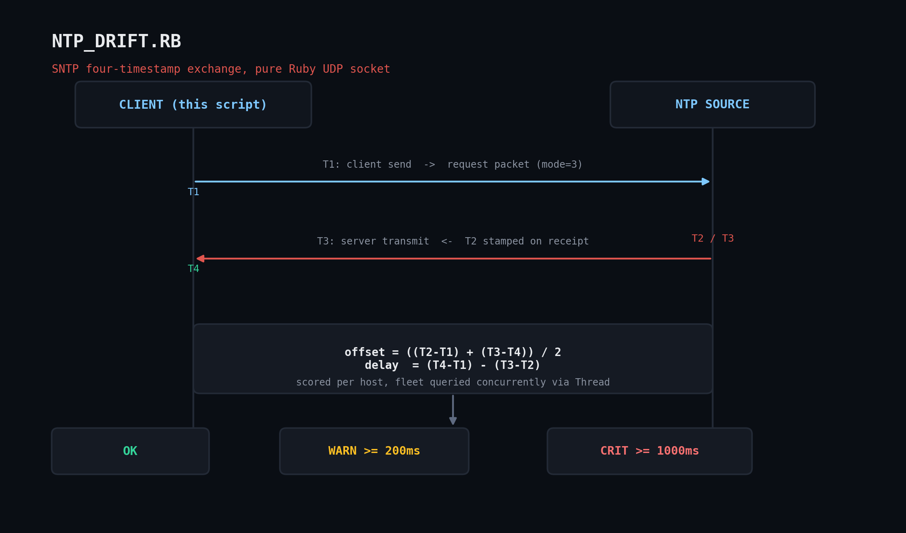

# ntp_drift.rb — NTP Time Drift Monitoring & Alerting Across a Server Fleet

A pure-Ruby SNTP client (RFC 4330 / RFC 5905 client mode) that speaks the NTP wire protocol
directly over a raw UDP socket — no gems, no shelling out to `ntpdate`/`chronyc` (which
aren't always installed, and whose text output changes between distros).



## Why this matters

Clock drift silently breaks Kerberos auth, TLS certificate validation, distributed log
correlation, and cron-based SLAs. A drift monitor that runs from a central box against every
NTP source (or every host's local NTP relay) in the fleet is one of the cheapest early-warning
systems you can build.

## Prerequisites

- Ruby 2.7+ — uses only `socket`, `optparse`, `json`, and `timeout` from the standard library
- Outbound UDP/123 reachability to whatever NTP source(s) you query (public pool servers or
  internal relays) — corporate firewalls sometimes block this by default
- Runs identically on Linux, macOS, and Windows

## Usage

```bash
ruby ntp_drift.rb pool.ntp.org time.google.com time.cloudflare.com
ruby ntp_drift.rb --warn-ms 200 --crit-ms 1000 10.0.0.5 10.0.0.6
ruby ntp_drift.rb --json ntp1.internal ntp2.internal
ruby ntp_drift.rb ntp1.internal:12301 ntp2.internal        # host:port supported
```

Exits `2` if any host is unreachable or over the CRIT threshold.

## How it works

Implements the classic four-timestamp NTP offset algorithm:

```
T1 = client send time         T2 = server receive time
T3 = server transmit time     T4 = client receive time

offset = ((T2 - T1) + (T3 - T4)) / 2
delay  = (T4 - T1) - (T3 - T2)
```

Every host is queried on its own `Thread`, so one slow or firewalled source can't stall the
whole fleet check — `Timeout.timeout` per-socket keeps a dead host from hanging forever.

NTP timestamps are seconds since **1900-01-01**, not the Unix epoch — the code subtracts the
well-known 2,208,988,800-second offset when converting.

## Example output

```
========================================================================
NTP DRIFT CHECK  (warn >= 200.0ms, crit >= 1000.0ms)
========================================================================
[WARN] 127.0.0.1                offset=   750.42ms  delay=   0.99ms  stratum=2
[OK  ] 127.0.0.1                offset=     0.85ms  delay=   1.82ms  stratum=2
[CRIT] 127.0.0.1                offset=  3499.30ms  delay=   2.37ms  stratum=2
[CRIT] 10.255.255.1             UNREACHABLE  (Errno::ENETUNREACH: Network is unreachable ...)
------------------------------------------------------------------------
Summary: 2 CRIT, 1 WARN, 1 OK
========================================================================
```

This was captured against a small loopback mock SNTP server simulating known clock offsets
(750ms / 0ms / 3500ms) — the recovered offsets matched the simulated drift to within ~1ms,
which is the round-trip noise you'd expect on localhost. Point it at real NTP sources in
production and the numbers behave the same way.

## Troubleshooting

- An `UNREACHABLE` result almost always means outbound UDP/123 is blocked by a firewall or
  security group — test with `nc -u -z -w2 <host> 123` first.
- If every host reports an oddly large, identical offset, check the system clock on the box
  *running* the script — offsets are always relative to your local clock.
- A `stratum` of `0` in the response usually means you hit a KoD (Kiss-of-Death) rate limit;
  back off your polling interval.

## Extending it

- Wire the CRIT exit code into a cron job that pages via a webhook.
- Add a `--history` mode that appends each run's offsets to a CSV for trend visibility.
- Resolve the Reference ID field to a human-readable upstream source name for richer
  fleet-topology reporting.

## References

- [RFC 5905 — NTPv4](https://datatracker.ietf.org/doc/html/rfc5905)
- [RFC 4330 — SNTPv4](https://datatracker.ietf.org/doc/html/rfc4330)
- [Ruby `Socket` stdlib docs](https://docs.ruby-lang.org/en/3.3/Socket.html)
