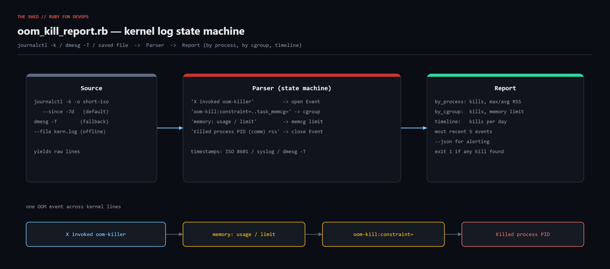

# oom-kill-report

Find out what the Linux OOM killer has been killing. Reads `journalctl -k`, `dmesg -T`,
or a saved kernel log; stitches each multi-line OOM event back together; and reports
kills per process (with max/avg RSS), kills per cgroup (with the memory limit that
was hit), a per-day timeline, and the most recent events. `--json` for alerting.



Blog post: https://tha-shed.com/ (search "oom_kill_report")

## Prerequisites

- Ruby 3.0+ (stdlib only: `json`, `open3`, `optparse`, `time`)
- Linux with systemd-journald (`journalctl -k`) or `dmesg`; kernel 4.x+ message formats
- root or `systemd-journal` group to read kernel messages (`--file` mode needs nothing)

## Usage

```bash
sudo ruby oom_kill_report.rb                      # journalctl -k --since -7d
sudo ruby oom_kill_report.rb --since "-24h"
ruby oom_kill_report.rb --file /var/log/kern.log   # offline / pasted log
ruby oom_kill_report.rb --file sample_kern.log --json
ruby oom_kill_report.rb --file sample_kern.log --top 5
```

Exit codes: `0` no kills found, `1` at least one kill, `3` error.

## How it works

1. **Source** yields raw lines from `--file`, else `journalctl -k -o short-iso --since`,
   else `dmesg -T`.
2. **Parser** is a two-state machine over four regexes:
   - `X invoked oom-killer: gfp_mask=..., order=N` opens a pending Event
   - `oom-kill:constraint=...,task_memcg=/docker/...` records the cgroup
   - `memory: usage NkB, limit NkB` records the cgroup limit (first/leaf wins)
   - `Out of memory: Killed process PID (comm) total-vm:... anon-rss:... file-rss:...`
     (or the `Memory cgroup out of memory:` variant) closes the Event
   Timestamps are parsed from journalctl ISO, syslog, and `dmesg -T` prefixes.
3. **Report** aggregates by process, by cgroup, by day; prints text or JSON.

## Example output

```
OOM KILL REPORT  7 kill(s)  2026-09-01 02:14 -> 2026-09-04 22:41
==============================================================================

PROCESS                KILLS    MAX RSS    AVG RSS   CGRP
node                       3    500.0MB    499.0MB      3
java                       2   4053.6MB   4040.6MB      2
postgres                   1   2306.6MB   2306.6MB      0
chrome                     1   2050.8MB   2050.8MB      0

CGROUP (memory limit)                              KILLS     LIMIT
/docker/71aa00bbccdd                                   3     512MB
/docker/9f1e2d3c4b5a                                   2    4096MB
/system.slice/postgresql.service                       1  no limit

TIMELINE
  2026-09-01 ####################           2
  2026-09-02 ##########                     1
  2026-09-03 ############################## 3
  2026-09-04 ##########                     1

MOST RECENT EVENTS
  09-04 22:41:03  pid 22110  chrome           rss   2051MB  system-wide  (invoked by chrome)
  09-03 09:13:19  pid 8859   node             rss    499MB  cgroup /docker/71aa00bbccdd  (invoked by node)
  09-03 09:13:01  pid 8830   node             rss    500MB  cgroup /docker/71aa00bbccdd  (invoked by node)
  09-03 09:12:44  pid 8801   node             rss    498MB  cgroup /docker/71aa00bbccdd  (invoked by node)
  09-02 03:30:12  pid 1877   postgres         rss   2307MB  system-wide  (invoked by kswapd0)
```

## Testing

`sample_kern.log` is a captured kernel log mixing kernel 6.8 (`UID:` / `pgtables:`)
and older (`Sep  4 ...`, no UID) formats, two Docker cgroups, a systemd service, and a
system-wide kill invoked by `kswapd0`. The script was developed in a sandbox without
journald or real OOM history, so the `journalctl` / `dmesg` paths were not exercised
live; they are plain `Open3.capture3` calls.

## Troubleshooting

- **`journalctl failed: permission`** - use sudo or join `systemd-journal`.
- **Zero events** - widen `--since`; enable `Storage=persistent` in journald.conf.
- **No timeline** - `dmesg` without `-T` has no wall-clock timestamps; use `-T`.
- **No cgroup section** - kernels < ~4.19 don't print `oom-kill:constraint=`.
- **Truncated comm names** - the kernel caps them at 15 chars (`TASK_COMM_LEN`).

## Extending

- Resolve `/docker/<id>` and `/kubepods/...` to container/pod names.
- Route JSON to `alert-notifier`; page only on an allow-list of critical processes.
- Correlate with `mem-pressure-monitor` PSI data before each kill.
- Emit `oom_kills_total{comm,memcg}` for Prometheus.

## References

- Kernel vm sysctl docs (overcommit / OOM): https://www.kernel.org/doc/html/latest/admin-guide/sysctl/vm.html
- cgroup v2 memory controller: https://www.kernel.org/doc/html/latest/admin-guide/cgroup-v2.html#memory
- journalctl(1): https://www.freedesktop.org/software/systemd/man/latest/journalctl.html
- Ruby Regexp: https://docs.ruby-lang.org/en/3.3/Regexp.html
