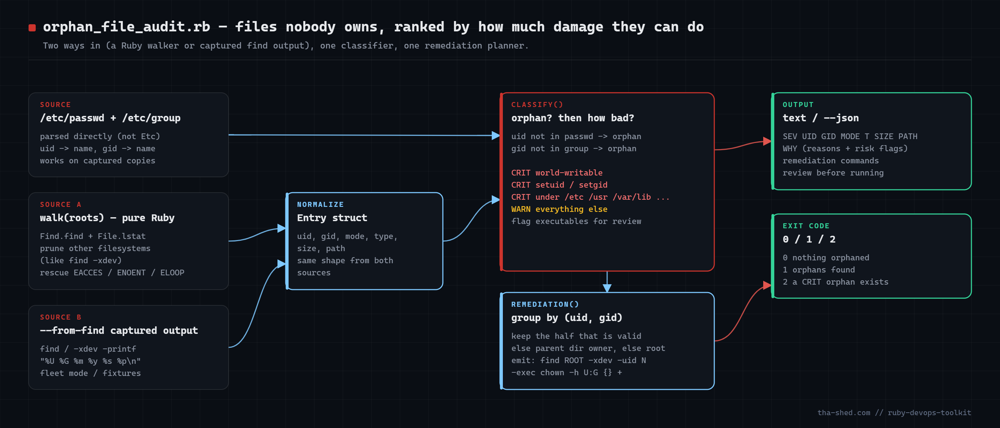
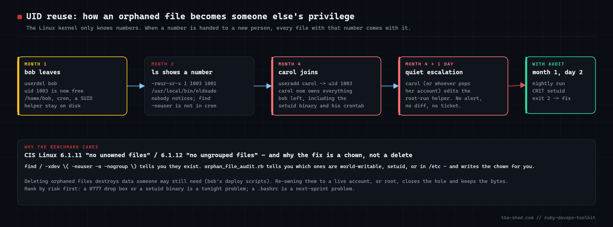

# orphan-file-audit

Find files and directories owned by users or groups that no longer exist (CIS Linux Benchmark
6.1.11 / 6.1.12), rank them by blast radius (world-writable, setuid/setgid, under `/etc`, `/usr`,
`/var/spool/cron`... = CRIT), and print the exact `chown` commands that re-home them — without
deleting anything. Pure Ruby, no gems.



Companion article: https://tha-shed.com/ — *Ruby for DevOps: Finding the Files Nobody Owns*

## Why

Linux ownership is numeric. `userdel bob` frees uid 1003 but leaves every file bob owned with that
number. The next `useradd` hands 1003 to someone else — together with bob's setuid helper, his
crontab and his 0777 drop box. `find -nouser` tells you the files exist; this script tells you which
ones matter and how to fix them.



## Prerequisites

- Ruby 3.0+ (tested on 3.4). Stdlib only: `optparse`, `json`, `find`.
- Root (or read access to the trees you scan) for the built-in walker; `--from-find` input can be
  produced with `sudo find` and analysed unprivileged.
- `/etc/passwd` and `/etc/group` by default; `--passwd` / `--group` accept captured copies or
  `getent passwd` / `getent group` output (needed for LDAP/SSSD accounts).

## Usage

```
sudo ruby orphan_file_audit.rb                     # walk / on one filesystem (like find -xdev)
sudo ruby orphan_file_audit.rb /srv /home /var     # specific roots
sudo find / -xdev -printf '%U %G %m %y %s %p\n' > files.txt
ruby orphan_file_audit.rb --from-find files.txt    # analyse captured output (fleet mode)
ruby orphan_file_audit.rb --passwd ./passwd --group ./group --from-find files.txt --json
```

| Flag | Meaning |
|------|---------|
| `--from-find FILE` | analyse `find -printf '%U %G %m %y %s %p\n'` output instead of walking |
| `--passwd FILE`, `--group FILE` | account databases (default `/etc/passwd`, `/etc/group`) |
| `--cross-fs` | descend into other filesystems (default stays on one, like `-xdev`) |
| `--limit N` | rows printed in text mode (default 40) |
| `--json` | machine-readable output incl. remediation plan |

Exit codes: `0` nothing orphaned, `1` orphans found, `2` at least one CRIT orphan.

## How it works

1. **`read_ids`** parses passwd/group as plain files into `{id => name}` Hashes — O(1) lookups, and it works on
   copies from other hosts.
2. **`walk`** uses `Find.find` + `File.lstat` (never follows symlinks) and `Find.prune`s directories whose
   `dev` differs from the root's, i.e. `-xdev`. `EACCES`/`ENOENT`/`ELOOP` are skipped.
3. **`read_find_output`** turns `find -printf` lines into the same `Entry` struct (`split(' ', 6)` keeps spaces in paths).
4. **`classify`** records *why* (uid missing, gid missing) and *how bad*: world-writable (`0o002`, not on symlinks),
   setuid/setgid, sensitive prefix => CRIT; executables flagged for review.
5. **`remediation`** groups by `(uid, gid)`, keeps whichever half is still valid, uses the parent directory's
   owner/group for the other half (else root), and emits a scoped
   `find <common-root> -xdev -uid N -exec chown -h U:G {} +`. Nothing is executed.

## Example output

```
orphan_file_audit  scanned 15 entries (from fixtures/files.txt)  passwd=6 users  group=7 groups
------------------------------------------------------------------------------------------------
SEV  UID    GID    MODE  T       SIZE  PATH                                     WHY
CRIT 1003   1003   0777  d       4096  /home/bob/dropbox                        uid 1003 has no passwd entry, gid 1003 has no group entry, world-writable
CRIT 1003   1001   4755  f      22016  /usr/local/bin/oldsudo                   uid 1003 has no passwd entry, setuid, sensitive-path, executable
CRIT 1003   1003   0644  f        118  /var/spool/cron/crontabs/bob             uid 1003 has no passwd entry, gid 1003 has no group entry, sensitive-path
WARN 1003   1003   0755  d       4096  /home/bob                                uid 1003 has no passwd entry, gid 1003 has no group entry
...
WARN 33     1005   0644  f       1200  /var/www/html/index.html                 gid 1005 has no group entry

Remediation (review before running):
  uid 1003   gid 1003       7 files      32347 bytes  -> chown to root:root
    find / -xdev -uid 1003 -gid 1003 -exec chown -h 0:0 {} +
  uid 1003   gid 1001       1 files      22016 bytes  -> chown to root:deploy
    find /usr/local/bin/oldsudo -xdev -uid 1003 -exec chown -h 0:1001 {} +
  uid 1004   gid 998        2 files       9216 bytes  -> chown to root:docker
    find /srv/app/shared -xdev -uid 1004 -exec chown -h 0:998 {} +
  uid 33     gid 1005       1 files       1200 bytes  -> chown to www-data:root
    find /var/www/html/index.html -xdev -gid 1005 -exec chown -h 33:0 {} +

CRIT: 11 orphaned entries, 3 critical
```

## Troubleshooting

- **LDAP/SSSD users all look orphaned** — feed `getent passwd` / `getent group` output via `--passwd`/`--group`.
- **Slow on big volumes** — capture with GNU `find` and use `--from-find`.
- **Container layers** (`/var/lib/docker`, `/var/lib/containers`) are full of foreign uids; `-xdev` keeps overlay
  mounts out of a root scan. Do not chown them.
- **`Errno::EACCES`** — run the walker as root, or capture with `sudo find`.
- **Suggested chown root is `/`** — one account's files span unrelated trees; the command is still scoped by `-uid`/`-gid`.
- **Testing note** — classifier and remediation were verified against the fixture above (11 orphans, 3 CRIT, exit 2) and
  `--json`. The pure-Ruby walker was exercised for control flow (prune, lstat, rescue) in an environment that reports
  uid 0 for everything, so run it once against a directory with a known `-nouser` file before scheduling.

## Extending

- Offboarding hook: run with the departing uid pinned *before* `userdel`.
- Reserve freed uids (tombstone passwd entry) instead of reusing them.
- Fleet aggregation of `--json` by uid.
- `--apply` mode that runs the generated commands after a dry run.
- Windows twin: orphaned SIDs in ACLs via `icacls` / `win32-security`.

## References

- find(1): https://man7.org/linux/man-pages/man1/find.1.html
- Ruby `Find`: https://docs.ruby-lang.org/en/3.4/Find.html
- Ruby `File::Stat`: https://docs.ruby-lang.org/en/3.4/File/Stat.html
- CIS Benchmarks: https://www.cisecurity.org/cis-benchmarks
