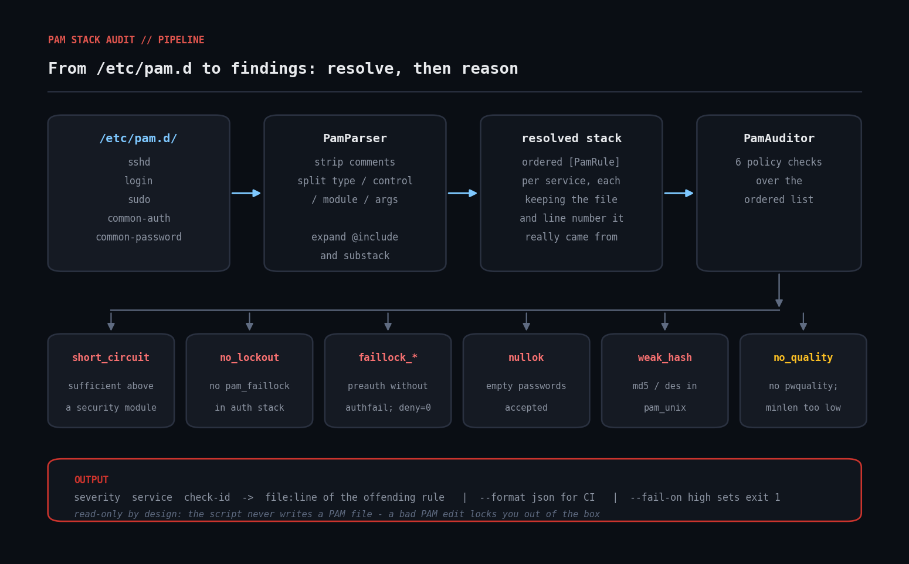
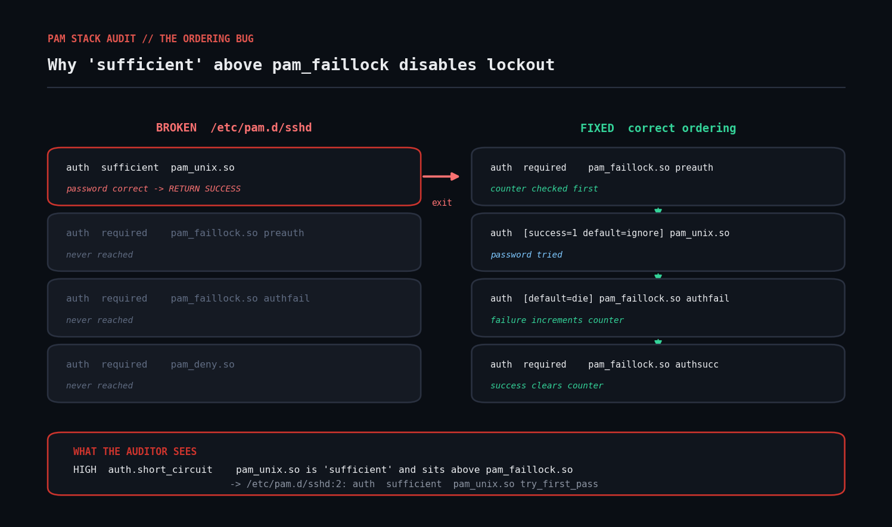

# pam-stack-audit

Audit Linux PAM stacks for policy gaps and ordering bugs — in Ruby, read-only, no gems.



## The problem

PAM (Pluggable Authentication Modules) decides who gets to log in and under what conditions. The rules live in `/etc/pam.d/<service>`, one file per service. Each line looks like:

```
<type>  <control>  <module>  [args...]
```

Two things go wrong on real fleets, and neither shows up in a package inventory or a config-management diff:

1. **A required hardening module simply isn't there.** No `pam_faillock`, so brute-force attempts are never throttled. No `pam_pwquality`, so users pick `Password1`.
2. **The modules are there, in the wrong order.** PAM evaluates a stack top to bottom, and a `sufficient` result that succeeds short-circuits every rule below it. A `sufficient` `pam_unix` placed above `pam_faillock` means the lockout counter is never consulted.

The second one is the nasty case. The package is installed. The file contains the line. Every inventory tool reports green. And the lockout does nothing.



## Prerequisites

| | |
|---|---|
| Ruby | 2.7+ (tested on 3.0.2) |
| Gems | none — `optparse`, `json`, `set` are all stdlib |
| OS | any Linux with `/etc/pam.d` (Debian/Ubuntu, RHEL/Rocky/Alma, SUSE, Arch) |
| Privileges | read access to `/etc/pam.d` — usually world-readable, but `sudo` is safest |

## Usage

```bash
# Audit the live system
ruby pam_stack_audit.rb

# Audit a captured copy (grab /etc/pam.d off a host and inspect it elsewhere)
ruby pam_stack_audit.rb --dir ./captured/pam.d

# Only the services you care about
ruby pam_stack_audit.rb --service sshd --service sudo

# Machine-readable, for a dashboard or a ticket
ruby pam_stack_audit.rb --format json

# CI gate: non-zero exit if anything high-severity is found
ruby pam_stack_audit.rb --fail-on high
```

Exit codes: `0` clean (or below the `--fail-on` threshold), `1` findings at or above the threshold, `2` the PAM directory could not be read.

## How it works

### 1. `PamParser` — resolve the stack before reasoning about it

You cannot audit `/etc/pam.d/sshd` by reading `/etc/pam.d/sshd`. On Debian it's four lines, three of which are `@include common-auth` and friends. The rules that actually run live somewhere else.

`PamParser#rules_for` returns the **fully resolved, ordered** rule list:

* `@include <file>` splices in the whole of another file, every type.
* `auth substack password-auth` / `session include common-session` splice in only the matching type.
* A `seen` set guards against a config that includes itself — PAM would loop too, and you don't want the audit tool to be the thing that hangs.
* Bracketed control fields (`[success=1 default=ignore]`) are joined back into one token rather than being split on whitespace.

Every resolved rule keeps the **file and line number it really came from**, so a finding on `login` can point you at `/etc/pam.d/common-auth:17` where the actual problem lives.

### 2. `PamAuditor` — six checks over the ordered list

| check | severity | what it catches |
|---|---|---|
| `auth.short_circuit` | high | a `sufficient` rule sitting above `pam_faillock` / `pam_tally2` / `pam_succeed_if` / `pam_access` / `pam_time` |
| `auth.no_lockout` | high | no lockout module at all in an interactive service's auth stack |
| `auth.faillock_incomplete` | high | `preauth` without `authfail` (or the reverse) — a half-wired counter |
| `auth.faillock_deny_zero` | high | `deny=0`, which disables lockout while looking configured |
| `auth.nullok` | high | `nullok` / `nullok_secure` — accounts with empty passwords authenticate |
| `auth.pam_permit` | high | `pam_permit.so` as `required`/`sufficient` in an auth stack — an outright bypass |
| `password.weak_hash` | high | `pam_unix` storing with `md5` / `des` / `bigcrypt` |
| `password.no_quality` | medium | no `pam_pwquality` / `pam_cracklib` in the password stack |
| `password.minlen_low` | medium | `minlen` below 12 |
| `password.hash_unset` | low | `pam_unix` names no algorithm, so the crypt default applies |

The lockout and password-quality checks are **scoped to interactive services** (`sshd`, `login`, `sudo`, `su`, `common-auth`, `system-auth`, `password-auth`, the display managers). Auditing `cups` for `pam_faillock` is noise.

### 3. Why it never writes

There is no `--fix` flag and there won't be. A bad PAM edit locks you out of the box, including out of `sudo`, and the recovery is a console or a rescue boot. The script prints `file:line` and lets you make the change yourself, with a second root shell already open.

## Example output

Run against a deliberately-broken fixture:

```
PAM stack audit -- ./fixtures/pam.d
services audited: 4   findings: 12
------------------------------------------------------------------------

[sshd]
  HIGH   auth.short_circuit
         pam_unix.so is 'sufficient' and sits above pam_faillock.so; a successful password skips those modules entirely.
         -> ./fixtures/pam.d/sshd:2: auth    sufficient   pam_unix.so try_first_pass nullok
  HIGH   auth.faillock_incomplete
         pam_faillock is present but the 'authfail' entry is missing; the counter is only half-wired and lockout will not take effect.
         -> ./fixtures/pam.d/sshd:3: auth    required     pam_faillock.so preauth deny=0
  HIGH   auth.faillock_deny_zero
         pam_faillock has deny=0, which disables lockout entirely.
         -> ./fixtures/pam.d/sshd:3: auth    required     pam_faillock.so preauth deny=0
  HIGH   auth.nullok
         pam_unix.so accepts accounts with an empty password (nullok).
         -> ./fixtures/pam.d/sshd:2: auth    sufficient   pam_unix.so try_first_pass nullok

[common-password]
  HIGH   password.weak_hash
         pam_unix stores passwords with md5, which is trivially crackable. Use sha512 or yescrypt.
         -> ./fixtures/pam.d/common-password:2: password  [success=1 default=ignore]  pam_unix.so md5
  MEDIUM password.minlen_low
         pam_pwquality minlen=8 is below the commonly required 12.
         -> ./fixtures/pam.d/common-password:1: password  requisite  pam_pwquality.so retry=3 minlen=8

------------------------------------------------------------------------
summary: high=11  medium=1
```

Note the `login` service in a full run: it has two auth lines of its own, but inherits findings from `common-auth` and the evidence points at `common-auth`'s line numbers. That's include resolution doing its job.

## Troubleshooting

**"No findings at all, on a box I know is misconfigured."**
Check that you're auditing the right directory and that the files are readable. `ruby pam_stack_audit.rb --format json` prints `services_audited` — if that's `0`, the directory glob found nothing.

**"Every service reports `auth.nullok` and `auth.pam_permit`."**
That's normal on stock Debian/Ubuntu: `common-auth` ships with `pam_unix.so nullok` and a trailing `pam_permit.so`, and every service `@include`s it. The `nullok` finding is real (it matters only if an account actually has an empty password hash — check with `awk -F: '$2==""' /etc/shadow`). The trailing `pam_permit.so` is by design in Debian's `[success=N default=ignore]` jump-based stack: the jumps skip past it on failure. Treat both as "confirm, then suppress" rather than "panic" — and if you want them gone from the report, drop `pam_permit` from `check_pam_permit` or scope `check_nullok` to the services you care about.

**"`faillock_incomplete` fires but my lockout works fine."**
Modern `pam_faillock` (libpam 1.4+) can run in a single-entry mode driven entirely by `/etc/security/faillock.conf`. The two-entry `preauth`/`authfail` pattern is the explicit form. If you're on the config-file form, this check is a false positive — narrow it by also reading `faillock.conf`, or suppress it for that service.

**"It flagged a rule in a file I didn't audit."**
That's include resolution. The `service` column is the service you asked about; the evidence line is where the offending rule physically lives.

**Encoding errors on a hand-edited file.** `File.readlines` will raise on invalid UTF-8. Run `file /etc/pam.d/*` to find the culprit — it's usually a stray byte from a copy-paste.

## Extending it

* **Read `/etc/security/faillock.conf` and `pwquality.conf`.** Modern distros moved most tunables out of the module arguments and into these files. Parsing them turns several "medium, can't tell" findings into precise ones.
* **Check `pam_pwhistory`.** Password reuse is a control most baselines require and almost nobody verifies.
* **Add `pam_wheel` for `su`.** `auth required pam_wheel.so use_uid` is what stops every user from attempting `su -`.
* **Diff two hosts.** Run with `--format json` on a known-good host and on a suspect one, then diff the resolved stacks rather than the files. Include resolution means the files can differ while the effective policy is identical — and vice versa.
* **Wire it into CI.** `--fail-on high` plus a golden-image build makes "the base image ships a broken auth stack" a build failure instead of a pen-test finding.
* **Emit Prometheus text format** instead of JSON and let a node_exporter textfile collector scrape it. One gauge per severity per host gives you a fleet-wide trend line.

## References

- [`pam.conf(5)` / `pam.d(5)`](https://www.man7.org/linux/man-pages/man5/pam.conf.5.html) — the authoritative description of type, control, and module syntax, including the bracketed control form
- [`pam_faillock(8)`](https://www.man7.org/linux/man-pages/man8/pam_faillock.8.html) — the `preauth` / `authfail` / `authsucc` pattern and `faillock.conf`
- [`pam_pwquality(8)`](https://www.man7.org/linux/man-pages/man8/pam_pwquality.8.html) — password quality arguments and `pwquality.conf`
- [`pam_unix(8)`](https://www.man7.org/linux/man-pages/man8/pam_unix.8.html) — `nullok`, hashing algorithm arguments
- [Linux-PAM System Administrators' Guide](http://www.linux-pam.org/Linux-PAM-html/Linux-PAM_SAG.html) — the stack evaluation model, including how `sufficient` short-circuits
- [Ruby `OptionParser`](https://docs.ruby-lang.org/en/master/OptionParser.html) and [`Struct`](https://docs.ruby-lang.org/en/master/Struct.html) — the stdlib pieces this script leans on

## Licence

MIT — see the repository root.
