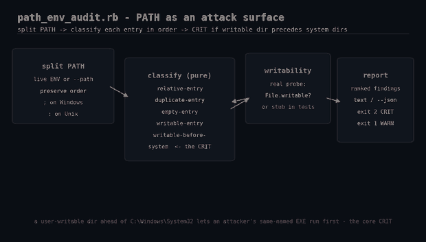

# path-env-audit

Audit the `PATH` environment variable for privilege-escalation and hygiene
problems, on Windows and Unix. A single stdlib-only Ruby script.



## Why this matters

`PATH` is an overlooked attack surface. If a directory that any user can write to
appears **before** the real system directories, an attacker drops a malicious
`python.exe` (or `ls`) there and it runs instead of the genuine binary — a classic
local privilege-escalation and persistence trick. Relative entries, duplicates,
and empty elements cause their own subtle bugs.

## Prerequisites

- Ruby 2.7+ (tested on 3.0.2) — stdlib only: `json`, `optparse`. No gems.
- Windows or Unix. The classification is pure and is exercised by the included
  test harness on any platform.

## Usage

```bash
# audit this process's live PATH
ruby path_env_audit.rb

# audit a specific PATH string (e.g. a service account's)
ruby path_env_audit.rb --path "/opt/bin:/usr/bin:/bin"

# machine-readable
ruby path_env_audit.rb --json
```

Run the logic tests anywhere:

```bash
ruby path_env_audit_test.rb
```

## What it flags

| Severity | Code | Meaning |
|----------|------|---------|
| CRIT | `writable-before-system` | A user-writable directory appears *before* the system directories — an attacker's binary would win name resolution |
| WARN | `writable-entry` | A user-writable directory on PATH (after system dirs) |
| WARN | `relative-entry` | A relative directory on PATH (resolves against the current working directory) |
| WARN | `empty-entry` | An empty PATH element (implicitly the current directory) |
| INFO | `duplicate-entry` | A directory that already appears earlier on PATH |

## How it works

`PATH` is split on the platform separator (`;` on Windows, `:` on Unix), preserving
order. `PathAudit.classify` walks the entries in order and, crucially, tracks
whether it has passed a system directory yet — a writable directory found *before*
that point is the CRIT. Writability is decided by an injected probe: the CLI uses a
real `File.directory? && File.writable?` check; the test harness injects a stub set,
so tests touch no real directories and run identically on every platform.

## Example output

```
PATH audit -- 5 entries (unix)

CRIT  writable-before-system   #0   user-writable dir /tmp precedes the system directories on PATH
WARN  relative-entry           #3   relative directory on PATH: relthing
INFO  duplicate-entry          #4   /usr/bin already appears at position 1

1 critical, 1 warning, 1 info
```

## Troubleshooting

- **On Windows, `writable-before-system` seems too eager** — `C:\ProgramData` and
  some app directories have unusual ACLs; confirm with `icacls` before treating a
  finding as exploitable.
- **A trusted tools dir is flagged `writable-entry`** — that's expected if it's
  writable; either lock down its ACL or accept it as a known exception downstream.

## Extending

- On Windows, resolve the real NTFS ACL of each directory instead of the writable
  probe for a definitive verdict.
- Add an allowlist so known-good entries don't re-alert every run.
- Emit JSON to a SIEM, or wire into a scheduled compliance job that mails on CRIT.

## Testing

The pure `PathAudit.classify` logic is covered by `path_env_audit_test.rb`
(9 cases: writable-before/after-system on both platforms, relative, duplicate,
empty, and clean paths), all passing on Linux (Ruby 3.0.2).

## References

- [Ruby `ENV`](https://docs.ruby-lang.org/en/3.4/ENV.html)
- [MITRE ATT&CK T1574.007 — Path Interception by PATH Environment Variable](https://attack.mitre.org/techniques/T1574/007/)
- [Ruby `File` writability checks](https://docs.ruby-lang.org/en/3.4/File.html)
