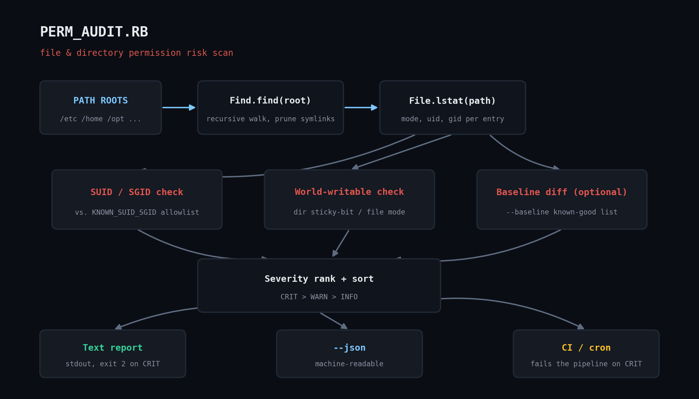

# perm_audit.rb — File Permission & SUID/SGID Security Auditor

Pure Ruby stdlib (`find`, `etc`, `optparse`, `json`, `set` — no gems) scanner for two of the
most common Linux permission bugs:

1. **World-writable files/directories** that aren't protected by the sticky bit (the classic
   "anyone can overwrite this" bug).
2. **Unexpected SUID/SGID binaries** — programs that run as their owner or group regardless
   of who executes them, checked against a starter allowlist of standard distro binaries.



## Prerequisites

- Ruby 2.7+ (tested on 3.0 and 3.3)
- Linux or any POSIX system with real `uid`/`gid`/mode bits
- Read access to the directories you're scanning (root gives full coverage; a normal user
  will skip unreadable paths and count them under `errors` instead of failing the scan)

## Usage

```bash
ruby perm_audit.rb /etc /home /var/www
ruby perm_audit.rb --json /etc                    # machine-readable output
ruby perm_audit.rb --baseline known_suid.txt /     # diff against a pre-approved list
ruby perm_audit.rb --follow-symlinks /opt          # also stat symlink targets
```

Exits `2` if any CRIT finding exists (useful as a CI gate or cron check), `0` otherwise.

## How it works

- `Find.find` walks each root with `Find.prune` on symlinks by default, so the scan never
  follows a symlink outside the tree you asked it to audit.
- SUID/SGID binaries are scored against `KNOWN_SUID_SGID`, a list of standard-issue
  setuid/setgid binaries shipped by most distros (`passwd`, `sudo`, `mount`, etc.). Anything
  with the bit set that *isn't* on that list is CRIT; anything on the list is WARN.
- World-writable directories are CRIT unless the sticky bit is set (the safe pattern used by
  `/tmp`); world-writable regular files are always WARN.
- `--baseline FILE` lets you hand the script a newline-delimited list of pre-approved
  SUID/SGID paths (e.g. an internal tool that legitimately needs the bit) so the same
  finding doesn't re-alert every run.

## Example output

```
========================================================================
PERMISSION AUDIT: /tmp/permtest
========================================================================
Scanned: 9 entries  |  Errors (permission denied etc.): 0
Findings: 2 CRIT, 1 WARN, 1 INFO
------------------------------------------------------------------------
[CRIT] SUID                 4755  user:user  /tmp/permtest/opt/badapp/mystery_setuid
         -> NOT in known-good allowlist
[CRIT] WORLD_WRITABLE_DIR   0777  user:user  /tmp/permtest/opt/shared_no_sticky
         -> sticky bit MISSING
[WARN] WORLD_WRITABLE_FILE  0666  user:user  /tmp/permtest/etc/oops.conf
         -> world-writable regular file
[INFO] WORLD_WRITABLE_DIR   1777  user:user  /tmp/permtest/tmp
         -> sticky bit set (safe pattern)
========================================================================
```

Run for real against `/usr/bin` on a stock Linux box and it will typically flag `chage` and
`expiry` as CRIT purely because they aren't on the starter allowlist — both are legitimate
shadow-utils SGID binaries. That's expected: resolve it once by adding them to your own
`--baseline` file rather than trusting any allowlist blindly.

## Troubleshooting

- A nonzero `errors` count in the summary means `Errno::EACCES` on directories you can't
  read — not a bug. Run under `sudo` for a complete audit.
- If `--baseline` has no effect, check the file has one path per line with no trailing
  whitespace and no inline comments after the path — the loader strips blank lines and `#`
  comment lines, then does an exact string match.

## Extending it

- Emit Nagios/Icinga-style exit codes and a one-line summary for monitoring integration
  (`--json` already gives a machine-readable base).
- Add a `--diff` mode that compares two JSON runs and reports only *new* findings since the
  last scan, turning this into a drift detector.
- Wire the CRIT exit code into a pre-deploy CI check so a build fails if a new SUID binary
  sneaks into a container image.

## References

- [Ruby `Find` stdlib docs](https://docs.ruby-lang.org/en/3.3/Find.html)
- [Ruby `File::Stat` docs](https://docs.ruby-lang.org/en/3.3/File/Stat.html)
- [Ruby `Etc` stdlib docs](https://docs.ruby-lang.org/en/3.3/Etc.html)
