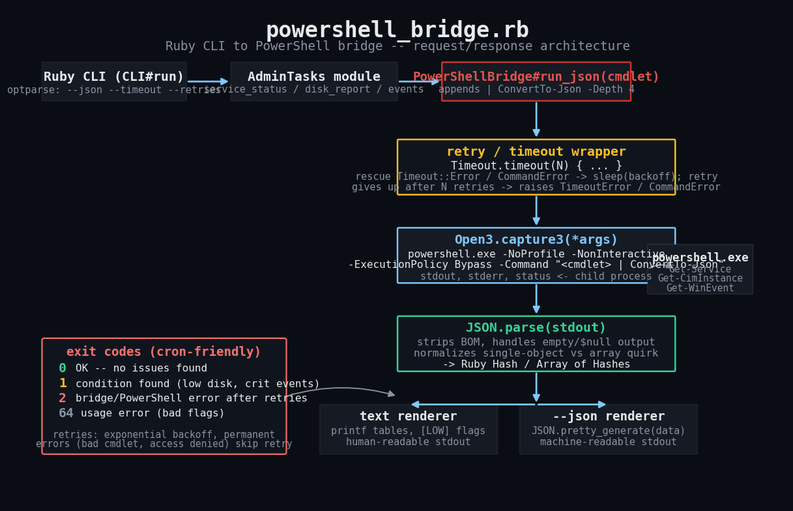

# powershell-bridge

Drive Windows administration (services, disk space, event logs) from Ruby by
shelling out to PowerShell and getting structured JSON back — with the
timeout, retry, and error handling that raw PowerShell scripting doesn't
give you for free.



## The problem

On Windows, a lot of admin surface area — service control, WMI/CIM classes,
the event log, local users and groups — is only cleanly reachable from
PowerShell. Ruby doesn't have a first-class WMI story. But PowerShell is a
clumsy language for the *orchestration* layer: retries, timeouts, JSON
reshaping, gluing multiple admin steps together, writing a CLI with
predictable, cron/Task-Scheduler-friendly exit codes.

`powershell_bridge.rb` splits the difference: Ruby owns the control flow,
PowerShell only ever gets called to answer one structured question at a
time via `ConvertTo-Json`.

## Prerequisites

- **Ruby 2.7+** (developed/tested against Ruby 3.0). Stdlib only —
  `open3`, `json`, `optparse`, `timeout`. No gems, no `Gemfile`.
- **Windows** with either:
  - Windows PowerShell 5.1 (`powershell.exe`, ships with every modern
    Windows box), or
  - PowerShell 7+ (`pwsh.exe`, install separately) — pass
    `PowerShellBridge.new(executable: 'pwsh.exe')` to use it.
- Whatever Windows permissions the underlying cmdlets need (e.g.
  `Restart-Service` on a protected service normally wants an elevated
  shell; `Get-WinEvent` against the Security log needs admin rights).

## Usage

```
ruby powershell_bridge.rb service-status [--name SERVICE] [--json]
ruby powershell_bridge.rb service-restart --name SERVICE [--json]
ruby powershell_bridge.rb disk-report [--json]
ruby powershell_bridge.rb events [--log-name System] [--hours 24] [--max-events 20] [--json]

Common flags:
  --timeout N     per-attempt timeout in seconds (default 30)
  --retries N     retry attempts after the first try (default 2)
  --json          machine-readable output instead of text tables
```

Examples:

```bash
# Human-readable service status for one service
ruby powershell_bridge.rb service-status --name Spooler

# All services, JSON, piped into jq
ruby powershell_bridge.rb service-status --json | jq '.[] | select(.Status != "Running")'

# Disk free-space report; non-zero exit if any volume is under 10% free
ruby powershell_bridge.rb disk-report
echo "exit: $?"

# Restart a service and confirm it came back up
ruby powershell_bridge.rb service-restart --name Spooler

# Critical/error events from the System log in the last 6 hours
ruby powershell_bridge.rb events --log-name System --hours 6 --json
```

Exit codes (cron-friendly, matches the rest of this repo's convention):

| Code | Meaning |
|------|---------|
| 0 | OK — command ran, nothing to flag (or restart succeeded) |
| 1 | Ran fine, but the condition being checked was found (low disk, events present, restart didn't come up Running) |
| 2 | Bridge/PowerShell error after retries were exhausted, or a timeout |
| 64 | Usage error (bad flags, missing `--name`, unknown subcommand) |

## How it works

1. **CLI layer** (`CLI` class) parses `ARGV` with `optparse`, builds a
   `PowerShellBridge`, and dispatches to one of the `AdminTasks` helpers.
2. **`AdminTasks` module** knows the actual PowerShell one-liners for each
   task (`Get-Service`, `Get-CimInstance Win32_LogicalDisk`,
   `Get-WinEvent -FilterHashtable`) and reshapes the parsed JSON into
   plain Ruby hashes (e.g. computing `PercentFree` for disks, since
   PowerShell won't hand you that for free).
3. **`PowerShellBridge#run_json(cmdlet)`** appends
   `| ConvertTo-Json -Depth 4 -Compress` to the cmdlet, invokes
   `powershell.exe -NoProfile -NonInteractive -ExecutionPolicy Bypass
   -Command "<full command>"` through `Open3.capture3`, and parses the
   result.
4. **Timeout + retry wrapper** (`run_raw`) wraps every attempt in
   `Timeout.timeout(N)`. Transient-looking failures (RPC/WMI hiccups,
   "server too busy") are retried with exponential backoff; failures
   that look permanent (cmdlet not found, parser error, access denied)
   are raised immediately without wasting a retry budget.
5. **JSON normalization** (`parse_json`) strips a possible UTF-8 BOM,
   treats empty stdout as `nil`/`[]` (PowerShell emits nothing for
   `ConvertTo-Json` on `$null`), and leaves the single-object-vs-array
   quirk of `ConvertTo-Json` to `run_json_array` to normalize when the
   caller always wants a list.
6. **Output layer**: every subcommand renders either a human text table
   or, with `--json`, `JSON.pretty_generate` of the exact same Ruby data
   structure — so anything you can eyeball you can also pipe to `jq`.

See `img/powershell_bridge_flow.png` for a step-by-step sequence diagram
of one retry cycle (attempt fails transiently, backs off, retries,
succeeds).

## Testing (and its limits — read this)

**`powershell.exe` does not exist in this sandbox environment** (or on any
non-Windows machine), so the PowerShell-invoking code path in this repo has
**not** been run against a real Windows host as part of building this
tutorial. What *has* been verified, exhaustively, is everything around
that boundary:

- JSON parsing (single object vs. array, empty output, malformed JSON,
  BOM stripping)
- retry-with-backoff behavior (transient vs. permanent failure
  classification, exhausting retries, exact retry counts)
- timeout handling (a simulated hung `powershell.exe` call raises
  `PowerShellBridge::TimeoutError`)
- the `AdminTasks` helpers' math and edge cases (disk `%` free, "no
  events found" being treated as an empty result rather than an error,
  service-restart status re-check)
- the CLI's argument parsing, `--json` vs. text rendering, and exit codes

`powershell_bridge_test.rb` does this by injecting a `FakeShellRunner` in
place of `Open3` — same `#capture3(*args)` signature, but instead of
spawning a process it returns hand-written strings shaped exactly like
real `ConvertTo-Json -Compress` output for `Get-Service`,
`Get-CimInstance Win32_LogicalDisk`, and `Get-WinEvent`. It's pure Ruby
stdlib (no test gem), and it's runnable anywhere Ruby runs:

```
ruby powershell_bridge_test.rb
```

### Real captured output from this stub harness

```
========================================================================
powershell_bridge_test.rb -- stub harness (no real powershell.exe)
========================================================================

-- JSON parsing --

-- retry / backoff --

-- timeout handling --

-- AdminTasks helpers --

-- CLI wiring --

========================================================================
  PASS  run_json returns a Hash for a single-object cmdlet result
  PASS  run_json returns an Array for a multi-object cmdlet result
  PASS  run_json_array normalizes a single Hash result into a one-element Array
  PASS  run_json_array returns [] for empty PowerShell output ($null pipeline)
  PASS  malformed JSON raises PowerShellBridge::CommandError, not a raw JSON::ParserError
  PASS  transient failure (RPC server unavailable) is retried and eventually succeeds
  PASS  permanent failure (cmdlet not found) is NOT retried
  PASS  exhausting retries on a persistent transient failure raises CommandError
  PASS  a hung powershell.exe call raises PowerShellBridge::TimeoutError after retries
  PASS  AdminTasks.disk_report computes GB and PercentFree correctly
  PASS  AdminTasks.restart_service re-queries status after restarting
  PASS  AdminTasks.recent_critical_events parses events with .NET /Date()/ timestamps intact
  PASS  AdminTasks.recent_critical_events treats "No events were found" as an empty result, not an error
  PASS  CLI service-status --json prints valid JSON and exits 0
  PASS  CLI disk-report text mode flags low free space and exits non-zero
  PASS  CLI service-restart without --name exits with usage error
  PASS  CLI events command exits non-zero when critical events are present (alerting use case)
  PASS  CLI unknown command exits usage error

18/18 tests passed
========================================================================
ALL PASSED

Reminder: this proves parsing/retry/timeout/CLI logic only. The
actual `powershell.exe` invocation has not been exercised against a
real Windows host in this run -- see README Troubleshooting.
```

## Troubleshooting

- **"The PowerShell calls themselves are untested on a real Windows
  host."** This is the single biggest caveat of this tutorial and repo
  entry. Everything above the `Open3.capture3` boundary is verified by
  the stub harness; everything below it (the actual behavior of
  `powershell.exe`, real `ConvertTo-Json` output shapes across PS
  5.1/7.x, locale/culture quirks, actual process-kill-on-timeout
  behavior) has only been exercised against hand-written fixtures.
  Before relying on this in production, run it against a real box and
  diff the real JSON shape against the fixtures in
  `powershell_bridge_test.rb`.
- **`ConvertTo-Json` collapses a single-object result to a bare object,
  not a one-element array.** That's why `run_json_array` exists — always
  use it in code that assumes a list.
- **Dates come back as `/Date(1753900800000)/`.** That's .NET JSON's
  legacy date format, which `ConvertTo-Json` still emits for
  `DateTime` properties in many PowerShell versions. This script does
  not convert it — if you need real `Time` objects, parse the embedded
  millisecond epoch with a regex before calling `Time.at`.
- **`Timeout.timeout` doesn't kill the child `powershell.exe` process.**
  `Open3.capture3` blocks the calling thread until the child exits;
  Ruby's `Timeout` module can only unwind the Ruby call stack, not
  reach into the OS to `TerminateProcess` the grandchild. For a genuine
  hard-kill of a wedged `powershell.exe`, switch to `Open3.popen3` and
  track the PID so you can `Process.kill('KILL', pid)` on timeout — see
  "Extending" below.
- **`Access is denied` errors.** Some cmdlets (`Restart-Service` on
  protected services, `Get-WinEvent` on the Security log) need an
  elevated PowerShell session. The bridge won't self-elevate; run your
  Ruby process as Administrator if the underlying cmdlet needs it.
- **`Get-WinEvent` throws instead of returning empty when nothing
  matches.** `AdminTasks.recent_critical_events` specifically rescues
  the `"No events were found"` message and treats it as `[]` — if
  Microsoft changes that error string in a future PowerShell build,
  this heuristic could start raising instead of returning empty. Worth
  re-verifying against a real host.
- **`RPC server is unavailable` / WMI/CIM hiccups.** These are the kind
  of transient failure the retry-with-backoff logic targets. If you're
  still seeing failures after the default 2 retries, raise `--retries`
  or check that the WinRM/WMI service is healthy on the target.

## Extending

- **Hard-kill on timeout**: swap `Open3.capture3` for `Open3.popen3`,
  keep the child PID, and `Process.kill` it if `Timeout.timeout` fires,
  instead of only unwinding the Ruby thread.
- **Remote hosts**: add `-ComputerName` / a `PSSession` and route
  commands through `Invoke-Command` for fleet-wide checks instead of
  local-only `powershell.exe` calls.
- **More cmdlets**: `Get-LocalUser`, `Get-LocalGroupMember`,
  `Get-ScheduledTask`, `Get-NetTCPConnection` all follow the exact same
  `run_json_array` pattern — add a one-line method to `AdminTasks` and a
  CLI subcommand.
- **Structured logging**: `PowerShellBridge.new(logger: ->(level, msg) {
  ... })` already has a hook — wire it to your logger of choice for
  attempt-by-attempt visibility in production.
- **Config file**: for a fleet of scheduled checks, load
  service/threshold lists from a YAML file instead of hardcoding
  `--name` per invocation.
- **Windows Event Forwarding**: for centralized monitoring, this script
  is a reasonable building block for a poller that ships `events`
  `--json` output to a central log sink on a schedule.

## References

- Ruby `Open3` stdlib documentation: <https://docs.ruby-lang.org/en/3.0/Open3.html>
- Microsoft `ConvertTo-Json` reference: <https://learn.microsoft.com/en-us/powershell/module/microsoft.powershell.utility/convertto-json>
- Microsoft `Get-WinEvent` reference: <https://learn.microsoft.com/en-us/powershell/module/microsoft.powershell.diagnostics/get-winevent>

## Source

Full source: [`jjam3774/ruby-devops-toolkit`](https://github.com/jjam3774/ruby-devops-toolkit/tree/main/powershell-bridge)
