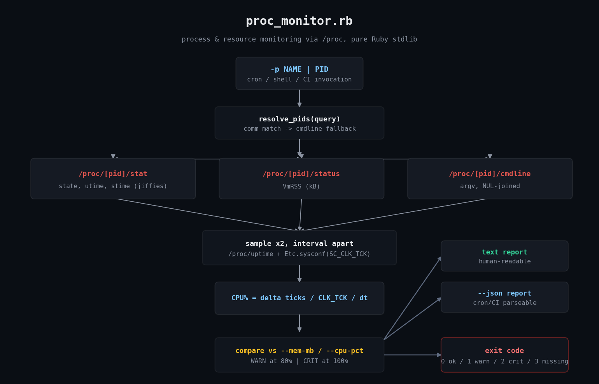
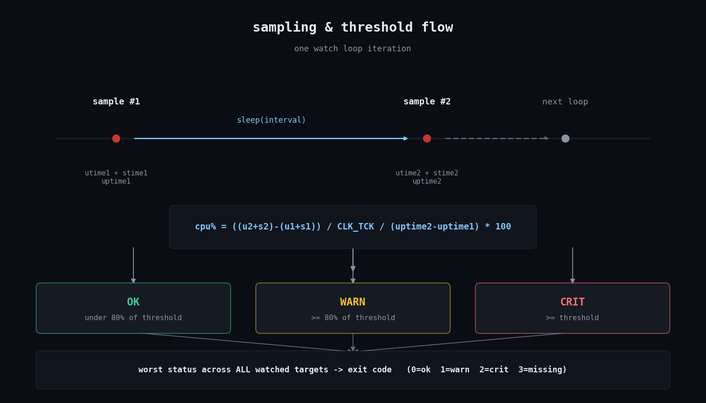

# proc-monitor

A lightweight process & resource monitor for Linux, written in pure Ruby
using nothing but the `/proc` filesystem. No gems, no agents, no daemons.



## The problem

You need to keep an eye on a handful of processes on a box — a web worker,
a queue consumer, `sshd`, whatever — and you want to know:

- How much memory is it actually using (RSS, not virtual size)?
- How much CPU is it burning right now?
- Is it even still running, or did it die and maybe come back under a new PID?
- Can I get a clean pass/fail signal out of this for cron or CI, without
  installing a monitoring agent, a gem, or a whole APM stack?

Linux already answers all of this through `/proc/[pid]/stat`,
`/proc/[pid]/status`, and `/proc/[pid]/cmdline`. `proc_monitor.rb` reads
those files directly — the same way `ps` and `top` do internally — and
turns them into a threshold check with a cron-friendly exit code.

## Prerequisites

- **Ruby 3.0+** (stdlib only — no `Gemfile`, no `bundle install`)
- **Linux** — this script depends on the `/proc` pseudo-filesystem, which
  does not exist on macOS or Windows. It has been tested with Ruby 3.0.2
  on a Linux sandbox.
- No root required to monitor your own processes; monitoring processes
  owned by other users may hit permission errors on some `/proc` files,
  which the script handles gracefully (they're just skipped/reported as
  unreadable rather than crashing).

## Usage

```bash
# One-shot check of a process by name, with thresholds
./proc_monitor.rb -p sshd --mem-mb 200 --cpu-pct 50

# Watch multiple targets, mixing names and PIDs
./proc_monitor.rb -p nginx -p 1234 --mem-mb 512 --cpu-pct 80

# Continuous monitoring, sampling every 5 seconds, forever
./proc_monitor.rb -p myapp --watch --interval 5 --mem-mb 512 --cpu-pct 80

# Continuous monitoring, stop after 10 reports
./proc_monitor.rb -p myapp --watch --iterations 10

# Machine-readable output for scripting / log shipping
./proc_monitor.rb -p myapp --json

# Cron-friendly one-liner
* * * * * /opt/scripts/proc_monitor.rb -p myapp --mem-mb 512 --cpu-pct 90 --json >> /var/log/proc_monitor.log 2>&1 || alert_oncall.sh
```

### Flags

| Flag | Description |
|---|---|
| `-p, --process NAME_OR_PID` | Process name or PID to watch. Repeatable. |
| `-i, --interval SECONDS` | Sampling interval for the CPU delta (and watch loop). Default `1.0`. |
| `-w, --watch` | Continuous mode — sample repeatedly until stopped. |
| `-n, --iterations N` | Stop watch mode after N reports (default: run forever). |
| `--mem-mb MB` | RSS memory threshold in MB. WARN at 80% of it, CRIT at/above it. |
| `--cpu-pct PCT` | CPU percent threshold. WARN at 80% of it, CRIT at/above it. |
| `--json` | Emit JSON instead of human-readable text. |
| `-h, --help` | Show usage. |

### Exit codes

| Code | Meaning |
|---|---|
| `0` | OK — every watched target found, all under thresholds. |
| `1` | WARN — something is within 80% of a configured threshold. |
| `2` | CRIT — a threshold was breached. |
| `3` | MISSING — a watched target could not be found (process dead/never started). |

When multiple targets are watched at once, the exit code reflects the
**worst** status across all of them, so a single cron job can watch a whole
fleet of processes and still give you one clean pass/fail signal.

## How it works



1. **Resolve the target to a PID.** A pure-digit argument is treated as a
   literal PID. Anything else is matched first against
   `/proc/[pid]/comm` (the kernel's short process name), and only falls
   back to a substring search of the full `/proc/[pid]/cmdline` if no
   `comm` match is found. `comm` gets priority on purpose — see
   [Troubleshooting](#troubleshooting) below for why.

2. **Take two samples, `--interval` seconds apart.** Each sample reads:
   - `/proc/[pid]/stat` — parsed carefully because field 2 (`comm`) is
     wrapped in parentheses and can itself contain spaces or parens, so
     the script splits on the **last** `)` in the line rather than naive
     whitespace splitting. From there it pulls `state` (field 3) and the
     cumulative `utime`/`stime` CPU-tick counters (fields 14/15).
   - `/proc/[pid]/status` — a simple `Key:\tvalue` file; `VmRSS` gives
     resident memory in kB directly, no page-size math required.
   - `/proc/[pid]/cmdline` — NUL-separated argv, joined with spaces for
     display.
   - `/proc/uptime` — used as the wall-clock reference for the CPU delta.

3. **Compute CPU%** from the two samples:

   ```
   cpu% = ((utime2 + stime2) - (utime1 + stime1)) / CLK_TCK / (uptime2 - uptime1) * 100
   ```

   `CLK_TCK` (clock ticks per second, almost always 100 on Linux) comes
   from `Etc.sysconf(Etc::SC_CLK_TCK)` rather than being hardcoded, since
   it's technically architecture/kernel dependent. This is the same
   technique `top`/`ps` use under the hood.

4. **Evaluate thresholds.** `--mem-mb` and `--cpu-pct` are each
   independently checked: CRIT at or above the threshold, WARN at 80% of
   it. The two verdicts are combined by taking the worse of the two.

5. **Report and exit.** Text or JSON, your choice, plus a `worst status
   across all targets` exit code so a single invocation is cron-safe.

In `--watch` mode, the script also remembers the PID it last resolved for
each name. If that PID stops existing and a fresh sample resolves to a
*different* PID under the same name, it flags `pid changed X -> Y
(process restarted)` in the report — useful for catching silent crash
loops or supervisor restarts.

## Example output

Captured from a real run against a `sleep 300` process and a
CPU-bound Ruby loop, both started in the background:

```
$ ruby proc_monitor.rb -p 6 -p 7 --mem-mb 100 --cpu-pct 90 -i 1
=== proc_monitor @ 2026-08-01T00:40:36Z ===
[OK     ] 6                    pid=6       state=S (sleeping) rss=2.1MB cpu=0.0%
           cmd: sleep 300
[CRIT   ] 7                    pid=7       state=R (running) rss=21.1MB cpu=100.0%
           cmd: ruby -e x=0; loop { 300000.times { x += 1 } }
           -> CPU 100.0% >= CRIT threshold 90.0%
EXIT CODE: 2

$ ruby proc_monitor.rb -p sleep -p ruby --mem-mb 10 --cpu-pct 50 -i 1 --json
{"timestamp":"2026-08-01T00:40:40Z","results":[{"query":"sleep","status":"ok","pid":6,"state":"S","state_label":"sleeping","rss_mb":2.11,"cpu_pct":0.0,"cmdline":"sleep 300","reasons":[]},{"query":"ruby","status":"crit","pid":7,"state":"R","state_label":"running","rss_mb":21.05,"cpu_pct":100.0,"cmdline":"ruby -e x=0; loop { 300000.times { x += 1 } }","reasons":["RSS 21.1MB >= CRIT threshold 10.0MB","CPU 100.0% >= CRIT threshold 50.0%"]}]}
EXIT CODE: 2

$ ruby proc_monitor.rb -p totally_nonexistent_proc_xyz -i 1
=== proc_monitor @ 2026-08-01T00:40:41Z ===
[MISSING] totally_nonexistent_proc_xyz pid=--    NOT FOUND (no matching process found)
EXIT CODE: 3
```

See `img/proc_monitor_flow.png` for the sampling/threshold decision flow.

## Troubleshooting

- **A process I'm not watching shows up as a match.** By default the
  script prefers exact/substring matches on `/proc/[pid]/comm` (the
  kernel-assigned short process name). It only falls back to scanning the
  full `/proc/[pid]/cmdline` when nothing matches on `comm` — because a
  naive cmdline substring search can produce false positives (a shell
  wrapper or supervisor process whose argv happens to mention your query
  string). We hit this for real while testing under a sandboxed shell
  wrapper, where PID 1's argv embedded the very command that launched
  `proc_monitor.rb`. The script also always excludes its own PID and its
  entire ancestor chain (parent, grandparent, ... up to PID 1) from
  matching, since you almost never want to "watch" your own shell.
- **`Errno::EACCES` / permission denied reading `/proc/[pid]/...`.** You
  can only fully inspect processes you own unless you run as root (or
  have `CAP_SYS_PTRACE`). The script treats unreadable `/proc` entries as
  "skip this candidate" rather than crashing.
- **CPU% reads as `0.0%` for a short-lived or idle process.** CPU% is a
  *rate* computed over `--interval` seconds. A process that isn't
  scheduled during that window will correctly show `0.0%` — increase
  `--interval` if you need to catch bursty CPU usage.
- **`Etc::SC_CLK_TCK` lookup fails.** The script falls back to `100`
  (the near-universal Linux default) if `Etc.sysconf` isn't available
  for some reason, so this shouldn't block you, but CPU% accuracy
  depends on it being correct for your kernel.
- **Doesn't run on macOS/Windows.** By design — `/proc` is Linux-specific.
  For macOS, `ps`/`libproc` would be the equivalent starting point; that's
  a different script.

## Extending this

- **Alerting integrations**: pipe `--json` output into a webhook (Slack,
  PagerDuty, a simple `curl`) whenever the exit code is non-zero.
- **Per-target thresholds**: currently `--mem-mb`/`--cpu-pct` apply
  uniformly to every watched target; a config file (YAML/JSON) could map
  different thresholds per process name.
- **Historical trending**: append each JSON report line to a file
  (newline-delimited JSON) and graph it later, or ship it to your metrics
  stack of choice.
- **I/O monitoring**: `/proc/[pid]/io` exposes `read_bytes`/`write_bytes`
  counters — the same delta-over-interval technique used for CPU% here
  would give you I/O throughput per process.
- **Container awareness**: for cgroup-scoped monitoring, cross-reference
  `/proc/[pid]/cgroup` to scope watches to a specific container/service.
- **systemd unit health**: combine with `systemctl show <unit>
  --property=MainPID` to resolve the PID for a systemd-managed service
  automatically instead of matching by name.

## References

- [`proc(5)` man page](https://man7.org/linux/man-pages/man5/proc.5.html) — the authoritative reference for every `/proc/[pid]/*` file this script reads.
- [Ruby `OptionParser` documentation](https://docs.ruby-lang.org/en/3.0/OptionParser.html) — stdlib CLI argument parsing used for `-p`/`--watch`/`--mem-mb`/etc.
- [Ruby `Etc` module documentation](https://docs.ruby-lang.org/en/3.0/Etc.html) — used for `Etc.sysconf(Etc::SC_CLK_TCK)` to get the kernel's clock-tick rate for CPU% math.

---

Part of [ruby-devops-toolkit](https://github.com/jjam3774/ruby-devops-toolkit).
