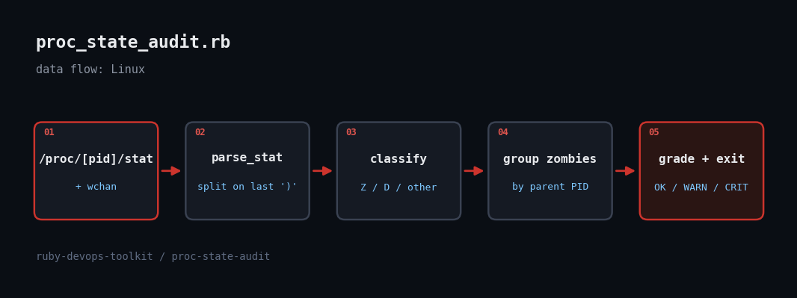

# Hunting Zombie and Stuck Processes on Linux with Ruby and /proc

> A box can look idle in every CPU graph and still be quietly rotting: zombies pile up behind a parent that never calls wait(), and D-state processes sit frozen on a dead NFS mount. This script finds both and tells you which parent to fix.



## The problem

Zombie (state Z) processes hold a PID-table slot and nothing else, but a leaking parent can exhaust `pid_max` and stop the box forking. Processes in uninterruptible sleep (state D) are worse: `kill -9` does nothing, load average climbs, and the usual cause is a hung NFS server or failing disk. `ps` shows them, but nobody reads `ps` at 3am. We want a cron-friendly check that groups zombies by their parent (the thing you need to restart) and lists what each D-state process is blocked on.

## Prerequisites

- Ruby 2.7+ (tested on 3.3.6); stdlib only, no gems
- Linux with `/proc` mounted (no root needed for state and ppid; `wchan` may read as `0` for other users' processes)
- Optional: cron or a Nagios-style runner to act on exit codes 0/1/2

## Usage

```
ruby proc_state_audit.rb
ruby proc_state_audit.rb --json
ruby proc_state_audit.rb --zombie-crit 50 --d-crit 5
ruby proc_state_audit.rb --root ./fixture_proc   # test against a fake tree
```

## How it works

1. **Parse /proc/PID/stat safely** - The stat file is `pid (comm) state ppid ...`. The command name can contain spaces and parentheses, so the parser splits on the *last* `)` instead of on whitespace. A test covers a process literally named `we ird) (name`.
2. **Scan tolerantly** - Every numeric directory under the proc root is read. Processes exit between `readdir` and `read`, so `ENOENT`/`EACCES`/`ESRCH` are swallowed rather than crashing the scan.
3. **Group zombies by parent** - A zombie cannot be killed; its parent must reap it or die. `group_by(&:ppid)` turns 300 zombies into one line naming the guilty parent.
4. **Grade and exit** - Any zombie is WARN (threshold configurable), 20+ zombies or 3+ D-state processes is CRIT, and any D-state process is at least WARN. Exit codes 0/1/2 make it drop into cron or monitoring.
5. **Fixture mode** - `--root DIR` points the scanner at a fake proc tree, which is how the test-suite and the sample output below were produced.

## Example output

```
proc-state-audit: WARN  (7 processes, 3 zombie, 2 D-state)
  ZOMBIES  parent=884    legacy-worker  count=3   e.g. pids 901,903,902
  D-STATE  pid=1200   rsync          blocked in: nfs_wait_bit_killable
  D-STATE  pid=1201   backup-agent   blocked in: nfs_wait_bit_killable
exit=1
{
  "status": "WARN",
  "total": 7,
  "zombie_count": 3,
  "dstate_count": 2,
  "zombie_parents": [
    {
      "ppid": 884,
      "parent": "legacy-worker",
      "zombies": 3,
      "pids": [
        901,
        903,
        902
Finished in 0.319938s, 12.5024 runs/s, 28.1305 assertions/s.

4 runs, 9 assertions, 0 failures, 0 errors, 0 skips
```

## Testing

Tested live in a Linux sandbox: 4 minitest cases against fixture proc trees (clean host, grouped zombies, a process name with parentheses, CRIT on stuck IO) plus a run against the sandbox's real /proc.

## Troubleshooting

- **wchan shows 0 or ?** - reading `/proc/PID/wchan` for other users' processes needs root or `kernel.kptr_restrict=0`. The audit still works; you just lose the blocked-in symbol.
- **Short-lived D-state blips** - a process in D for a few milliseconds during disk IO is normal. Run it twice, a few seconds apart, before paging anyone, or raise `--d-crit`.
- **Inside containers** - you only see your PID namespace. Run it on the host (or with `--root /proc` from a privileged container) to see everything.

## Extending it

- Sample twice and only report D-state PIDs present in both runs
- Send the JSON to a webhook or Prometheus textfile collector
- Read `/proc/PID/stack` (root) for the full kernel call chain
- Add process start time (stat field 22) to show how long a zombie has been around

## References

- [proc(5) man page](https://man7.org/linux/man-pages/man5/proc.5.html)
- [Ruby OptionParser docs](https://docs.ruby-lang.org/en/master/OptionParser.html)
- [wait(2) - zombie processes](https://man7.org/linux/man-pages/man2/wait.2.html)
