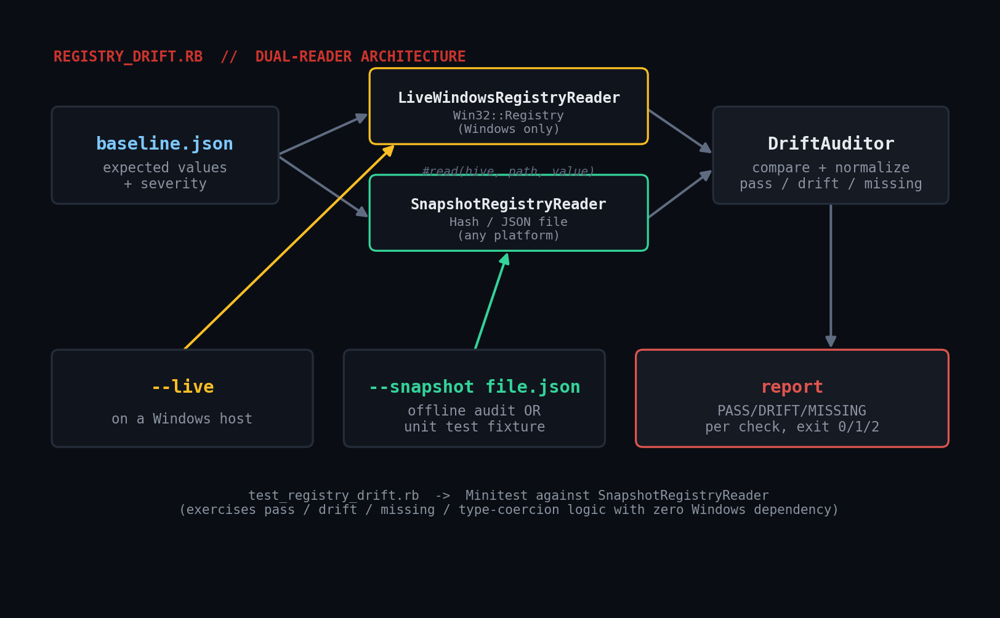

# registry_drift.rb

Compare a Windows machine's registry settings against a JSON security
baseline (the kind of thing a CIS benchmark or internal hardening
standard defines) and report which keys have drifted, which are
missing, and which match. Built for fleet-wide compliance auditing
where clicking through `regedit` on every box isn't an option.



## Prerequisites

- **Ruby 2.7+** (tested on Ruby 3.0.2) for the baseline loading, drift
  comparison, and reporting - all pure stdlib (`optparse`, `json`).
- **`--live` mode requires Windows** with RubyInstaller's Ruby, which
  ships `win32/registry`. It does **not** run on Linux/macOS.
- **`--snapshot` mode runs anywhere** - it reads "actual" values from a
  JSON file instead of the live registry, which is also how this
  script is unit-tested without a Windows host.

## Usage

```bash
ruby registry_drift.rb --baseline baseline.json --live
ruby registry_drift.rb --baseline baseline.json --snapshot snapshot.json
ruby registry_drift.rb --baseline baseline.json --snapshot snapshot.json --json
```

**Exit codes:** `0` every check passed, `1` drift or missing keys found,
`2` usage/input error.

### Baseline format

```json
[
  {
    "name": "UAC enabled (EnableLUA)",
    "hive": "HKEY_LOCAL_MACHINE",
    "path": "SOFTWARE\\Microsoft\\Windows\\CurrentVersion\\Policies\\System",
    "value": "EnableLUA",
    "expected": 1,
    "severity": "high"
  }
]
```

### Snapshot format (for `--snapshot`, and for offline auditing)

```json
{
  "HKEY_LOCAL_MACHINE\\SOFTWARE\\Microsoft\\Windows\\CurrentVersion\\Policies\\System\\EnableLUA": 1
}
```

A snapshot can be produced on the target machine with `reg export` or a
small PowerShell/Ruby dump script, then copied to your workstation for
offline auditing - no live WinRM/RDP access required per host.

## How it works

1. **Two interchangeable readers** implement `#read(hive, path, value)`:
   `LiveWindowsRegistryReader` (wraps `Win32::Registry`, `require`'d
   lazily so this file loads cleanly on non-Windows platforms too) and
   `SnapshotRegistryReader` (a plain Hash-backed fake). `DriftAuditor`
   only ever talks to that interface, never to either implementation
   directly.
2. **`DriftAuditor`** compares each baseline check's `expected` value
   against what the reader returns, normalizing both to strings first
   (JSON round-tripping can turn `1` into `"1"`; that shouldn't count
   as drift).
3. Each check becomes a `pass` / `drift` / `missing` result. Exit code
   is `0` only if every single check passed.

## Example output

```
$ ruby registry_drift.rb --baseline baseline.json --snapshot snapshot.json
registry_drift report
----------------------------------------------------------------------
[PASS   ] (HIGH  ) HKEY_LOCAL_MACHINE\SOFTWARE\...\EnableLUA
[DRIFT  ] (HIGH  ) HKEY_LOCAL_MACHINE\...\UserAuthentication
           expected=1 actual=0
[DRIFT  ] (CRITICAL) HKEY_LOCAL_MACHINE\...\DisableRealtimeMonitoring
           expected=0 actual=1
[MISSING] (MEDIUM) HKEY_LOCAL_MACHINE\...\NoDriveTypeAutoRun
           expected=255 actual=(not present)
----------------------------------------------------------------------
5 checks, 2 passed, 3 flagged
```

## Testing without a Windows host

`win32/registry` is Windows-only, so this script's logic is verified
with a Minitest suite (`test_registry_drift.rb`) that swaps in
`SnapshotRegistryReader` - a plain Hash-backed fake satisfying the same
`#read` interface a real reader would. That exercises every branch
(pass, drift, missing, string/integer type coercion) on any machine,
with zero Windows dependency:

```
$ ruby test_registry_drift.rb
Run options: --seed 37504
# Running:
......
Finished in 0.008992s, 667.2317 runs/s, 1000.8475 assertions/s.
6 runs, 9 assertions, 0 failures, 0 errors, 0 skips
```

This is an honest substitute for live-registry testing, not a
workaround - it was actually run in a Linux sandbox while writing this
tutorial. `--live` mode itself (the `Win32::Registry` calls) could not
be executed here since that API only exists on Windows; if you run it
on a real Windows host and hit a discrepancy, please open an issue.

## Troubleshooting

- **"win32/registry is not available on this Ruby/platform"** - you
  passed `--live` on non-Windows, or a Windows Ruby build without the
  win32 extensions. Use `--snapshot` instead, or switch to
  RubyInstaller's Ruby on the target host.
- **A value you know is set still reports MISSING** - check the exact
  `hive` spelling (`HKEY_LOCAL_MACHINE` vs the `HKLM` alias) and that
  `path` is the key, not the key+value combined.
- **Multi-string values report drift even though they "look" the
  same** - make sure your baseline's `expected` string matches the
  exact separator/format `Win32::Registry#[]` returns for that type.

## Extending it

- **Auto-remediation**: add a `--fix` mode (with a `--dry-run` default)
  that writes the expected value back for critical drifts.
- **Fleet-wide snapshots**: pull a snapshot from every host in an
  inventory file and roll results into one compliance dashboard.
- **CIS Benchmark import**: convert a published CIS Benchmark export
  into this script's `baseline.json` format instead of hand-transcribing.
- **Severity-weighted exit codes**: page differently for a `critical`
  drift versus a `medium` one.

## References

- [Ruby stdlib: OptionParser](https://docs.ruby-lang.org/en/3.0/OptionParser.html)
- [Minitest documentation](https://docs.seattlerb.org/minitest/)
- [RubyInstaller / win32-registry background](https://github.com/oneclick/rubyinstaller2)
