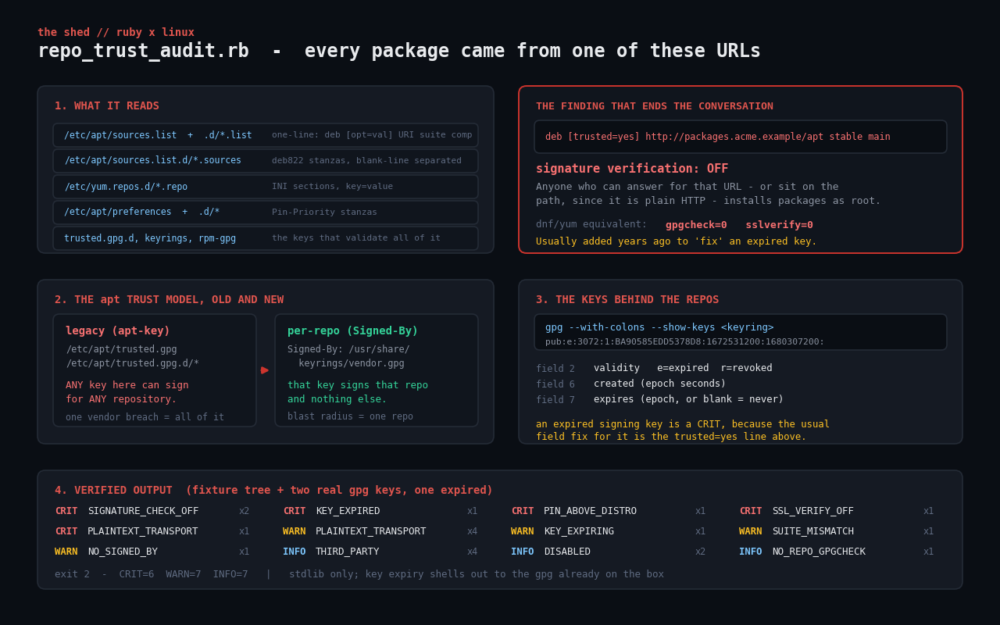

# repo-trust-audit

Audit the software repositories a Linux host trusts — and the signing keys
behind them.

Every package on the box arrived from a URL in one of these files, validated by
a key in one of these keyrings. That is the shortest supply chain an attacker
has to compromise, and almost nobody audits it. Meanwhile `trusted=yes` gets
added to "fix" an expired key at 2 a.m. and stays there for four years.



## Prerequisites

- Ruby 2.6 or newer (tested on Ruby 3.0.2). No gems — `optparse`, `json` and
  `time` only.
- Debian/Ubuntu (apt) or RHEL/Fedora (dnf/yum). Both are handled in one run, so
  a mixed fleet uses one script.
- `gpg` for signing-key inspection. It is already installed on any host that has
  apt or dnf. If it is missing, key checks are **skipped and reported as
  skipped** rather than quietly passing.
- Read access to the repo files. `/etc/apt/sources.list*` and
  `/etc/yum.repos.d/*` are world-readable; `/etc/apt/auth.conf.d` is not, and is
  not read by this script at all.

## Usage

```
ruby repo_trust_audit.rb                      # audit this host
ruby repo_trust_audit.rb --root ./captured    # audit a tree copied off a server
ruby repo_trust_audit.rb --expiry-warn 180    # warn further ahead of key expiry
ruby repo_trust_audit.rb --no-keys            # skip key inspection entirely
ruby repo_trust_audit.rb --json
```

Exit codes: `0` clean, `1` WARN, `2` at least one CRIT.

## What it reads

| Path | Format |
| --- | --- |
| `/etc/apt/sources.list`, `/etc/apt/sources.list.d/*.list` | one-line: `deb [opt=val] URI suite components` |
| `/etc/apt/sources.list.d/*.sources` | deb822 stanzas, blank-line separated |
| `/etc/yum.repos.d/*.repo` | INI sections, `key=value` |
| `/etc/apt/preferences`, `/etc/apt/preferences.d/*` | `Pin-Priority` stanzas |
| `/etc/apt/trusted.gpg.d`, `/etc/apt/keyrings`, `/usr/share/keyrings`, `/etc/pki/rpm-gpg` | signing keyrings |
| `/etc/os-release` | the host's codename, for suite-mismatch detection |

Commented-out repo lines are parsed too and reported as `DISABLED` — a disabled
repo is not a risk, but it is context, and "we turned that off, didn't we?"
deserves an answer.

## How it works

### 1. Three parsers, one model

Each source file yields the same `Repo` struct regardless of format, so the rule
engine never has to care whether it is looking at apt or dnf. The deb822 parser
handles continuation lines (a `Signed-By:` field can carry an entire armoured
key indented under it) and `Enabled: no`. The yum parser is a small INI reader
that carries the section name down as the repo id.

### 2. The finding that ends the conversation

```
deb [trusted=yes] http://packages.acme.example/apt stable main
```

`trusted=yes` disables signature verification **entirely**. Anyone who can
answer for that URL — or, since it is plain HTTP, sit anywhere on the path —
installs packages as root. The dnf equivalents are `gpgcheck=0` and
`sslverify=0`.

These are almost never added maliciously. They are added because a signing key
expired, `apt update` started failing, and the first Stack Overflow answer said
to add `trusted=yes`. Which is exactly why this script checks key expiry in the
same run.

### 3. The apt trust model, old and new

| | legacy (`apt-key`) | per-repo (`Signed-By`) |
| --- | --- | --- |
| Where | `/etc/apt/trusted.gpg`, `/etc/apt/trusted.gpg.d/*` | `Signed-By: /usr/share/keyrings/vendor.gpg` |
| Scope | **any** key here can sign for **any** repository | that key signs that repo, and nothing else |
| Blast radius | one vendor key compromise signs for the whole system | one repo |

`apt-key` has been deprecated since apt 2.2 and removed in newer releases, but
the keys it added are still sitting in `trusted.gpg.d` on plenty of hosts. The
script flags a non-empty `/etc/apt/trusted.gpg` (`LEGACY_TRUSTED_GPG`) and flags
**third-party** repos with no `Signed-By` (`NO_SIGNED_BY`).

It deliberately does *not* flag the distribution's own archives for missing
`Signed-By` — those are validated by the distro keyring package, which is the
intended design. A vendor repo riding on that same global keyring is the actual
problem, and that is what gets reported.

### 4. Key expiry, without writing an OpenPGP parser

Parsing OpenPGP packets by hand is a project in its own right, so this shells
out to the `gpg` already on the box and reads the machine-readable colon format:

```
$ gpg --no-default-keyring --batch --with-colons --show-keys /etc/apt/trusted.gpg.d/acme.gpg
pub:e:3072:1:BA90585EDD5378D8:1672531200:1680307200::u:::sc::::::23::0:
```

| Field | Meaning |
| --- | --- |
| 2 | validity — `e` expired, `r` revoked |
| 5 | key id |
| 6 | creation time (epoch seconds) |
| 7 | expiry time (epoch seconds, or blank for never) |

Expired → CRIT. Expiring inside `--expiry-warn` days (default 90) → WARN.
Revoked but still in a trusted keyring → CRIT.

Backup files (`*.gpg~`, left behind whenever a keyring is edited) are skipped,
or you get duplicate findings for keys that are no longer in use.

### 5. Pin priorities

apt's default priority for a normal repository is 500. A `Pin-Priority` above
that lets a source **replace OS packages**:

```
Package: *
Pin: origin packages.acme.example
Pin-Priority: 1001
```

`Package: *` makes it CRIT — that vendor can now ship a replacement for
`openssl`, `sudo` or `openssh-server` and apt will prefer it. A pin scoped to
named packages is a WARN: still worth a deliberate decision, much narrower blast
radius.

### 6. Suite mismatch

If `/etc/os-release` says `jammy` and a repo asks for `focal`, that is a
FrankenDebian in the making — it works right up until the next `dist-upgrade`.
Only recognisable release codenames are flagged; vendor repos legitimately use
suites like `stable`, `any` or `nodistro`, and those are left alone.

## Example output

Against a fixture tree containing a `trusted=yes` repo, a `gpgcheck=0` dnf repo,
a 1001-priority pin, a codename mismatch, and two **real** GPG keys — one
generated with `--faked-system-time` so it is genuinely expired:

```
$ ruby repo_trust_audit.rb --root ./fixtures --no-color

repository trust audit  -  7 enabled repo(s), 2 disabled, 2 signing key(s)
host codename: jammy
==============================================================================

repositories
------------------------------------------------------------------------------
    http://archive.ubuntu.com/ubuntu               /etc/apt/sources.list:1
      suite=jammy
    http://security.ubuntu.com/ubuntu              /etc/apt/sources.list:2
      suite=jammy-security
  # http://archive.ubuntu.com/ubuntu               /etc/apt/sources.list:3
      suite=jammy
    http://archive.ubuntu.com/ubuntu               /etc/apt/sources.list:4
      suite=focal
    http://packages.acme.example/apt               /etc/apt/sources.list.d/acme.list:2
      suite=stable  TRUSTED=YES
    https://repo.nimbus.example/deb                /etc/apt/sources.list.d/nimbus.sources:1
      suite=jammy  signed-by=nimbus.gpg
  # http://legacy.nimbus.example/deb               /etc/apt/sources.list.d/nimbus.sources:7
      suite=jammy
    https://rpm.vendor.example/el9/                /etc/yum.repos.d/vendor.repo:1
      signed-by=RPM-GPG-KEY-vendor
    http://nightly.vendor.example/el9/             /etc/yum.repos.d/vendor.repo:9
      gpgcheck=0

CRIT  KEY_EXPIRED   (1)
------------------------------------------------------------------------------
    BA90585EDD5378D8 Acme Vendor Repo (test) <repo@acme.example>
      signing key expired 2023-04-01. Updates from the repo it signs will
      start failing, and the usual "fix" people reach for is trusted=yes.
      at /etc/apt/trusted.gpg.d/acme-vendor.gpg

CRIT  PIN_ABOVE_DISTRO   (1)
------------------------------------------------------------------------------
    * <- origin packages.acme.example
      Pin-Priority 1001 is above the distribution's 500, so this source can
      replace OS packages - and it applies to every package.
      at /etc/apt/preferences.d/99-acme:1

CRIT  SIGNATURE_CHECK_OFF   (2)
------------------------------------------------------------------------------
    deb http://packages.acme.example/apt stable
      trusted=yes disables signature verification entirely. Anyone who can
      answer for this URL - or sit on the path when it is plain HTTP - can
      install packages as root.
      at /etc/apt/sources.list.d/acme.list:2
    vendor-nightly
      gpgcheck=0 disables package signature verification for this repo.
      at /etc/yum.repos.d/vendor.repo:9

WARN  KEY_EXPIRING   (1)
------------------------------------------------------------------------------
    1868B9F34243DDFA Nimbus Packages (test) <pkg@nimbus.example>
      signing key expires in 61 days (2026-11-20).
      at /usr/share/keyrings/nimbus.gpg

WARN  SUITE_MISMATCH   (1)
------------------------------------------------------------------------------
    deb http://archive.ubuntu.com/ubuntu focal
      suite focal does not match this host's codename jammy. Mixing releases
      ("FrankenDebian") breaks on the next dist-upgrade.
      at /etc/apt/sources.list:4

==============================================================================
summary  CRIT=6  WARN=7  INFO=7
```

Trimmed — the full run also reports `SSL_VERIFY_OFF`, `PLAINTEXT_TRANSPORT`
(CRIT on the `trusted=yes` repo, WARN elsewhere), `NO_SIGNED_BY`,
`NO_REPO_GPGCHECK`, `DISABLED` and `THIRD_PARTY`. Exit code was `2`.

## Troubleshooting

**Lots of `PLAINTEXT_TRANSPORT` on a stock Ubuntu box.** Expected —
`archive.ubuntu.com` is HTTP by default, and signatures still protect package
*contents*. It is a WARN, not a CRIT, because what leaks is the package list you
fetch (and therefore what you are told to install), not the packages themselves.
It becomes CRIT when combined with `trusted=yes`.

**`THIRD_PARTY` on a mirror we run ourselves.** The allowlist is a constant at
the top of the script. Add your own mirror hostnames to `DISTRO_HOSTS`.

**"gpg is not installed, so signing-key expiry was not checked."** Install
`gnupg`, or pass `--no-keys` to make the omission explicit.

**No findings at all on a host you know is messy.** Check you are not running
with `--root` pointed at an empty tree, and that `/etc/apt/sources.list.d` is
readable.

**A key shows as expired but `apt update` works fine.** Check whether another,
newer copy of the same key exists in a different keyring — apt will use it. The
report names the keyring file for exactly this reason.

**deb822 files with an inline armoured `Signed-By`.** Parsed as a continuation
line and reported as present; the script does not extract and inspect an inline
key, only file paths. That is a real gap — see below.

## Extending it

- **Inspect inline `Signed-By` keys.** Write the armoured block to a temp file
  and run it through the same `KeyInspector`.
- **Reachability.** A `HEAD` on each repo's `Release`/`repomd.xml` catches the
  dead vendor repo that has been failing silently for eight months.
- **`Release` file freshness.** Parse `Valid-Until` from the cached
  `/var/lib/apt/lists/*_Release` and flag stale metadata — that is how you
  detect a freeze/replay attack, and also just a broken mirror.
- **Fleet inventory.** `--json` from every host into one table answers "which
  boxes still trust the 2019 vendor key?" in one query.
- **A pure-Ruby OpenPGP reader.** Dropping the `gpg` dependency means parsing
  public-key and signature packets, including the self-signature subpacket that
  carries key expiry. Genuinely interesting, and a good excuse to learn
  `String#unpack`.
- **CI gate.** Non-zero exit already works as a gate; add `--fail-on WARN` so a
  golden image cannot be published with an expiring key.

## References

- [`sources.list(5)` — Debian manpages](https://manpages.debian.org/bookworm/apt/sources.list.5.en.html) — the one-line and deb822 formats, and every `[option=value]`.
- [`apt_preferences(5)` — Debian manpages](https://manpages.debian.org/bookworm/apt/apt_preferences.5.en.html) — what priority 500 and 1001 actually mean.
- [`apt-key(8)` deprecation notice](https://manpages.debian.org/bookworm/apt/apt-key.8.en.html) — why `Signed-By` replaced it.
- [GnuPG `--with-colons` field format](https://github.com/gpg/gnupg/blob/master/doc/DETAILS) — the authoritative description of the `pub:` record parsed here.
- [`dnf.conf(5)` repo options](https://dnf.readthedocs.io/en/latest/conf_ref.html) — `gpgcheck`, `repo_gpgcheck`, `sslverify`.

## License

MIT, same as the rest of the toolkit.
