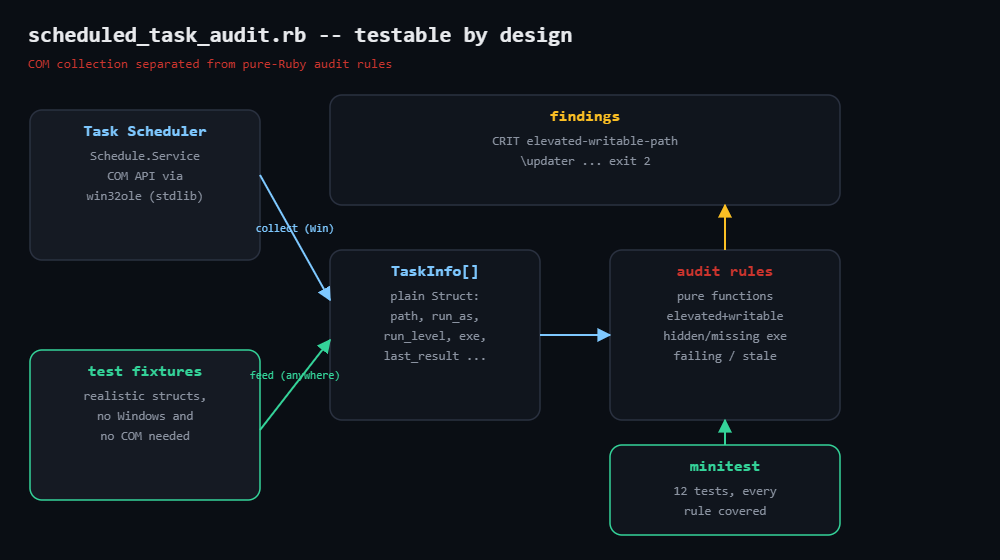

# scheduled-task-audit

Audits Windows Scheduled Tasks via the Task Scheduler 2.0 COM API
(`Schedule.Service` through stdlib `win32ole`) for persistence tricks and
neglect: elevated tasks running from user-writable paths, hidden tasks,
missing executables, chronic failures, stale jobs, and missed runs.

Collection (COM) and analysis (pure Ruby) are deliberately separated, so the
detection rules are fully unit-testable on any OS — see
`test_scheduled_task_audit.rb` (12 tests, no Windows or COM required).



## Prerequisites

- **Collector**: Windows + Ruby (RubyInstaller); `win32ole` ships with Ruby on
  Windows. Run from an elevated prompt to see every task.
- **Audit rules / tests**: any OS, plain Ruby.

## Usage

```powershell
ruby scheduled_task_audit.rb            # text report, \Microsoft\* excluded
ruby scheduled_task_audit.rb --json
ruby scheduled_task_audit.rb --all      # include \Microsoft\* (noisy)
ruby scheduled_task_audit.rb --stale-days 60
```

```bash
ruby test_scheduled_task_audit.rb       # runs anywhere
```

Exit codes: `0` clean · `1` warnings · `2` criticals.

## How it works

1. **Walk the tree over COM** — `WIN32OLE.new('Schedule.Service')` +
   `Connect`; `GetTasks(1)` passes `TASK_ENUM_HIDDEN` so hidden tasks are
   included; a recursive lambda descends every subfolder.
2. **Flatten to `TaskInfo`** — each COM object becomes a plain Struct (path,
   principal, run level, exec action, `LastTaskResult`, last run, missed runs,
   and `exe_missing`, computed after expanding `%ENVVAR%` the way Task
   Scheduler would). COM quirks stay in one function.
3. **Audit rules** (pure functions):
   - `elevated-writable-path` (CRIT) — SYSTEM / highest-runlevel task whose
     binary lives under `C:\Users\...`, `C:\ProgramData\...` or temp dirs:
     any local user can swap the binary and own the box at next trigger
   - `hidden-task` — concealment outside `\Microsoft\`
   - `missing-executable` — enabled task pointing at a deleted binary
   - `failing-task` — nonzero `LastTaskResult` (0x41303 "not yet run" exempt)
   - `stale-task` — enabled but silent past `--stale-days`
   - `missed-runs` — more than 3 missed runs

## Example findings (fixture fleet)

```
scheduled_task_audit: 4 tasks scanned
CRIT elevated-writable-path   \updater                 runs as SYSTEM (highest) from user-writable path C:\Users\bob\AppData\Local\updater\updater.exe
WARN hidden-task              \Adobe\telemetry-helper  task is hidden from the UI — legitimate software rarely needs this
WARN missing-executable       \MyCorp\log-ship         enabled task points at C:\Tools\logship.exe, which no longer exists
WARN failing-task             \MyCorp\log-ship         last run returned 0x80070002
1 CRIT, 5 WARN
```

## Testing notes (honest ones)

The audit rules were verified with the bundled minitest fixtures on Linux
(12 runs, 24 assertions, 0 failures). The COM collector follows the documented
Task Scheduler 2.0 API but requires a real Windows host — run it on one before
trusting fleet numbers.

## Troubleshooting

- **`WIN32OLERuntimeError` on Connect** — Task Scheduler service stopped or a
  stripped container image; check `sc query schedule`.
- **Fewer tasks than the UI** — you're not elevated.
- **ProgramData false positives** — the path heuristic can't see ACLs; some
  vendors lock their subfolder down correctly. Verify with `icacls`, or extend
  the script to query ACLs.

## Extending

- Replace the writable-root heuristic with real ACL checks (`icacls` / WMI)
  for write access by `BUILTIN\Users`.
- Baseline diffing: alert only on *new* tasks — fresh persistence is the
  highest-signal event on a box.
- Surface at-logon / at-startup triggers.
- Fleet rollup over WinRM; aggregate JSON by finding code.

## References

- Blog post: https://tha-shed.com/ (Ruby for DevOps series)
- Task Scheduler 2.0 API: https://learn.microsoft.com/en-us/windows/win32/taskschd/task-scheduler-start-page
- Ruby stdlib `WIN32OLE`: https://docs.ruby-lang.org/en/3.3/WIN32OLE.html
- MITRE ATT&CK T1053.005 (Scheduled Task): https://attack.mitre.org/techniques/T1053/005/
