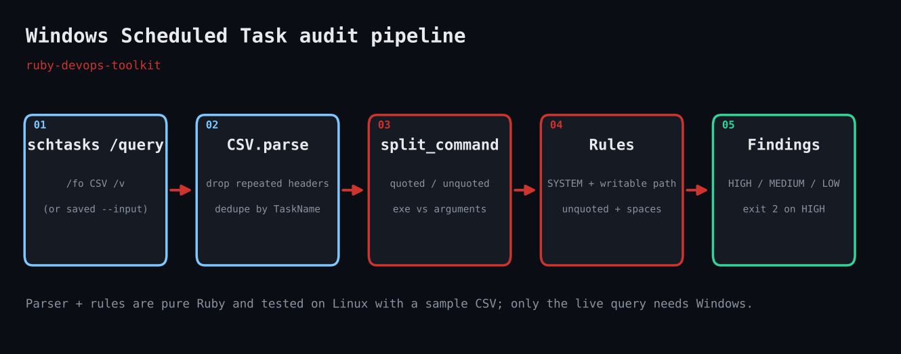

# Windows Scheduled Task Audit

Audits Windows Scheduled Tasks (via `schtasks /query /fo CSV /v`) for privileged tasks running binaries from user-writable paths, unquoted paths and failures.



## Prerequisites

- Ruby 3.0+ (RubyInstaller on Windows); standard library only (`csv`, `json`, `optparse`)
- Windows for the live query; the parser also runs on Linux/macOS with `--input` on a saved dump
- Run from an elevated prompt to see tasks owned by other accounts

## Usage

```bash
ruby schtasks_audit.rb --input sample_schtasks.csv
```

## How it works

### Querying the scheduler

Without `--input` the script runs `schtasks /query /fo CSV /v`. With `--input` it reads a saved dump, which also makes the logic testable anywhere.

### Cleaning the CSV

The verbose output repeats the header row before every task and emits one row per trigger. `load_tasks` drops repeated headers and de-duplicates by `TaskName`.

### Splitting the command line

`split_command` separates a quoted path or a path ending in a known extension (`.exe`, `.bat`, `.ps1`...) from its arguments, so rules can look at the executable alone.

### The rules

A task is privileged if it runs as SYSTEM, a service account or an Administrator. Privileged tasks are HIGH if the executable is in a user-writable location or unquoted with spaces, MEDIUM if the last result is non-zero, LOW if third-party and otherwise clean. Disabled tasks and COM-handler tasks are skipped.

### Exit codes for automation

The script exits 2 when any HIGH finding exists, so you can run it from a scheduled task or CI and alert on failure.

## Example output

```text
Scanned 6 scheduled tasks, 3 findings

[HIGH  ] \Backup Nightly
         run as : SYSTEM
         command: C:\Users\bob\AppData\Local\Temp\backup.exe /full
         why    : privileged task runs binary from user-writable location
[HIGH  ] \Vendor Updater
         run as : SYSTEM
         command: C:\Program Files\Acme Updater\update.exe --silent
         why    : unquoted path with spaces: Windows tries shorter paths first (C:\Program.exe)
[MEDIUM] \Disk Cleanup
         run as : SYSTEM
         command: "C:\Program Files\Cleanup\clean.exe" /quiet
         why    : privileged task last result 1 (non-zero)
```

## Troubleshooting

- `schtasks query failed`: you are not on Windows or the shell lacks `schtasks`; use `--input` with a dump.
- Localised Windows: column headers are translated; run `chcp 437` or export with an English locale.
- Accented characters garbled: the script reads with `bom|utf-8`; re-save the dump as UTF-8.
- Honest caveat: the live `schtasks` call could not be executed in the Linux test sandbox. The parser and every rule were tested against a realistic sample CSV (included); the Windows-only call is a one-line backtick.

## Extending

- Resolve each executable's ACL with `icacls` and flag only paths that are actually writable by Users.
- Query remote hosts with `schtasks /s HOST`.
- Diff results against yesterday's JSON to spot newly created tasks.
- Send HIGH findings to a webhook.

## References

- [schtasks query (Microsoft Learn)](https://learn.microsoft.com/en-us/windows-server/administration/windows-commands/schtasks-query)
- [Ruby CSV docs](https://docs.ruby-lang.org/en/3.3/CSV.html)
- [RubyInstaller for Windows](https://rubyinstaller.org/)

Part of [ruby-devops-toolkit](https://github.com/jjam3774/ruby-devops-toolkit). MIT licensed.
