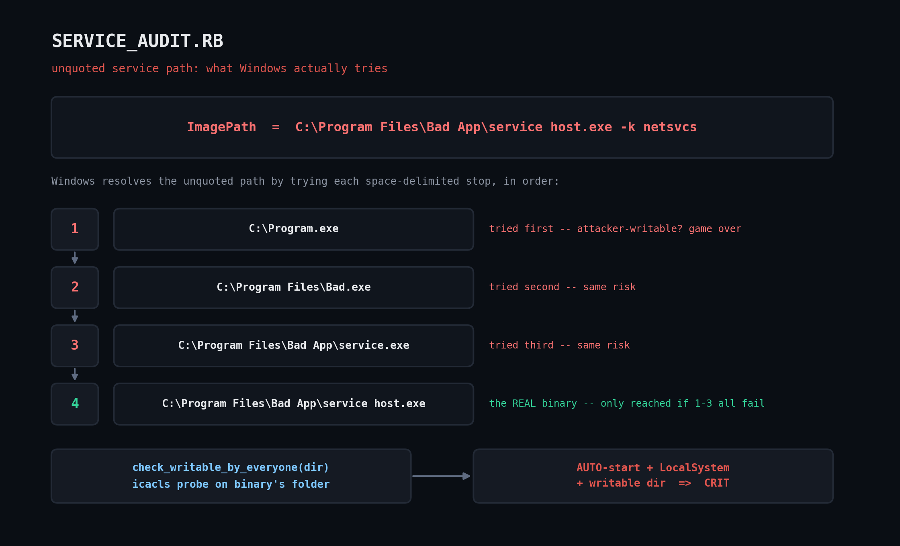

# service_audit.rb — Windows Service Inventory & Unquoted-Path Security Audit (WMI)

Enumerates every Windows service via WMI (`Win32_Service`) and flags the specific
misconfigurations that show up over and over in privilege-escalation checklists
(PrivescCheck, WinPEAS, PowerUp) and CIS benchmarks.



## The bug

When a service's binary path contains a space and isn't wrapped in quotes — e.g.
`C:\Program Files\My App\service.exe` — the Service Control Manager doesn't know where the
executable name ends. It tries `C:\Program.exe` first, then `C:\Program Files\My.exe`, and
only reaches the real binary if both of those don't exist. If the service runs as
`LocalSystem` (extremely common) and any earlier stop in that chain is writable by a
non-admin account, that account can drop a malicious `Program.exe` and get SYSTEM on next
reboot — no exploit required, just a filesystem write.

## Prerequisites

- Windows with a standard Ruby install (RubyInstaller for Windows) — `win32ole` ships with
  it, no gem needed
- Elevated (Administrator) shell for a complete scan — some fields may be blank without it,
  and the ACL probe needs read access to each service's install directory
- `icacls.exe` on `PATH` (present by default on every supported Windows version)

## Usage

```powershell
ruby service_audit.rb
ruby service_audit.rb --json
ruby service_audit.rb --state Running
```

Exits `2` if any CRIT finding exists.

## How it works

1. Queries `Win32_Service` via `WIN32OLE.connect('winmgmts://./root/cimv2')` for structured
   service objects (`PathName`, `StartMode`, `StartName`) instead of parsing `sc.exe qc` text
   output, which has changed format across Windows versions.
2. `unquoted_path_vulnerable?` flags a path only when it's unquoted **and** has a space
   **before** the `.exe` — a quoted path with trailing arguments like
   `"C:\App\service.exe" --run` is correctly left alone.
3. `unquoted_path_candidates` reconstructs the exact sequence of paths Windows itself would
   try, so a reviewer sees precisely what's exploitable.
4. A second, independent check correlates `StartMode == 'Auto'` + running as a system account
   + a binary directory that `icacls` shows as writable by Everyone/Users — the combination
   that makes the bug immediately exploitable rather than theoretical. This check **fails
   closed**: if `icacls` output can't be parsed, it returns "unknown" rather than a false
   accusation.

## Example output

Verified with a WIN32OLE stub test harness (this script requires a real Windows host to run
against live WMI; see `test_harness.rb` pattern described below) feeding five realistic
service records:

```
==============================================================================
WINDOWS SERVICE SECURITY AUDIT (Win32_Service via WMI)
==============================================================================
Services scanned: 5  |  Findings: 3
------------------------------------------------------------------------------
[CRIT] BadApp  (Bad Application Service)
         state=Running  start_mode=Auto  start_name=LocalSystem
         path=C:\Program Files\Bad App\service host.exe -k netsvcs
         -> UNQUOTED_PATH: C:\Program.exe, C:\Program Files\Bad.exe, C:\Program Files\Bad App\service.exe would be tried before the real binary
         -> BINARY_DIR_WRITABLE: C:/Program Files/Bad App appears writable by Everyone/Users while service runs as LocalSystem
[CRIT] ManualThing  (Manual Utility)
         state=Stopped  start_mode=Manual  start_name=LocalSystem
         path=C:\Custom Tools\utility runner.exe -service
         -> UNQUOTED_PATH: C:\Custom.exe, C:\Custom Tools\utility.exe would be tried before the real binary
[WARN] Weird1  ()
         state=Running  start_mode=Auto  start_name=NT AUTHORITY\NetworkService
         path="C:\Windows\weird1.exe"
         -> NO_DISPLAY_NAME: service metadata looks incomplete
==============================================================================
```

Note the quoted, properly-formed `GoodApp` and no-space `Spooler` fixtures in the test set
correctly produced *no* finding — confirming the detector doesn't false-positive on safe
paths.

## Troubleshooting

- Blank `StartName`/`PathName` fields for every service means the shell isn't elevated —
  re-run as Administrator.
- A `LoadError` on `win32ole` means this is running on a non-Windows Ruby build (some
  cross-compiled/JRuby builds omit it); use the stock RubyInstaller build.
- If `icacls` output looks garbled, check the system locale — permission abbreviations
  (`M`, `F`, `W`) are stable across locales, but header text isn't, which is why the regex
  only matches the abbreviation codes.

## Extending it

- Add a remediation mode that shells out to
  `sc.exe config <name> binPath= "<quoted-path>"` once a finding is confirmed (default to
  `--dry-run`).
- Pull `Win32_Service.DelayedAutoStart` and cross-reference dependency chains via
  `Win32_DependentService`.
- Point `--json` output at a fleet-wide collector so findings across hundreds of endpoints
  roll up into one dashboard.

## References

- [`Win32_Service` class (Microsoft Learn)](https://learn.microsoft.com/en-us/windows/win32/cimwin32prov/win32-service)
- [Ruby `win32ole` stdlib docs](https://docs.ruby-lang.org/en/3.3/WIN32OLE.html)
- [`icacls` reference (Microsoft Learn)](https://learn.microsoft.com/en-us/windows-server/administration/windows-commands/icacls)
