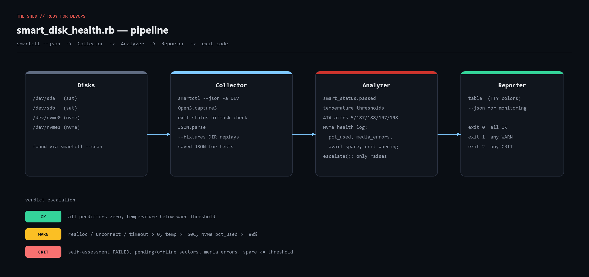

# smart-disk-health

S.M.A.R.T. health report for every disk on a Linux host, built on `smartctl --json`.
One line per drive, an **OK / WARN / CRIT** verdict with reasons, optional JSON, and
exit codes (0/1/2) you can gate cron alerts or Nagios checks on.



Blog post: https://tha-shed.com/ (search "smart_disk_health")

## Prerequisites

- Ruby 3.0+ (stdlib only: `json`, `open3`, `optparse`, `time`)
- smartmontools **7.0+** (`smartctl --json` support): `apt install smartmontools`
- root/sudo to read SMART data from block devices (not needed for `--fixtures`)

## Usage

```bash
sudo ruby smart_disk_health.rb                  # scan all disks, print table
sudo ruby smart_disk_health.rb --json            # machine-readable
sudo ruby smart_disk_health.rb --temp-warn 45 --temp-crit 55
ruby smart_disk_health.rb --fixtures fixtures    # replay saved smartctl JSON (no root, no disks)
```

Exit codes: `0` all OK, `1` at least one WARN, `2` at least one CRIT, `3` error.

## How it works

1. **Collector** runs `smartctl --json --scan` to enumerate devices, then
   `smartctl --json -a DEV` for each via `Open3.capture3`. smartctl's exit status is a
   bitmask; only bits 0/1 (can't open device) with empty stdout are treated as fatal
   for that drive. Unreadable drives become a WARN row instead of a crash.
2. **Analyzer** normalizes ATA and NVMe into one `Result` struct:
   - `smart_status.passed == false` -> CRIT (firmware's own verdict)
   - temperature >= `--temp-warn` (50C) -> WARN, >= `--temp-crit` (60C) -> CRIT
   - ATA attrs 5 / 187 / 188 non-zero -> WARN; 197 / 198 non-zero -> CRIT;
     any attribute with `when_failed` set -> CRIT
   - NVMe: `percentage_used` >= 80 -> WARN; `media_errors` > 0, `available_spare`
     <= threshold, or `critical_warning` != 0 -> CRIT
   - `escalate` only ever raises the verdict, never lowers it.
3. **Reporter** prints an aligned table (ANSI colors only on a TTY) or JSON and maps
   the worst verdict to the exit code.

## Example output

```
DEVICE         MODEL                      TYPE    TEMP    HOURS  STATUS REASONS
----------------------------------------------------------------------------------------------------
/dev/nvme0     Samsung SSD 980 PRO 1TB    nvme     41C     8760  OK     healthy
/dev/nvme1     KINGSTON SA2000M8500G      nvme     47C    19934  CRIT   SMART overall-health self-assessment: FAILED; NVMe percentage_used=97%; NVMe media_errors=12; NVMe available_spare 6% at/below threshold; NVMe critical_warning bitmask=0x4
/dev/sda       WDC WD40EFRX-68N32N0       sat      38C    31245  OK     healthy
/dev/sdb       ST4000DM004-2CV104         sat      53C    42210  CRIT   temperature 53C >= 50C; Reallocated_Sector_Ct=24; Reported_Uncorrect=3; Current_Pending_Sector=8; Offline_Uncorrectable=8

4 disk(s): 2 OK, 2 CRIT
```

## Testing

The `fixtures/` directory contains four saved `smartctl --json -a` documents (healthy
WD HDD, failing Seagate HDD, healthy Samsung NVMe, failed Kingston NVMe). Capture
your own with `smartctl --json -a /dev/sdX > fixtures/sdX.json`.

The script was developed in a Linux sandbox with no physical disks, so the live
`--scan` / `-a` path follows the documented smartctl JSON interface but was verified
only through fixtures. Run it on one real host before rolling out fleet-wide.

## Troubleshooting

- **`smartctl not found or --scan failed`** - install smartmontools >= 7.0.
- **Empty device list** - run as root; containers usually can't see host disks.
- **USB / RAID drives unreadable** - pass a device type (`-d sat`, `-d megaraid,N`);
  extend `Collector#collect` to use the `type` field from `--scan`.
- **Temperature nil** - fall back to ATA attribute 194 or 190.
- **Healthy SSD flagged** - some vendors reuse attribute IDs; add a model exclusion.

## Extending

- Emit Prometheus textfile metrics from the JSON output.
- Persist daily JSON and alert on *deltas* in reallocated sectors.
- Run across a fleet with `ssh-fleet-runner`; route CRIT rows to `alert-notifier`.
- Add `--run-short-test` to trigger `smartctl -t short` and read the self-test log.

## References

- smartctl man page: https://www.smartmontools.org/browser/trunk/smartmontools/smartctl.8.in
- smartmontools 7.0 release notes (JSON output): https://www.smartmontools.org/wiki/ReleaseNotes70
- Backblaze, "What SMART Stats Tell Us About Hard Drives": https://www.backblaze.com/blog/what-smart-stats-indicate-hard-drive-failures/
- Ruby Open3: https://docs.ruby-lang.org/en/3.3/Open3.html
