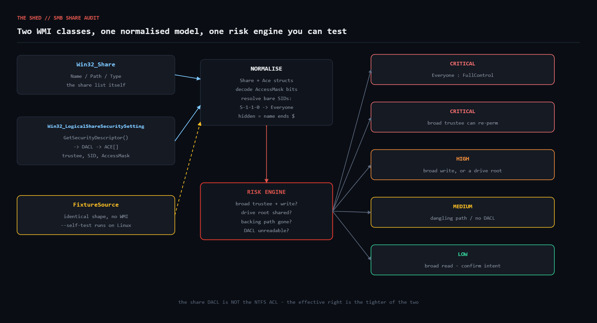

# smb-share-audit

Enumerate every SMB share on a Windows host via WMI, decode the **share-level**
DACL, and flag the dangerous combinations: broad trustees with write or full
control, shares exposing a whole drive root, shares whose backing folder no
longer exists, and descriptors that could not be read at all.



## The problem

File shares are where temporary access grants go to die.

Someone creates `\\FS01\ProjectX` for a two-week migration. The deadline is
tomorrow, so they tick **Everyone / Full Control** on the share permissions
dialog, tell themselves they will tighten it on Friday, and move on. Five years
later the share is still there, still Everyone/Full Control, and now holds
400 GB of finance data. Nothing in Windows ever reminds you.

The trap that makes this worse is that Windows has **two** access control lists
on every share, and the GUI puts them on different tabs:

- the **share DACL**, set in the Sharing tab — often left wide open because
  "NTFS will catch it"
- the **NTFS ACL** on the folder underneath, set in the Security tab

The effective permission is the *tighter* of the two, which is why leaving the
share DACL at Everyone/Full Control often causes no visible problem — right up
until someone loosens the NTFS side, or copies data into a folder that
inherits permissive ACLs. This script audits the share DACL specifically,
because it is the one that gets ignored.

## Prerequisites

| Requirement | Notes |
|---|---|
| Ruby | >= 2.7. A **Windows** build (RubyInstaller) for live mode — `win32ole` is bundled with it. |
| Gems | None. Stdlib only (`win32ole`, `json`, `optparse`). |
| OS | Windows for live mode. `--self-test` runs anywhere, including Linux CI. |
| Privileges | Local Administrator to read share security descriptors. Remote auditing additionally needs DCOM/WMI reachable and admin rights on the target. |

## Usage

```powershell
# Audit the local host (hidden admin shares excluded by default)
ruby smb_share_audit.rb

# A remote file server, as JSON
ruby smb_share_audit.rb --host FS01 --json

# Include C$ / ADMIN$ / IPC$, and fail the run on anything medium or worse
ruby smb_share_audit.rb --include-hidden --fail-on medium
```

```bash
# Verify the risk logic on any platform, no WMI involved
ruby smb_share_audit.rb --self-test
```

Exit codes: `0` nothing at or above the threshold, `1` findings present,
`2` the audit could not run.

## How it works

### Two WMI classes, not one

The share list and the share permissions live in different places:

| Class | Gives you |
|---|---|
| `Win32_Share` | `Name`, `Path`, `Type`, `Description` |
| `Win32_LogicalShareSecuritySetting` | `GetSecurityDescriptor()` → `Win32_SecurityDescriptor` → `DACL` → `ACE[]` |

`GetSecurityDescriptor` is a WMI method with an **out-parameter**, which is
genuinely awkward from Ruby. Depending on the Ruby/`win32ole` build the
descriptor arrives as a return value or only via `ExecMethod_`. The script
tries both rather than assuming:

```ruby
def extract_dacl(descriptor, setting)
  return descriptor.DACL if descriptor.respond_to?(:DACL)
  setting.ExecMethod_('GetSecurityDescriptor').Descriptor.DACL
rescue StandardError
  nil
end
```

Share names are interpolated into a WQL `WHERE` clause, so single quotes are
doubled (`gsub("'", "''")`) — share names are user-controlled and WQL injection
is a real thing.

### Decoding the access mask

`AccessMask` is a bitfield. The bits that matter for a share audit:

| Constant | Value | Meaning |
|---|---|---|
| `FILE_READ_DATA` | `0x00000001` | read |
| `FILE_WRITE_DATA` | `0x00000002` | write |
| `FILE_APPEND_DATA` | `0x00000004` | append |
| `DELETE` | `0x00010000` | delete |
| `WRITE_DAC` | `0x00040000` | **rewrite the ACL itself** |
| `WRITE_OWNER` | `0x00080000` | **take ownership** |
| `GENERIC_ALL` | `0x10000000` | everything |
| `FULL_CONTROL` | `0x001F01FF` | everything, expanded |

`WRITE_DAC` and `WRITE_OWNER` deserve their own severity. A trustee holding
either can grant themselves anything else, so "they only have WRITE_DAC" is not
a mitigation — it is full control with an extra step.

### Resolving bare SIDs

When an account is deleted, a trust breaks, or the DC is unreachable, WMI
returns an ACE with an empty `Trustee.Name` and only a SID. A naive audit skips
those, which is exactly backwards — an unresolvable `S-1-1-0` is still
Everyone. The script maps the well-known SIDs itself:

```ruby
def effective_name
  return trustee unless trustee.nil? || trustee.empty?
  Win::WELL_KNOWN_SIDS.fetch(sid.to_s, sid.to_s)
end
```

### Risk rules

| Rule | Severity | Fires when |
|---|---|---|
| `broad_full_control` | critical | Everyone / Authenticated Users / Domain Users etc. holds FullControl |
| `broad_can_reperm` | critical | a broad trustee holds `WRITE_DAC` or `WRITE_OWNER` |
| `broad_write` | high | a broad trustee can write, append or delete |
| `anonymous_read` | high | `ANONYMOUS LOGON` can read |
| `drive_root_share` | high | the share path is `X:\` and the share is not a hidden admin share |
| `dangling_path` | medium | the backing folder does not exist |
| `no_share_dacl` | medium | a disk share returned no ACEs at all |
| `broad_read` | low | a broad trustee has read only — usually intentional, worth confirming |

The hidden-share exclusion on `drive_root_share` matters: `C$` and `D$` are
built-in admin shares that point at drive roots by design, and flagging them
every run trains people to ignore the report.

### Testing Windows-only code

`win32ole` does not exist off Windows, so all WMI access is isolated in
`WmiSource`. `FixtureSource` produces the identical `Share`/`Ace` shape from a
literal, and `--self-test` runs the entire normalisation and risk pipeline
against a deliberately nasty (but realistic) fixture file server, asserting nine
properties of the result.

**Honest scope note:** `--self-test` verifies the classification logic — mask
decoding, SID resolution, every risk rule, and the hidden-share exception. It
does **not** verify the WMI calls themselves, because those cannot execute on
Linux. The `WmiSource` class was written against the documented WMI class
signatures and needs a real Windows host to validate end to end. Everything
below the `Share`/`Ace` boundary is covered by the self-test; `WmiSource` is not.

## Example output

`ruby smb_share_audit.rb --self-test`:

```
============================================================================
  SMB SHARE AUDIT   source=fixture (self-test)   2026-08-18 14:34:06
============================================================================
  6 share(s) enumerated, 6 finding(s)

  Finance  ->  D:\Finance   [Disk Drive]
      Allow Everyone : FullControl
      Allow CORP\Domain Admins : FullControl
      [CRIT] broad_full_control: Everyone has FullControl on the share DACL

  Public  ->  D:\Public   [Disk Drive]
      Allow Authenticated Users : Read,Write,Execute
      [HIGH] broad_write: Authenticated Users has write access (Read,Write,Execute)

  Reports  ->  D:\Reports   [Disk Drive]
      Allow CORP\Domain Users : Read,Execute
      Allow BUILTIN\Backup Operators : Read
      [LOW ] broad_read: Domain Users has read access -- confirm this is intended

  Wholedisk  ->  E:\   [Disk Drive]
      Allow CORP\svc_migrate : FullControl
      [HIGH] drive_root_share: share exposes the root of E:\, not a subfolder

  OldProject  ->  D:\Projects\Gone   [Disk Drive]
      Allow Everyone : Read
      [MED ] dangling_path: backing path D:\Projects\Gone does not exist -- stale share definition
      [LOW ] broad_read: Everyone has read access -- confirm this is intended

  ADMIN$ (hidden)  ->  C:\Windows   [Disk Drive Admin]
      (no share-level ACEs returned)

----------------------------------------------------------------------------
  6 shares | critical=1 high=2 medium=1 low=2
============================================================================

SELF-TEST
------------------------------------------------------------
  ok    Finance flagged critical for Everyone/FullControl
  ok    Public flagged high for Authenticated Users write
  ok    Reports NOT flagged above low (read-only by design)
  ok    Wholedisk flagged for sharing a drive root
  ok    OldProject flagged for a dangling backing path
  ok    Bare SID S-1-1-0 resolved to Everyone
  ok    ADMIN$ (hidden admin share) not flagged as a drive-root share
  ok    FULL_CONTROL mask decodes to FullControl
  ok    Read+Execute mask decodes without write rights
------------------------------------------------------------
  9/9 assertions passed
```

## Troubleshooting

**`win32ole is unavailable`.** You are on Linux or macOS, or on a Ruby built
without the Windows extensions. Use `--self-test` to exercise the logic; live
mode needs RubyInstaller on Windows.

**Every share shows `(no share-level ACEs returned)`.** Almost always
privileges: reading a share security descriptor requires local Administrator.
Run the shell elevated. If it persists on one specific share, the descriptor
really may be absent — which is what the `no_share_dacl` finding is for.

**`cannot reach WMI on FS01`.** Remote WMI needs DCOM (TCP 135 plus the dynamic
range) open, the Windows Management Instrumentation service running, and admin
rights on the target. Test independently with
`Get-CimInstance -ComputerName FS01 -ClassName Win32_Share`.

**A share is flagged `dangling_path` but the folder exists.** `Dir.exist?` is
evaluated **where the script runs**. Auditing `FS01` remotely from your
workstation checks the path on *your* machine. Run the script on the file
server, or treat that finding as advisory in remote mode.

**Everything looks fine but users still get in.** You audited the share DACL.
Check the NTFS ACL too (`Get-Acl`) — a permissive NTFS ACL under a tight share
is invisible to this script, and vice versa.

**`Win32_LogicalShareSecuritySetting` returns nothing for a printer share.**
Expected. It only covers disk shares; print queues and IPC have their own
security model.

## Extending

- **Pair it with the NTFS ACL.** Query `Win32_LogicalFileSecuritySetting` on
  `share.path` and report the *effective* permission — the tighter of the two —
  rather than the share DACL alone.
- **Fleet sweep.** `--host` already accepts a remote name; loop it over your
  server list and merge the JSON into one report.
- **Diff mode.** Persist the JSON and diff run to run, so a newly added
  Everyone ACE pages someone the same day it appears.
- **CIM instead of DCOM.** Shelling out to `Get-CimInstance` over WinRM
  replaces `WmiSource` entirely and works through firewalls that block DCOM.
- **Share enumeration from the client side.** `net view \\host` shows what an
  unprivileged user can *see*, which is a different and complementary question.

## References

- [`Win32_Share` class (Microsoft Learn)](https://learn.microsoft.com/en-us/windows/win32/cimwin32prov/win32-share)
- [`Win32_LogicalShareSecuritySetting` class](https://learn.microsoft.com/en-us/windows/win32/cimwin32prov/win32-logicalsharesecuritysetting)
- [`Win32_ACE` class and AccessMask values](https://learn.microsoft.com/en-us/windows/win32/cimwin32prov/win32-ace)
- [File access rights constants](https://learn.microsoft.com/en-us/windows/win32/fileio/file-access-rights-constants)
- [Well-known SID structures](https://learn.microsoft.com/en-us/windows/win32/secauthz/well-known-sids)
- [Ruby `win32ole` documentation](https://docs.ruby-lang.org/en/master/WIN32OLE.html)

## License

MIT — see the repository root.
