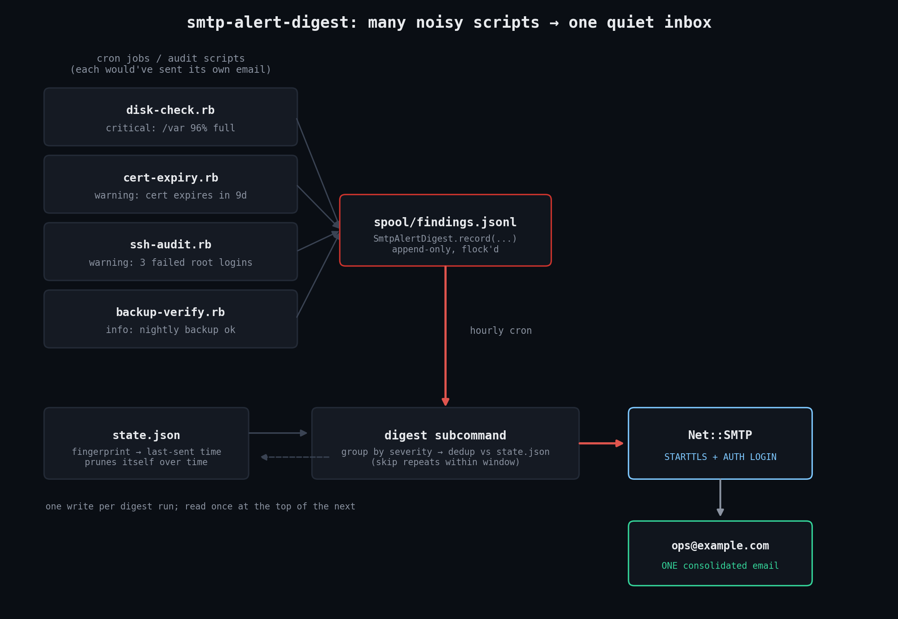
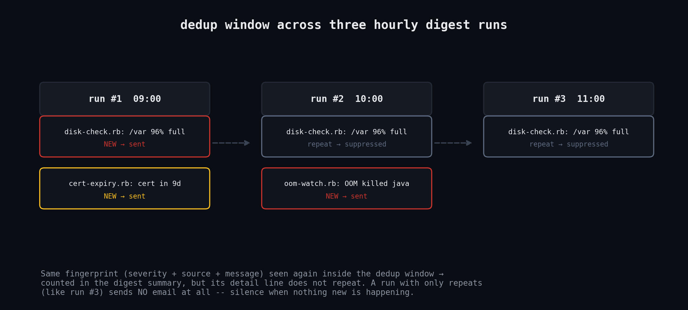

# smtp-alert-digest

A pure Ruby stdlib alert-digest mailer for cron jobs, health checks, and audit scripts. No gems.

## The problem

Every box eventually collects a handful of independent watchdogs: a disk-space check, a TLS
cert-expiry check, a failed-login auditor, a backup verifier. The path of least resistance for
each of them is "if something's wrong, shell out to `mail` or open an SMTP connection and send an
email." That works fine for exactly one script. It falls apart once you have ten of them:

- Five different scripts email five different times about the same underlying disk-full condition
  because they all noticed it on the same hourly cron tick.
- A flapping check re-alerts every single run, so the same "disk at 96%" email lands in the inbox
  24 times a day until someone mutes the sender.
- Nobody reads monitoring email anymore, which means the one email that actually mattered --
  the backup that silently stopped running three weeks ago -- gets missed too.

`smtp-alert-digest` gives every script one place to drop a finding instead of its own SMTP logic:

```ruby
SmtpAlertDigest.record(severity: :critical, source: "disk-check.rb",
                        message: "/var is at 96% capacity (raid1, /dev/md1)")
```

That's it -- one line appended to a local JSON-lines spool file, no network I/O, so a monitoring
script that would otherwise fail outright if the mail relay is down keeps working. Separately, on
a schedule (an hourly cron entry is typical), you run the same file as the digest sender:

```
ruby smtp_alert_digest.rb digest --to ops@example.com --from alerts@example.com \
     --smtp-host smtp.example.com --smtp-port 587 --starttls \
     --smtp-user alerts --smtp-pass "$SMTP_PASSWORD"
```

It reads the spool, groups findings by severity, drops anything that already fired within a
configurable dedup window, sends **one** consolidated email for whatever's new, and rotates the
spool so the next run starts clean. A run where every finding is a repeat of something already
alerted sends **no email at all** -- silence is the correct behavior when nothing new has
happened.

## Prerequisites

- Ruby >= 2.7 (developed and tested against Ruby 3.3.6; anything with `Net::SMTP#enable_starttls`
  taking an `OpenSSL::SSL::SSLContext`, i.e. Ruby >= 2.0, will work).
- No gems -- only stdlib: `net/smtp`, `openssl`, `json`, `fileutils`, `socket`, `optparse`,
  `digest`, `time`.
- Any OS with Ruby and a filesystem (Linux, macOS, BSD). File locking uses `File#flock`, which is
  a no-op stub on some non-POSIX platforms but does not error.
- An SMTP relay to send through for real use (a company mail relay, Postfix on localhost, or a
  transactional provider like Mailgun/SES/Postmark's SMTP endpoint). None is required to run the
  built-in selftest.

## Installation

Drop the single file on the box (or check it into the same repo as your other cron scripts):

```
curl -O https://raw.githubusercontent.com/jjam3774/ruby-devops-toolkit/main/smtp-alert-digest/smtp_alert_digest.rb
chmod +x smtp_alert_digest.rb
```

## Usage

### 1. Other scripts record findings

From any Ruby script on the box:

```ruby
require_relative "smtp_alert_digest"

SmtpAlertDigest.record(severity: :warning, source: "cert-expiry.rb",
                        message: "TLS cert for mail.example.com expires in 9 days")
```

`severity` accepts `critical` (aliases: `crit`, `fatal`, `error`), `warning` (alias: `warn`), or
`info` (alias: `notice`). If the calling script isn't Ruby, the same thing works from the shell:

```
ruby smtp_alert_digest.rb record --severity critical --source disk-check.sh \
     --message "/var is at 96% capacity"
```

Findings land in `~/.local/spool/smtp-alert-digest/findings.jsonl` by default (override with
`--spool-dir`, or the `SMTP_ALERT_DIGEST_SPOOL` environment variable, or a `spool_dir:` keyword to
`record`). Writes are `flock`-protected so concurrent cron jobs can't interleave partial lines.

### 2. A scheduled job sends the digest

Add one cron entry (hourly is a reasonable default):

```cron
0 * * * *  SMTP_ALERT_DIGEST_USER=alerts SMTP_ALERT_DIGEST_PASS=s3cret \
           ruby /opt/scripts/smtp_alert_digest.rb digest \
           --to ops@example.com --from alerts@example.com \
           --smtp-host smtp.example.com --smtp-port 587 --starttls
```

Credentials are read from `SMTP_ALERT_DIGEST_USER` / `SMTP_ALERT_DIGEST_PASS` if you don't want
them visible in `ps` output via `--smtp-user`/`--smtp-pass`. Useful flags:

| Flag | Purpose |
|---|---|
| `--dedup-window SECONDS` | How long a fingerprint stays "recently alerted" (default 21600 = 6h) |
| `--force` | Send even if nothing new (e.g. a daily heartbeat) |
| `--dry-run` | Print the composed email to stdout; don't send or rotate the spool |
| `--no-tls-verify` | Skip certificate verification (self-signed relays; not for production) |
| `--state-file FILE` | Override where the dedup fingerprint history is stored |

### 3. Try it with no mail server at all

```
ruby smtp_alert_digest.rb selftest
```

This spins up a real `TCPServer`-backed fake SMTP server on `127.0.0.1` (with a genuine
self-signed cert for STARTTLS and a hand-rolled AUTH LOGIN handshake), records five synthetic
findings including a duplicate, runs the real digest sender against it three times in a row, and
prints the full captured SMTP transcript plus the message bodies that were actually received. See
`test_output.txt` for a full captured run.

## How it works



```
cron jobs -> SmtpAlertDigest.record -> spool/findings.jsonl (JSON Lines, flock'd append)
                                              |
                                     (hourly cron) digest subcommand
                                              |
                     group by severity -> drop fingerprints seen within
                     the dedup window (checked against state.json)  -> compose ONE email
                                              |
                                    Net::SMTP (STARTTLS + AUTH LOGIN)
                                              |
                                         ops@example.com
```

Key design decisions:

- **JSON Lines, not a database.** Every finding is one `File#puts` of a JSON object, appended
  with an exclusive `flock`. Simple enough to `tail -f` or `jq` by hand, and no risk of a crashed
  writer corrupting anything but its own last (unflushed) line.
- **Dedup by content, not by script.** The fingerprint is `sha256(severity|source|message)`, so
  the same failure text recurring from the same source is what "recurring" means -- not "this
  script fired an alert." Two different problems from the same script both get through.
- **Dedup state is separate from the spool.** `state.json` holds `fingerprint -> last-alerted-at`
  and prunes itself every run. That means a *new* finding always fires even if the spool briefly
  has zero unprocessed lines, and a stale fingerprint eventually falls out of the window on its
  own without any manual cleanup.
- **No email is itself a signal.** If every finding in a run is a repeat, `run_digest` returns
  `sent: false` and nothing is mailed. Silence means "nothing new," which is exactly what you want
  from something meant to fight alert fatigue.
- **Spool rotation archives, it doesn't just delete.** After a successful send, the spool's
  contents are moved into `spool_dir/archive/findings-<timestamp>.jsonl` (keeping the most recent
  20) rather than discarded, so you can audit exactly what went into any given digest.
- **STARTTLS and AUTH LOGIN are exercised for real in the selftest**, against a real TCP
  connection and a real (self-signed, in-memory) TLS handshake -- not a mocked `Net::SMTP`. See
  Testing below.

## Example output

Digest email body (from a real captured run -- see `test_output.txt` for the full transcript):

```
Alert digest for vm
Generated: 2026-09-27T18:56:50Z

4 new finding(s) (1 critical, 2 warning, 1 info)
1 repeat finding(s) suppressed (already alerted within the last 360 min)

== CRITICAL ====================================================
  [2026-09-27 18:56:49 UTC] disk-check.rb: /var is at 96% capacity (raid1, /dev/md1)

== WARNING =====================================================
  [2026-09-27 18:56:49 UTC] cert-expiry.rb: TLS cert for mail.example.com expires in 9 days
  [2026-09-27 18:56:49 UTC] ssh-audit.rb: 3 failed root logins from 203.0.113.9 in the last hour

== INFO ========================================================
  [2026-09-27 18:56:49 UTC] backup-verify.rb: nightly backup completed, 4.2GB, 812 files

--
Sent by smtp_alert_digest.rb -- one email instead of one per check.
```



## Testing

This script is Linux-testable end to end with zero external dependencies, and it actually was:

```
ruby smtp_alert_digest.rb selftest
```

The selftest (`SmtpAlertDigest::SelfTest`, built into the same file) does not mock `Net::SMTP` --
it drives the real client against a real server:

1. Starts a `TCPServer` on `127.0.0.1` bound to an ephemeral port.
2. Speaks just enough hand-rolled SMTP (RFC 5321 `EHLO`/`MAIL`/`RCPT`/`DATA`, RFC 3207 `STARTTLS`,
   RFC 4954 `AUTH LOGIN`) to satisfy `Net::SMTP`, including a genuine in-process self-signed
   certificate (`OpenSSL::X509::Certificate` + `OpenSSL::PKey::RSA`) so the STARTTLS handshake is
   a real TLS negotiation, not a stub.
3. Records five synthetic findings (via the same `SmtpAlertDigest.record` API real scripts use),
   including one intentional duplicate.
4. Runs `SmtpAlertDigest.run_digest` -- the exact code path the cron job uses -- against that
   server and captures the full line-by-line transcript plus the raw message the server received.
5. Repeats with a second, then third digest run against fresh fake servers to prove the dedup
   window works across runs, and that an all-repeats run sends nothing (the third run points at
   an intentionally unreachable port to prove no connection is even attempted).

`test_output.txt` is the real captured stdout of that run (plus a separate CLI walkthrough of the
`record` and `digest --dry-run` subcommands), not a hand-written transcript.

## Troubleshooting

- **`Net::SMTPAuthenticationError`** -- check `--auth-type` matches what your relay supports
  (`login`, `plain`, or `cram_md5`); Gmail/Workspace and most transactional providers want `login`
  or `plain` over STARTTLS on port 587.
- **`OpenSSL::SSL::SSLError: certificate verify failed`** -- your relay's certificate isn't in the
  system trust store (common with internal/self-signed relays). Use `--no-tls-verify` only for
  known-internal relays; never for anything crossing the public internet.
- **Nothing gets sent and `--force` wasn't used** -- this is very likely correct behavior: every
  finding in the spool was already alerted within `--dedup-window`. Check `state.json` in the
  spool directory, or lower `--dedup-window` temporarily to confirm.
- **Findings pile up but no digest ever runs** -- confirm the cron entry actually fires
  (`grep CRON /var/log/syslog` on most distros) and that the `digest` subcommand's `--spool-dir`
  matches the directory the recording scripts write to (`SMTP_ALERT_DIGEST_SPOOL` must match on
  both sides, or pass `--spool-dir` explicitly everywhere).
- **Multiple cron jobs recording at once** -- each `record` call takes an exclusive `flock` on the
  spool file for the duration of a single line append, so concurrent writers are safe; if you see
  interleaved/corrupt lines anyway, check that the spool directory isn't on an NFS mount without
  proper lock support, since `flock` semantics over NFS are notoriously unreliable.

## Extending

- **Per-source routing** -- swap `--to` for a lookup table (e.g. `security@` for `ssh-audit.rb`
  findings, `ops@` for everything else) and send one digest per recipient group.
- **Severity threshold** -- add a `--min-severity` flag to `run_digest` that drops `info` findings
  from the email entirely while still recording them, for a quieter daily summary.
- **Slack/webhook fallback** -- `render_email_body` already returns a plain string; pipe the same
  text to a webhook via `Net::HTTP` (still stdlib) alongside, or instead of, SMTP.
- **JSON output mode** -- add a `--json` flag to `digest --dry-run` that emits the digest as
  structured JSON instead of a rendered email, for feeding into another aggregator.
- **Systemd timer instead of cron** -- the script has no dependency on cron specifically; a
  `systemd` `.timer`/`.service` pair calling the same `digest` subcommand works identically.

## References

- [Ruby stdlib: `Net::SMTP`](https://docs.ruby-lang.org/en/3.3/Net/SMTP.html) -- the SMTP client
  used for sending, including `enable_starttls` and the supported AUTH mechanisms.
- [Ruby stdlib: `OpenSSL::SSL::SSLContext`](https://docs.ruby-lang.org/en/3.3/OpenSSL/SSL/SSLContext.html)
  -- used both by the real STARTTLS client path and by the selftest's fake server to terminate TLS.
- [RFC 5321 -- Simple Mail Transfer Protocol](https://www.rfc-editor.org/rfc/rfc5321) -- the base
  protocol the fake server implements (EHLO/MAIL/RCPT/DATA).
- [RFC 3207 -- SMTP Service Extension for Secure SMTP over TLS](https://www.rfc-editor.org/rfc/rfc3207)
  -- defines the `STARTTLS` command the fake server and `Net::SMTP` both speak.
- [Get the code on GitHub](https://github.com/jjam3774/ruby-devops-toolkit/tree/main/smtp-alert-digest)
