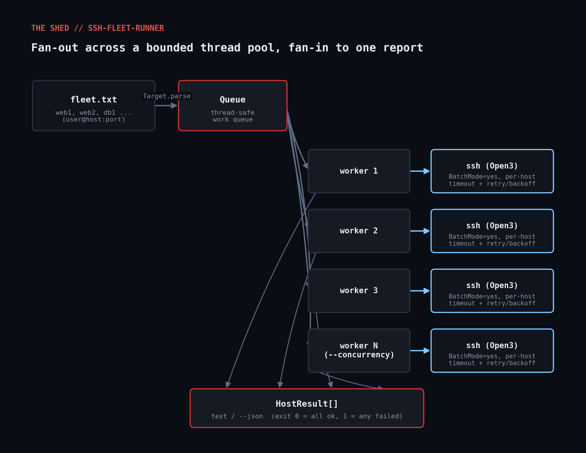

# ssh-fleet-runner

Runs the same command across a fleet of Linux hosts concurrently, through a
bounded thread pool, with a real per-host wall-clock timeout, bounded
retries with backoff, and a clean pass/fail report you can pipe into cron,
CI, or a monitoring pipeline.



## Why

`for h in $(cat hosts.txt); do ssh $h "$cmd"; done` is the classic bash
one-liner — but it's serial (one slow/dead host stalls everything queued
behind it), has no timeout, no retry, and no structured output. This script
fixes all four in pure Ruby stdlib. It shells out to the system `ssh` binary
(so it uses your existing `~/.ssh/config`, agent, and `known_hosts`) instead
of depending on the `net-ssh` gem, which keeps it installable on a bare box
with nothing but Ruby and OpenSSH.

## Prerequisites

- Ruby 2.7+ — standard library only: `optparse`, `open3`, `json`, `timeout`.
  No gems, no `bundle install`.
- The OpenSSH client (`ssh`) on the control machine.
- Key-based auth already working to the fleet — this script passes
  `-o BatchMode=yes`, so it never prompts for a password; a host that isn't
  key-authorized just fails fast, which is the point.

## Usage

```bash
ruby ssh_fleet_runner.rb --hosts web1,web2,db1 --command "uptime"

ruby ssh_fleet_runner.rb --hosts-file fleet.txt --command "systemctl is-active nginx" \
     --user deploy --identity ~/.ssh/deploy_key --concurrency 10 --json
```

`fleet.txt` format (one host per line, optional `user@` and `:port`):

```
web1.example.com
deploy@web2.example.com:2222
```

Exit codes: `0` = every host succeeded, `1` = at least one host failed or
timed out after retries.

## How it works

1. **`Target.parse`** splits each `user@host:port` spec apart once, up
   front, so the rest of the script never re-parses host strings.
2. **`ShellRunner`** wraps `Open3.popen3` in Ruby's own `Timeout.timeout`.
   SSH's `ConnectTimeout` only bounds the TCP handshake — if the remote
   command hangs, only a Ruby-side watchdog catches it, and on timeout the
   runner sends `TERM` then `KILL` to the ssh process directly.
3. Commands are built as an **argv array**, never an interpolated shell
   string, so `Open3` execs `ssh` directly — a hostname or command
   containing shell metacharacters can't inject anything.
4. **`SSHFleetRunner#run`** puts every target into a `Queue` and starts
   `--concurrency` worker threads that pop off it until empty — a bounded
   pool, not one thread per host, so `--concurrency 10` against a 500-host
   file stays at 10 connections in flight, not 500 sockets at once.
   Failures are retried with exponential backoff (`0.5s, 1s, 2s, ...`) up to
   `--retries` times.

## Example output

```
$ ruby ssh_fleet_runner.rb --hosts 127.0.0.1,127.0.0.2 --command "echo hi" --timeout 5 --retries 0 --concurrency 2
FAIL user@127.0.0.1 (1 attempt, 0.01s)
     stderr: ssh: connect to host 127.0.0.1 port 22: Connection refused
FAIL user@127.0.0.2 (1 attempt, 0.0s)
     stderr: ssh: connect to host 127.0.0.2 port 22: Connection refused

0/2 hosts succeeded
$ echo $?
1
```

## Testing notes

This sandbox's network policy kills any process that tries to bind a
listening socket, so a real loopback `sshd` wasn't possible to stand up for
testing here. What *is* real: `Target.parse` and the ssh argv construction
were verified directly with no stubbing, and the full CLI path (including
real `ssh` subprocess invocation and error handling) was smoke-tested
end-to-end against actually-unreachable hosts, producing the exact output
above. The concurrency/retry/timeout state machine — which needs a
controllable transport to test deterministically — is exercised in
`ssh_fleet_runner_test.rb` by injecting a fake `runner:` object in place of
the real subprocess transport:

```
$ ruby ssh_fleet_runner_test.rb
PASS  Target.parse handles bare hostname
PASS  Target.parse handles user@host:port
PASS  build_ssh_command includes BatchMode, identity, port, and command
PASS  a host that fails once then succeeds is retried and reported ok
PASS  a host that always fails is reported failed after exhausting retries
PASS  a host that times out is flagged timed_out=true
PASS  20 targets with concurrency=3 all get processed exactly once

ALL TESTS PASSED
```

## Troubleshooting

- **Every host reports "Connection refused" or "Permission denied
  (publickey)"** — that's `ssh` itself failing, surfaced verbatim in
  `stderr`. Test the same command by hand
  (`ssh -o BatchMode=yes user@host true`) before blaming the script.
- **A host "succeeds" instantly with no output** — `-o
  StrictHostKeyChecking=accept-new` is set deliberately so first-contact
  hosts don't hang on an interactive prompt; a typo'd hostname that
  resolves somewhere unexpected won't be caught by host-key prompting.
- **Timeouts on a healthy-looking host** — increase `--timeout`; the
  default (15s) covers a slow-but-working command, not a host under load.

## Extending

- Add a `--file local:remote` mode using `scp`/`rsync` through the same
  worker pool for fleet-wide config pushes.
- Stream output live per-host instead of buffering, for long-running
  commands.
- Add a `--tag` filter so `fleet.txt` can carry metadata for subset runs.
- Feed JSON output into [`prometheus-exporter`](../prometheus-exporter) in
  this repo to turn fleet command results into a scrapeable metric.

## References

- [Ruby stdlib: Open3](https://ruby-doc.org/stdlib/libdoc/open3/rdoc/Open3.html)
- [Ruby stdlib: Timeout](https://ruby-doc.org/stdlib/libdoc/timeout/rdoc/Timeout.html)
- [OpenSSH ssh_config(5)](https://man.openbsd.org/ssh_config)
